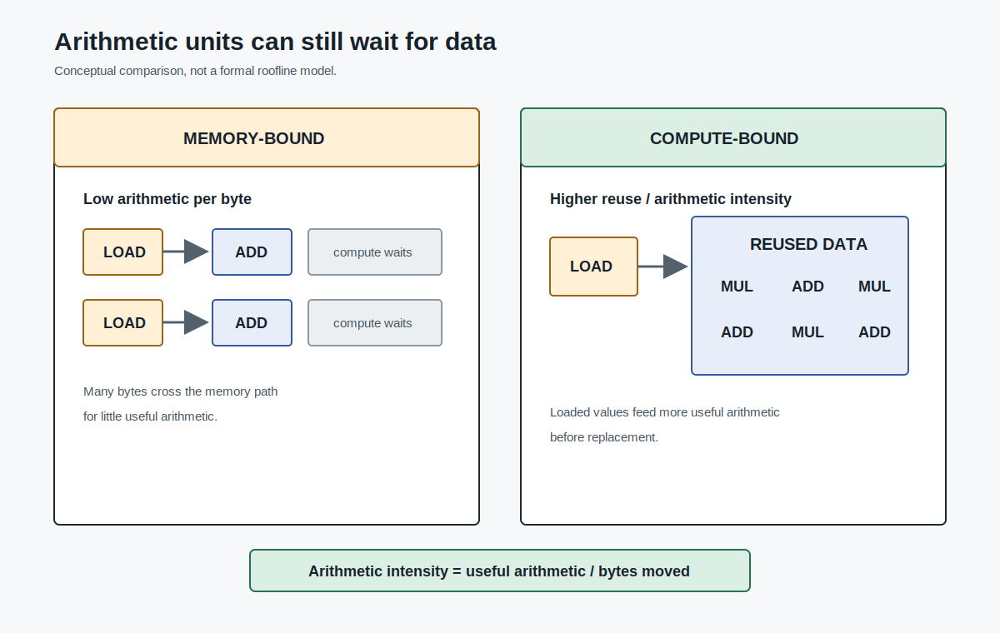
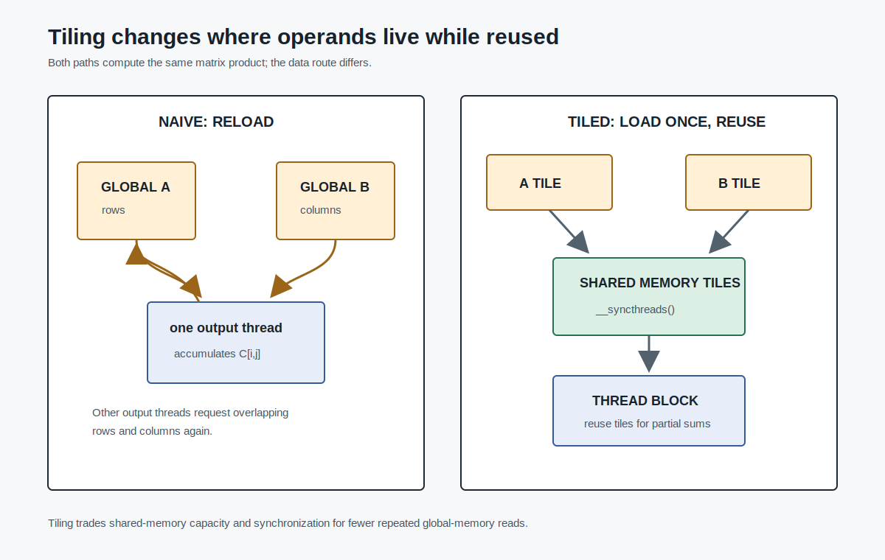
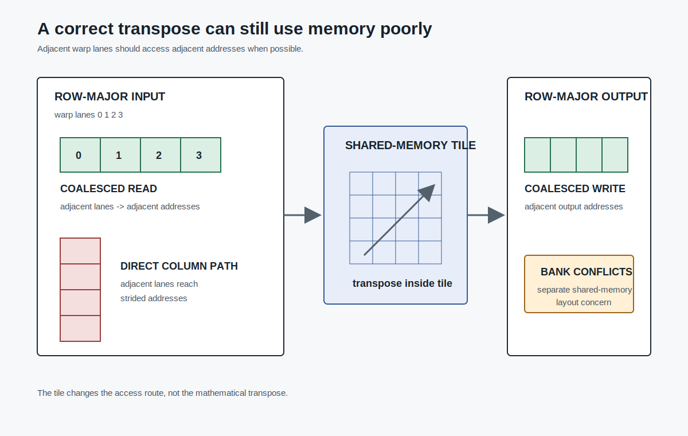
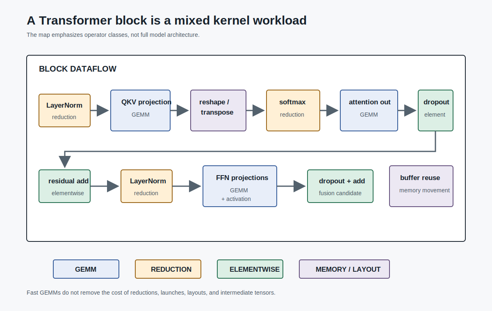

# Kernels, Memory, and Transformer Blocks

Chapter 4 made a GPU program concrete. The host launches a kernel. The device runs many threads. Threads are grouped into blocks and warps. Each thread maps its identity to data.

That is enough to write a correct CUDA program. It is not enough to write a fast one.

The next question is performance: what is the GPU waiting for? Sometimes it waits for arithmetic. Often it waits for data. Transformer blocks are large tensor programs, but their performance is not determined only by peak FLOPs. It is shaped by memory bandwidth, data reuse, access layout, synchronization, launch overhead, precision, and intermediate tensor storage.

This chapter turns the GPU programming model into performance reasoning.

## Memory-Bound Is a Real Category

A GPU can advertise enormous arithmetic throughput and still run a kernel slowly. The reason is simple: arithmetic units need data. If data arrives too slowly, the compute units wait.



One useful question is:

```text
How much useful arithmetic does the kernel perform for each byte moved from global memory?
```

This is often called arithmetic intensity or compute-to-memory-access ratio. The exact model can become sophisticated, but the first-order lesson is enough for now: a kernel with little computation per byte loaded is likely to be memory-bound. [CITE: llmsys-04-memory-access-efficiency]

Vector addition is the simplest example:

```text
C[i] = A[i] + B[i]
```

Each element performs one addition, but it loads two values and stores one result. There is little reuse. Making the addition unit faster does not help much if the kernel is already waiting for memory traffic.

Transformer systems encounter the same pattern in less obvious places. Elementwise adds, dropout masks, residual connections, simple reshapes, and some normalization steps can move large tensors while doing relatively little arithmetic.

## Naive Matrix Multiplication Wastes Reuse

Matrix multiplication has more arithmetic, but a naive implementation can still waste memory bandwidth.



A simple kernel assigns one output element to one thread:

```cuda
float acc = 0.0;
for (int k = 0; k < N; k++) {
  acc += A[row * N + k] * B[k * N + col];
}
C[row * N + col] = acc;
```

Each output element re-reads a row of `A` and a column of `B`. Neighboring threads often need overlapping data, but the naive kernel does not explicitly reuse it. A simplified accounting gives two floating-point operations for two FP32 global-memory reads, yielding `0.25 FLOP/B` under that model. [CITE: llmsys-04-naive-matmul-intensity]

That number should be read as intuition, not as a complete performance model. Real GPUs have caches, vectorized loads, tensor cores, scheduling effects, and library kernels with much more sophisticated structure.

The important point is durable: if a kernel repeatedly fetches the same data from global memory, peak FLOPs will not save it.

## Tiling Turns Bandwidth Into Reuse

Tiling is a standard answer to that problem.

Instead of having each thread independently read all operands from global memory, a thread block cooperatively loads a small tile of `A` and a small tile of `B` into shared memory. Threads synchronize. Then they reuse the tile data to update partial sums. The block repeats this process across the `k` dimension until the output tile is complete. [CITE: llmsys-04-tiling-shared-memory]

The shape is:

```text
load A tile and B tile into shared memory
wait for the block to finish loading
compute partial sums using shared memory
wait before reusing shared memory
move to the next tile
```

The key change is not the mathematical formula. It is where data lives while it is reused.

Global memory is large but relatively expensive to access. Shared memory is smaller but closer to the SM. Tiling spends coordination and shared-memory capacity to reduce repeated global-memory traffic.

This is why Chapter 4's memory hierarchy matters. If all memory looked the same, tiling would be less important. On GPUs, the distance between registers, shared memory, caches, and global memory is part of the algorithm.

## Layout Decides Whether Warps Load Efficiently

Tiling is about reuse. Coalescing is about access shape.



When neighboring threads in a warp access neighboring memory addresses, the hardware can combine those accesses efficiently. When those same threads access scattered or strided addresses, the hardware may need more memory transactions. [CITE: llmsys-04-coalesced-access]

Matrix transpose is the clean example. Reading a row-major matrix by rows gives adjacent threads adjacent addresses. Writing the transposed output can turn that pattern into strided writes. The kernel may be correct, but its memory behavior can be poor.

Shared memory can help here too. A block can load a tile from global memory in a coalesced pattern, transpose the tile in shared memory, then write it back in a more favorable pattern. This does not change the mathematical operation. It changes the route data takes through the memory hierarchy.

There is another layer inside shared memory: bank conflicts. Shared memory is divided into banks. Certain access patterns can cause multiple threads to hit the same bank in a way that serializes access. Padding a shared-memory tile can avoid some conflict patterns. [CITE: llmsys-04-bank-conflict]

This is an advanced detail, but the lesson is simple: performance depends not only on which data a kernel accesses, but also on how a warp's addresses line up with the memory system.

## Libraries Are Part of the Design

High-performance dense linear algebra is hard. Production GEMM kernels use deep hardware knowledge: tiling across memory levels, vectorized instructions, tensor cores, scheduling, and many shape-specific choices.

That is why systems often rely on optimized libraries for standard dense operations. cuBLAS provides CUDA BLAS routines, including vector dot product, matrix-vector multiplication, and matrix-matrix multiplication. [CITE: llmsys-04-cublas]

For LLM systems, this creates a practical boundary.

If the operation is a standard dense GEMM, the first answer is usually not "write a custom kernel." It is to use a mature library or framework path that dispatches to one.

But Transformer blocks are not only GEMM. They also contain elementwise operations, reductions, reshapes, masks, dropout, residual additions, normalization, softmax, cross entropy, and memory-management decisions. That is where custom kernels and fusion become important.

## Transformer Blocks Are Mixed Workloads

A Transformer block contains GEMM-heavy work:



- projections to `Q`, `K`, and `V`;
- attention output projection;
- feed-forward network linear layers;
- vocabulary projection.

These are natural library-kernel territory.

It also contains non-GEMM work:

- bias addition;
- dropout;
- residual addition;
- LayerNorm;
- softmax;
- reshape and transpose;
- masking;
- cross entropy during training;
- memory allocation and reuse.

For systems work, this stack separates into GEMM, custom elementwise operators, and custom reduction operators. [CITE: llmsys-10-transformer-operator-stack]

This distinction prevents a common misunderstanding. Attention and FFN layers may be dominated by matrix multiplication in some regimes, but end-to-end Transformer performance also depends on all the smaller operations around those GEMMs. A system that calls fast GEMM kernels and then spills many intermediate tensors through global memory can still leave performance on the table.

## Kernel Fusion Removes Unnecessary Boundaries

Kernel fusion combines multiple simple operations into one kernel.


Suppose a program computes:

```text
C = A + B
E = C + D
```

Two separate kernels must write `C` to memory and then read `C` back. A fused kernel can compute:

```text
E = A + B + D
```

It loads the inputs, performs the arithmetic, and writes the final output once. The benefit is reduced launch overhead and less extra memory access. [CITE: llmsys-10-kernel-fusion]

Transformer blocks have many opportunities of this kind. Bias addition, dropout, residual addition, scaling, masks, and simple activations often surround larger operations. Fusing them can reduce intermediate writes and reads.

The fused embedding example follows the same idea. Word embedding lookup, positional embedding lookup, scaling, and dropout can be organized as one fused path instead of several separate launches with intermediate tensors. [CITE: llmsys-10-fused-embedding]

Fusion is not free. A fused kernel may become more complex, use more registers, reduce occupancy, or be less reusable across shapes. The point is not to fuse everything. The point is to remove boundaries that exist only because the framework represented an expression as several separate operators.

## Reductions Are Synchronization Problems

Some Transformer operators are difficult because they require reductions.

LayerNorm computes statistics across a hidden dimension. Softmax computes row-wise normalization, usually involving a maximum for numerical stability and a sum of exponentials. These are not simple one-thread-per-output elementwise operations. Threads need to cooperate, exchange partial results, and synchronize. [CITE: llmsys-10-layernorm-reduction-rewrite; llmsys-10-softmax-reduction]

This makes reduction-heavy operators sensitive to shape and implementation.

A softmax over a short row may need a different kernel strategy from a softmax over a long row. The number of columns, rows, warps per block, and memory layout all affect performance. Softmax launch parameters are therefore shape-dependent. [CITE: llmsys-10-softmax-reduction]

LayerNorm has a similar character. The algebra can sometimes be rearranged to reduce synchronization. For example, variance can be expressed using mean of squares minus square of mean, which changes the reduction structure. The final formula and numerical details need careful technical review before publication, but the systems point is already clear: algebraic form affects synchronization. [CITE: llmsys-10-layernorm-reduction-rewrite]

This is one reason ML systems work sits between algorithms and hardware. A mathematically equivalent expression can produce a different execution plan.

## Mixed Precision Changes the Resource Model

Precision is a systems choice as well as a numerical one.

Modern GPUs support lower-precision formats such as FP16, BF16, FP8 on some hardware, and specialized tensor operations. Lower precision can reduce storage, reduce memory traffic, and increase effective compute throughput. [CITE: llmsys-10-mixed-precision]

But lower precision cannot simply be applied everywhere without thought. Training often keeps some optimizer state or update arithmetic in FP32 for stability. Forward/backward low-precision computation and FP32 optimizer updates serve different roles. [CITE: llmsys-10-mixed-precision]

The important habit is to ask what each tensor is used for:

- Is it an activation used briefly during forward pass?
- Is it a gradient accumulated across steps or devices?
- Is it a parameter copy used for updates?
- Is it a cache that persists across decode steps?
- Is it part of a numerically sensitive reduction?

Different answers justify different precision choices.

## Memory Reuse Depends on Liveness

Another optimization pattern is memory reuse.

During training, the backward pass needs some forward activations but not all intermediates forever. During inference, the system usually does not need gradients at all. If a tensor is no longer needed, its storage can be reused for another tensor. [CITE: llmsys-10-memory-reuse]

This turns memory management into a liveness problem:

```text
When is this value last used?
Can its buffer be reused safely?
Would recomputing it be cheaper than storing it?
```

Transformer attention backward is a dense example because it creates many intermediate gradients and temporary tensors. Serving has a different version of the same issue: KV cache persists, while many intermediate activations can be discarded after a decode step.

This pattern will reappear in ZeRO, activation checkpointing, KV cache management, and serving systems. The details change, but the question remains the same: which tensors must exist at the same time?

## The Chapter 5 Pattern

The techniques in this chapter are different on the surface:

- tiling;
- coalesced access;
- library GEMM;
- kernel fusion;
- reduction rewrites;
- mixed precision;
- memory reuse.

They are all responses to the same pressure: the Transformer block is a large computation whose bottleneck changes by operator, shape, precision, and hardware.

The engineer's job is to identify which resource is active:

- arithmetic throughput;
- global-memory bandwidth;
- shared-memory capacity;
- register pressure;
- synchronization;
- kernel launch overhead;
- intermediate tensor storage;
- numerical precision.

Chapter 6 narrows this pattern to attention. FlashAttention is useful not just because it is a faster attention kernel, but because it shows the full co-design loop: change the algorithm so the GPU memory hierarchy sees a better workload.

Owner: Principal Author  
Purpose: Chapter 5 ready draft after source extraction, brief, technical review, and red-team review  
Evidence grade: A for course lecture claims and official cuBLAS documentation card; no benchmark numbers used  
Assumptions: Chapter 5 explains performance patterns and defers FlashAttention details to Chapter 6  
Open questions: Add primary LightSeq/LightSeq2 cards if the final chapter keeps named case-study detail  
Handoff: Production can move to front-half Chapter 1-3 reviews or book-level consistency audit
