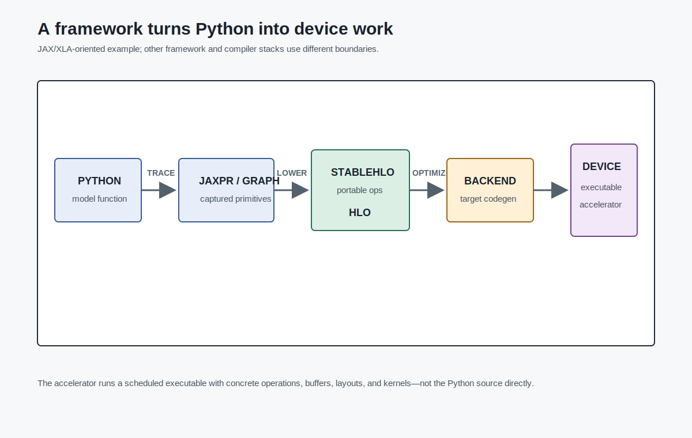
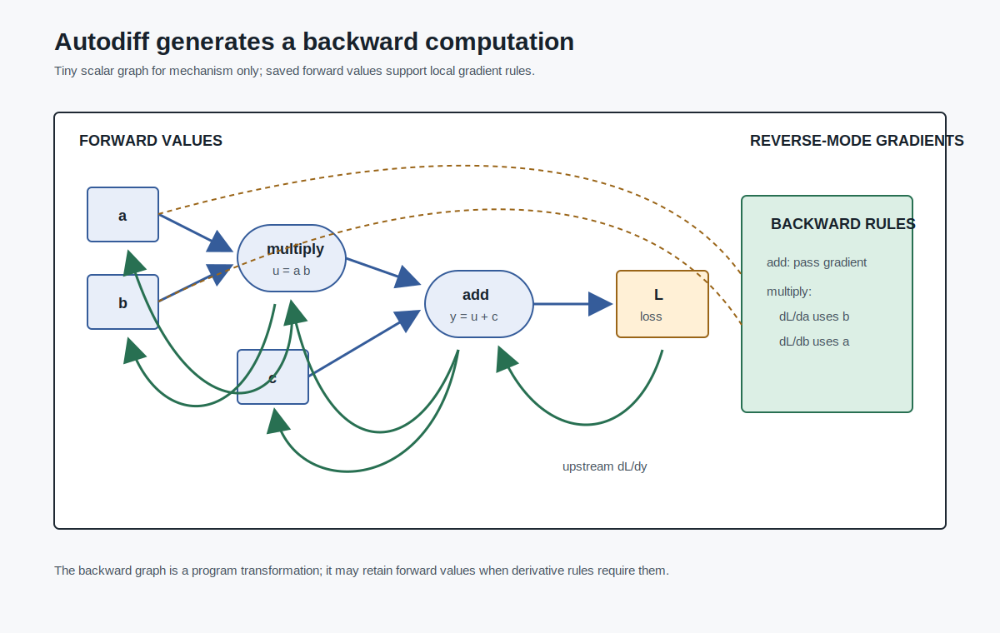
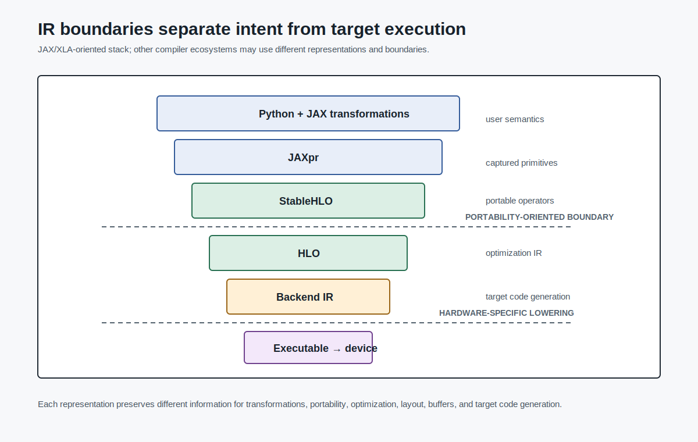
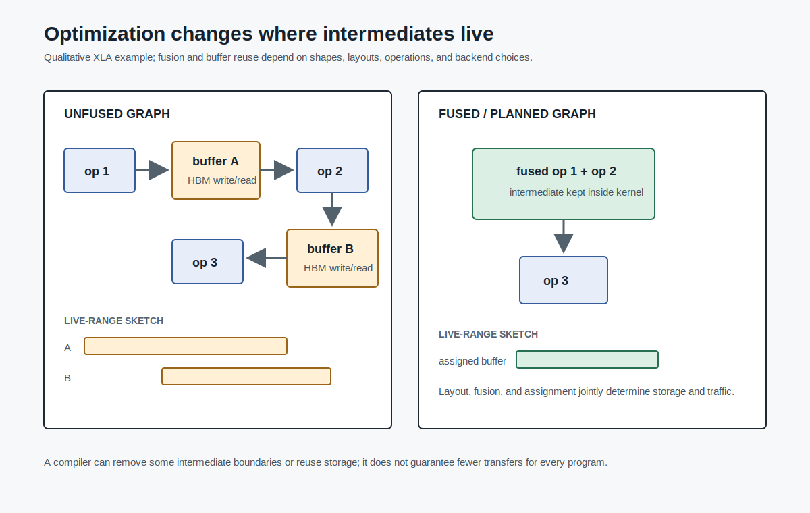
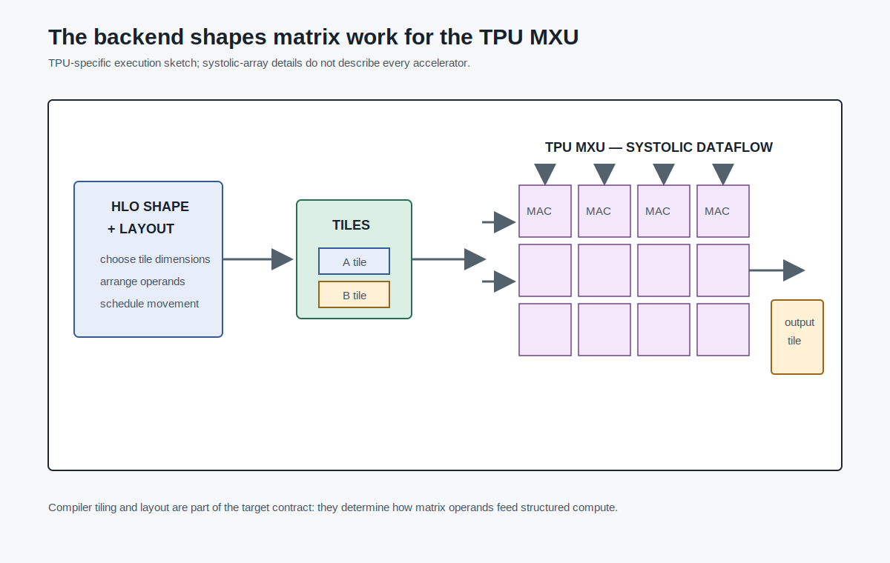
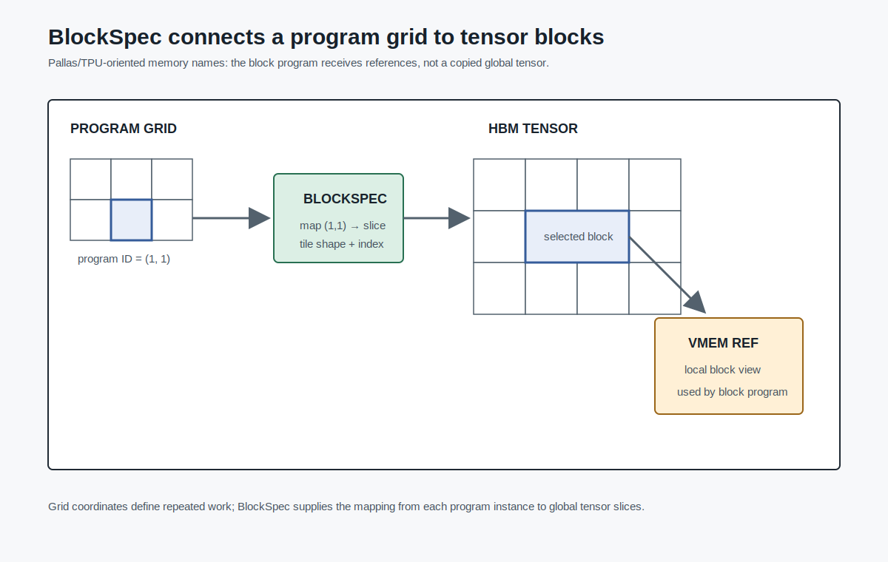
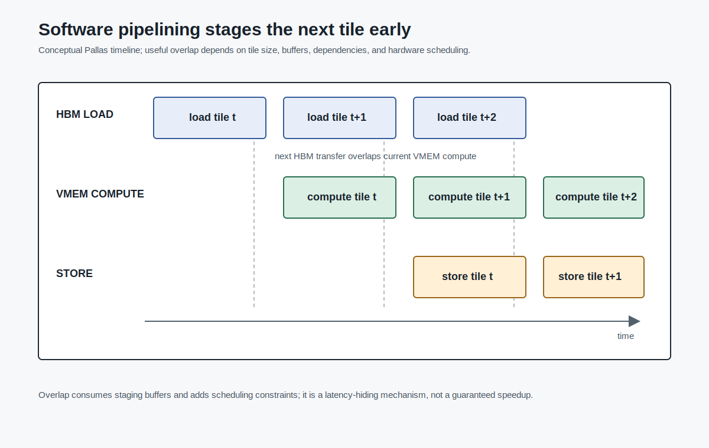

# Deep Learning Frameworks, JAX, XLA, and TPU

The previous chapters moved downward through the stack. A Transformer became tensor operations. Tensor operations became kernels. Kernels became memory traffic, tiling, reductions, fusion, and attention schedules.

Now move back up one level.

Most model authors do not write kernels directly. They write Python:

```python
def train_step(params, batch):
    logits = model(params, batch["tokens"])
    loss = cross_entropy(logits, batch["labels"])
    grads = grad(loss)(params)
    return optimizer_update(params, grads)
```

That code is not what the accelerator runs. The accelerator needs a scheduled program: operations, buffers, layouts, device transfers, collectives, compiled kernels, and sometimes custom code for a specific memory hierarchy.

This is the central problem of deep learning frameworks:

```text
turn a Python-level model expression into an executable accelerator program
```

A framework is therefore not only a convenience library. It is a staging system. It captures computation, transforms it, differentiates it, optimizes it, lowers it toward hardware, and decides when the abstraction is too high and the programmer needs a kernel-level escape hatch.

## The Model Is Python; the Machine Wants a Program

A training step has several kinds of work:



- forward computation;
- loss computation;
- backward computation;
- optimizer update;
- device memory allocation and reuse;
- communication if the tensors are sharded or replicated.

The author would like to write the mathematical structure once. The system must produce the executable work.

This gap is not accidental. Python is a productive language for model construction, but Python itself is not a good representation for accelerator scheduling. The accelerator does not want arbitrary control flow, dynamic objects, interpreter overhead, or hidden side effects. It wants a constrained program over arrays.

The usual solution is to create an intermediate representation of the computation. The course lecture on deep learning frameworks introduces this as a computation graph: a graph of primitive operators whose edges carry tensor values. [CITE: llmsys-05-computation-graph]

For a tiny expression:

```text
y = (a * b) + c
```

the graph is:

```text
a ----\
       multiply ----\
b ----/             add ---- y
c ------------------/
```

That graph is already more useful to a system than the original Python expression. It exposes primitive operations. It exposes dependencies. It gives the runtime or compiler something to schedule.

The same idea scales to neural networks. A Transformer layer is not one primitive operation. It is a graph containing matrix multiplications, reshapes, transposes, masks, normalization, softmax, elementwise operations, and residual connections. Once represented as a graph, the system can ask questions that Python source code does not answer directly:

```text
Which operations can be fused?
Which tensors must remain live?
Which buffers can be reused?
Which shapes are known?
Which device should hold this array?
Which communication must happen before this matmul can run?
```

Those are systems questions, not modeling questions.

## Autodiff Is a Program Transformation

Training requires gradients. A framework must compute derivatives of the loss with respect to parameters. For LLMs, doing that by hand is not realistic. The model graph is too large, and the implementation changes constantly.



Automatic differentiation solves this by turning the forward computation into a related backward computation. The lecture frames autodiff as building gradient calculation from primitive operations in the computation graph. [CITE: llmsys-05-automatic-differentiation]

Use the small expression again:

```text
y = (a * b) + c
```

Let:

```text
t = a * b
y = t + c
```

The local derivatives are:

```text
dy/dt = 1
dy/dc = 1
dt/da = b
dt/db = a
```

Reverse-mode autodiff propagates an upstream gradient from `y` backward through the graph:

```text
g_y = 1
g_t += g_y * 1
g_c += g_y * 1
g_a += g_t * b
g_b += g_t * a
```

The important point is not the arithmetic in this toy example. The important point is that each primitive operation carries a rule for how gradients flow through it. The framework can compose those local rules to build a backward program.

That backward program has its own systems behavior. It reads saved forward values, writes gradients, performs reductions, and may consume more memory than the forward pass. The framework must decide which intermediates to store and which to recompute. That connects directly to Chapter 6's FlashAttention backward pass: recomputation is a memory tradeoff, not a mystical property of attention.

Gradient checking with finite differences is useful for validation. For a scalar parameter `x`, one can estimate:

```text
df/dx ≈ (f(x + ε) - f(x - ε)) / (2ε)
```

The framework lecture notes finite differences as a way to check gradient calculations. [CITE: llmsys-05-gradient-checking] But finite differences are not how large models are trained. They require extra function evaluations per parameter and suffer from numerical sensitivity. Autodiff is the scalable mechanism; finite differences are a correctness probe.

## Dynamic, Static, and Functional Interfaces

Frameworks differ in how much of the computation they expose to the system ahead of execution.

In a dynamic or eager style, operations execute as the Python program runs. This is convenient for debugging and Python-native control flow. In a static graph style, the program first constructs a graph, then executes an optimized version of that graph. The framework lecture contrasts PyTorch, TensorFlow, JAX, and NumPy along these programming-model lines, with PyTorch associated with dynamic computation, TensorFlow historically associated with static graphs, JAX with functional transformations, and NumPy without built-in autograd. [CITE: llmsys-05-framework-programming-models]

This should be read as a conceptual comparison, not a permanent product matrix. Frameworks evolve. PyTorch has compiler paths. TensorFlow has eager execution. JAX has its own sharp edges around tracing and staging.

The durable systems distinction is:

```text
How much of the program is visible to the optimizer before it runs?
```

If the system sees only one operation at a time, it can dispatch good kernels but has limited opportunity to optimize across operator boundaries. If it sees a larger graph, it can fuse operations, plan memory, specialize shapes, and lower to a target-specific executable.

TensorFlow-style graph execution makes this explicit: define a symbolic dataflow graph, then execute an optimized computation graph on available devices. [CITE: llmsys-05-tensorflow-graph-execution]

That separation is the bridge to compilers. The graph is no longer just a debugging picture. It is an input to optimization.

## JAX as Staged Array Programming

This chapter uses JAX, XLA, and TPU as a case study because the boundaries are visible: Python functions are transformed, lowered, compiled, and sometimes replaced with explicit kernels. That is not a claim that every LLM system should use this stack, or that other framework/compiler stacks lack the same systems problems.

JAX is a clean case study because its user-facing model makes transformations central. Official JAX documentation describes it as array-oriented numerical computation with automatic differentiation and just-in-time compilation, and highlights CPU, GPU, and TPU execution, gradients, and vectorization. [CITE: official-jax-quickstart-transformations]

The course lecture summarizes the same core transformations:

```text
jit()
grad()
vmap()
```

`grad` transforms a function into a gradient function. `vmap` transforms a function so it maps over a batch dimension. `jit` stages a function for compilation. [CITE: llmsys-12-jax-transformations]

For example:

```python
def f(x):
    return x * x + 2 * x

g = grad(f)
compiled_f = jit(f)
batched_f = vmap(f)
```

The surface syntax is small, but the system contract is strong. JAX transformations work well when the function can be represented as operations over arrays with behavior that the tracer understands.

That is why JAX is not simply "NumPy on accelerators." The NumPy-like surface is the entry point. The deeper idea is staged array programming: write a Python function, trace the array operations it performs, represent them in an intermediate form, transform that representation, and compile it.

## Tracing Turns Python into JAXpr

When a JAX function is staged, JAX does not run it in the ordinary sense for every concrete value. It traces it. The lecture describes tracing as abstract execution that captures primitive operations into JAXpr, JAX's internal expression language. [CITE: llmsys-12-jax-tracing-jaxpr]

Take:

```python
def f(x, y):
    z = x @ y
    return z + 1
```

The Python source contains names, local variables, and operators. The traced representation instead records a small program over array primitives:

```text
dot_general x y -> z
add z 1 -> out
```

That simplified sketch omits details, but it exposes the key change. The compiler sees array operations, shapes, dtypes, and dependencies. It does not need to interpret arbitrary Python every time the function runs.

Tracing also explains why some Python patterns surprise users. If a branch depends on an ordinary Python boolean known at trace time, it may be resolved during tracing. If a branch depends on an array value only known at runtime, it must be expressed with traceable control-flow primitives. The model author writes Python, but the staged part must become an array program.

This is one of the main tradeoffs of the chapter:

```text
staging gives the compiler a program it can optimize,
but the staged program must obey the tracer's rules
```

## StableHLO and HLO Are Compiler Boundaries

After tracing, the program must move into compiler IR.



The lecture describes a path:

```text
Python/JAX tracing → JAXpr → StableHLO → HLO → optimized executable
```

[CITE: llmsys-12-xla-compilation-pipeline]

StableHLO sits at an important boundary. Official OpenXLA documentation describes StableHLO as a portability layer between ML frameworks and ML compilers, with a versioned operation set and compatibility goals. [CITE: official-openxla-stablehlo-portability]

That matters because a framework/compiler stack has two sides:

```text
frontend:  capture model programs from user frameworks
backend:   compile those programs for target hardware
```

If every frontend and backend used a private representation, the ecosystem would fragment. A stable intermediate representation gives frontends and compilers a common contract.

XLA is the compiler side of this story. Official OpenXLA documentation describes XLA as compiling StableHLO model graphs into target-optimized executables through target-independent optimization, backend-specific optimization, and target-specific code generation. [CITE: official-openxla-xla-architecture]

The practical pipeline is:

```text
model function
  ↓ tracing
JAXpr
  ↓ lowering
StableHLO
  ↓ XLA internal conversion and optimization
HLO
  ↓ backend-specific optimization/code generation
executable for CPU/GPU/TPU backend
```

Real implementations may include caches, frontend-specific paths, runtime dispatch layers, and backend-specific shortcuts. The diagram is a teaching path for the main abstractions, not a promise that every compiled program visits every named layer in exactly this order.

This is not merely a format conversion. Each stage enables different decisions. A frontend cares about user language semantics and transformations. A compiler IR cares about operations, shapes, layouts, buffers, and target behavior.

## Shapes and Layouts Are Systems Information

The framework author sees an array shape as a type-like fact:

```text
x: f32[batch, sequence, hidden]
```

The compiler sees more:

```text
how large is the buffer?
which dimension is contiguous?
can this operation be fused?
does this layout feed the target matrix unit efficiently?
can this intermediate be eliminated?
```

The lecture emphasizes that HLO uses compile-time array dimensions to reason about memory allocation and layout. [CITE: llmsys-12-hlo-static-shapes]

That claim needs a caveat in final prose: modern compiler stacks may support forms of dynamic shape or shape polymorphism, so the draft should not claim that every dimension is always fixed in every XLA use. The safe systems point is narrower:

```text
the more shape and layout information the compiler has,
the more aggressively it can plan memory and specialize execution
```

XLA optimization passes include graph simplification, fusion, layout and tiling decisions, buffer/copy insertion, and memory-space assignment. [CITE: llmsys-12-xla-optimization-passes]

These are the compiler versions of ideas from Chapters 4–6:

- fusion removes unnecessary intermediate writes;
- tiling changes data reuse;
- buffer assignment decides what storage is live;
- layout controls memory access patterns;
- memory-space assignment chooses where data should reside.

The difference is where the decision is made. In Chapter 5, a kernel author explicitly fused operations or tiled memory. In this chapter, the compiler may do some of that work from a higher-level graph.

## Fusion Is a Memory Decision

Consider a simple sequence:



```text
y = gelu(x + bias)
z = dropout(y) + residual
```

If implemented as separate kernels, the system may write `x + bias`, read it for `gelu`, write `y`, read it for dropout, write another intermediate, and so on. A compiler or framework fusion pass can reduce those round trips.

The XLA architecture page names execution speed and memory usage as central objectives, including fusing pipelined operations to reduce memory overhead and analyzing memory usage to eliminate intermediate storage buffers. [CITE: official-openxla-xla-architecture]

That connects directly to the recurring rule:

```text
operator boundaries are not free
```

In Python, writing three functions may be clearer than writing one. On the accelerator, three materialized operators may be expensive. The compiler tries to preserve the high-level expression while removing unnecessary runtime boundaries.

The same principle applies to attention-like code, but attention is harder. The Chapter 7 lecture includes examples where XLA attention or softmax fusion can avoid materializing large intermediates under specific compiled shapes and backend behavior. [CITE: llmsys-12-xla-attention-fusion]

That should be used carefully. A compiler can fuse some attention patterns, but it is not safe to claim that arbitrary high-level attention code will always avoid materialization. The result depends on shapes, backend, precision, compiler version, and the exact expression. Chapter 6 remains the stronger source for FlashAttention as an algorithmic/kernel reorganization.

## TPU Shows Why the Backend Matters

So far the chapter has treated the compiler target abstractly. TPU makes the target concrete.



A TPU is designed around dense linear algebra. The lecture describes TPU matrix multiply units using systolic-array-style dataflow: operands move through a grid of compute elements, and the compiler must organize data movement and scheduling so the matrix units stay fed. [CITE: llmsys-12-tpu-systolic-mxu]

Do not overread that as a full TPU hardware specification. Hardware details vary by generation and need official documentation or source-level evidence before publication-level claims. The chapter-level lesson is stable:

```text
backend code generation is shaped by the hardware's execution model
```

For a matrix multiply, the compiler must care about:

- operand layout;
- tile size;
- local memory capacity;
- data movement into the matrix unit;
- vector/scalar work around the matrix multiply;
- synchronization and scheduling.

That is why the IR cannot be just "multiply these arrays" at the final stage. The backend needs enough structure to map logical tensor operations onto physical compute and memory resources.

The same idea applies across accelerators. A GPU backend will make different choices from a TPU backend. A future accelerator may need a different layout, memory-space model, or code generator. The compiler stack exists partly so model code can stay higher level while backends specialize the executable.

## Compilation Is Also a Runtime Contract

Compilation does not eliminate runtime. It changes what the runtime does.

A staged function may compile the first time it sees a new combination of shapes, dtypes, or sharding constraints. Later calls may reuse the compiled executable. Inputs must be transferred or made available on devices. Outputs may be device-resident arrays whose values are not copied back to the host until needed.

This matters for performance measurement. Timing a compiled function once may include compilation. Timing it many times may mostly measure execution. Moving an array to the host for printing can synchronize work that was otherwise asynchronous.

This is why the chapter should avoid casual claims like:

```text
jit makes code faster
```

The defensible claim is conditional:

```text
jit can improve repeated accelerator execution when compilation overhead is amortized
and the compiler can optimize the staged array program
```

The conditions are part of the claim.

## Sharding Turns Compilation into Distributed Execution

Single-device compilation is not the end of the story. LLM training quickly reaches multi-device execution.

The Chapter 7 lecture introduces JAX sharding annotations and shows them lowering into distributed SPMD execution where the compiler can insert collectives such as all-gather. [CITE: llmsys-12-jax-sharding-spmd]

The minimal example is a matrix multiplication where one operand is partitioned across devices. A local device may not have all columns or rows needed for its part of the result. The system has choices:

```text
replicate data
partition data
insert all-gather
insert reduce-scatter
change the layout
change the computation order
```

Those choices are the beginning of distributed training systems. Chapter 8 will treat data parallelism directly. Chapter 9 will treat model parallelism. Chapter 10 will treat memory partitioning through ZeRO and MoE.

Here, the point is narrower: once tensors are sharded, the compiler/runtime boundary includes communication. A tensor expression may imply a collective. The model author may see a matmul; the system may see local matmuls plus all-gather or reduce-scatter.

That is a major abstraction shift:

```text
array layout becomes a distributed-systems decision
```

## When the Compiler Is Not Enough

Automatic compilation is powerful, but it has an abstraction ceiling.

Sometimes the programmer knows the schedule that should happen:

- which tile should move from HBM to local memory;
- when the next tile should be prefetched;
- which scratch buffer should hold partial sums;
- which grid coordinate owns which block;
- which sparse attention blocks should be skipped.

The generic compiler may not infer that schedule, or it may infer a legal schedule that is not the one the kernel author wants.

Pallas is one answer in the JAX ecosystem. Official JAX documentation describes Pallas as an experimental extension for writing custom GPU and TPU kernels with fine-grained control over generated code while retaining JAX tracing and `jax.numpy` ergonomics. [CITE: official-jax-pallas-experimental]

The experimental status matters. A book draft should not treat Pallas APIs as stable without checking the current docs and source. But as a systems concept, Pallas is useful: it shows the layer below automatic array compilation and above hand-written low-level backend code.

## Pallas: Grid, Blocks, and Memory Movement

The Pallas lecture frames the problem as explicit memory hierarchy control. Pallas exposes memory spaces such as HBM and VMEM on TPU, and gives the kernel author tools to orchestrate movement between them. [CITE: llmsys-13-pallas-memory-hierarchy]



The core programming shape is:

```text
pallas_call(
  kernel,
  grid=...,
  in_specs=BlockSpec(...),
  out_specs=BlockSpec(...)
)
```

`grid` defines the iteration space. `BlockSpec` maps global tensors to per-program blocks. The kernel receives references to those local blocks and computes on them. [CITE: llmsys-13-pallas-blockspec]

For a matrix multiplication, a simplified 3D grid might look like:

```text
grid = (M_blocks, N_blocks, K_blocks)
```

where:

- the first axis selects output row blocks;
- the second axis selects output column blocks;
- the third axis iterates through the reduction dimension.

This is the same tiling logic from Chapter 5, but expressed in a JAX-integrated kernel language rather than CUDA C++.

The memory reason is direct. LLM-sized tensors do not fit wholesale into local memory. The Pallas lecture shows VMEM capacity as a real constraint and motivates tiling because loading entire large tensors into VMEM can fail. [CITE: llmsys-13-pallas-vmem-constraint]

The systems invariant is:

```text
only the tile needed for this program instance should occupy scarce local memory
```

## Pipelining Hides Transfer Latency

Tiling solves capacity and reuse. It does not automatically solve latency.



If a kernel waits for every HBM-to-VMEM transfer before doing compute, the compute units may sit idle. Pipelining overlaps data movement with computation: while the current tile is being processed, the next tile is being fetched. The Pallas lecture describes this as overlapping HBM and VMEM transfer with active computation. [CITE: llmsys-13-pallas-pipelining]

The shape is:

```text
load tile 0
compute tile 0 while loading tile 1
compute tile 1 while loading tile 2
...
write final output
```

This is not free. Pipelining consumes buffers. It adds scheduling complexity. It may require careful tile sizes so transfer and compute overlap usefully. But it expresses a recurring accelerator principle:

```text
latency is often hidden by arranging independent work around it
```

Pallas also includes mechanisms such as output aliasing, where output can reuse an input buffer under valid aliasing constraints. [CITE: llmsys-13-pallas-output-aliasing] The high-level idea is familiar from memory reuse: avoid allocations and extra movement when the program can safely update existing storage.

## Tile Size Is a Performance Parameter

Tile size is not a cosmetic choice.

Small tiles may fit comfortably in local memory but create many program invocations and more scheduling overhead. Large tiles may improve reuse and reduce overhead but exceed local memory or reduce parallelism. The Pallas lecture includes tile-size tuning examples and emphasizes that grid shape and tile size affect invocation count and throughput for a given workload. [CITE: llmsys-13-pallas-tile-size-tuning]

This draft deliberately avoids quoting the lecture's speedup numbers. To use those numbers responsibly, the chapter would need to carry shape, precision, tile size, device generation, measurement method, and baseline. The source card marks the numeric claim as high risk for exactly that reason.

The durable takeaway does not require the number:

```text
the same mathematical matmul can have different performance
because tile shape changes memory pressure, reuse, and scheduling overhead
```

That is the same lesson as Chapters 4–6, now expressed at the framework/compiler boundary.

## Splash Attention as a Boundary Case

Splash Attention is useful here as a boundary case, not as a replacement for Chapter 6's FlashAttention discussion.

The Pallas lecture frames Splash Attention as combining FlashAttention-style tiling and fusion with sparse block execution. Instead of processing every attention block, sparse metadata identifies which blocks matter, and the kernel maps that metadata to work. [CITE: llmsys-13-splash-attention-sparse-flash; llmsys-13-splash-attention-mask-metadata]

This combines several systems concerns:

- algorithmic structure: attention can be tiled;
- sparsity: some blocks may be skipped;
- metadata: the kernel needs active row/column information;
- memory hierarchy: blocks should fit local memory;
- scheduling: grid coordinates map to useful work.

That is why custom kernel interfaces matter. A generic high-level expression may not expose the sparse execution plan or memory schedule. A lower-level kernel can.

But the boundary should stay clear. Chapter 6 owns the attention algorithm. This chapter uses Splash Attention only to show why compiler and kernel abstractions affect what systems can express.

## The Tradeoff: Abstraction Boundary

Every layer in this chapter buys something and costs something.

Python buys expressiveness and model-author productivity. It costs the system visibility.

Computation graphs buy scheduling and autodiff structure. They cost some flexibility.

JAX transformations buy staged compilation, vectorization, and differentiation. They cost tracing constraints and a sharper programming model.

StableHLO/HLO buy compiler portability and optimization. They cost another semantic boundary that must preserve enough information without overfitting to one frontend.

XLA backends buy target-specific performance. They cost backend complexity.

Pallas buys explicit kernel control. It costs portability and API stability risk, especially because the official docs mark it experimental. [CITE: official-jax-pallas-experimental]

The point is not to choose one layer as the "right" layer. The point is to know which layer owns which decision.

For an LLM systems engineer, the reusable test is:

```text
If performance is poor, ask which abstraction boundary hid the bottleneck.
```

Maybe the Python code prevented tracing. Maybe a shape change forced recompilation. Maybe an operator boundary caused unnecessary HBM traffic. Maybe the compiler picked a layout that was legal but not ideal. Maybe the attention pattern needs a custom kernel. Maybe the tensor sharding implies a collective the model author did not notice.

Frameworks and compilers are the machinery that makes LLM work productive. They are also part of the performance model.

## What to Remember

Deep learning frameworks turn model expressions into executable systems.

The chapter's mechanism is:

```text
Python function
  → traced array program
  → autodiff/vectorized/compiled representation
  → StableHLO/HLO compiler IR
  → optimized backend executable
  → optional custom kernel path when the compiler abstraction is too high
```

The chapter's bottleneck is programmability under hardware constraints. The model author wants clean Python. The accelerator wants scheduled work with explicit memory and communication behavior.

The misconception to discard is:

```text
the framework is just a library call layer
```

For LLM systems, the framework is part of the system design. It decides what computation is visible, what can be transformed, what can be fused, what can be sharded, what can be compiled, and where the programmer must take back control.

Owner: Principal Author  
Purpose: Chapter 7 ready draft after source extraction, brief, draft, technical review, and red-team review  
Evidence grade: A for course lecture claims and official JAX/OpenXLA/Pallas documentation; no benchmark numbers used  
Assumptions: The chapter uses JAX/XLA/TPU as a case study for framework/compiler/runtime design, not as a recommendation that all LLM systems should use JAX  
Open questions: Add narrower cards only if later revisions introduce precise JAXpr internals, Pallas `BlockSpec` API behavior, TPU backend microarchitecture, or exact StableHLO compatibility guarantees  
Handoff: Production can move to Chapter 8 source extraction
