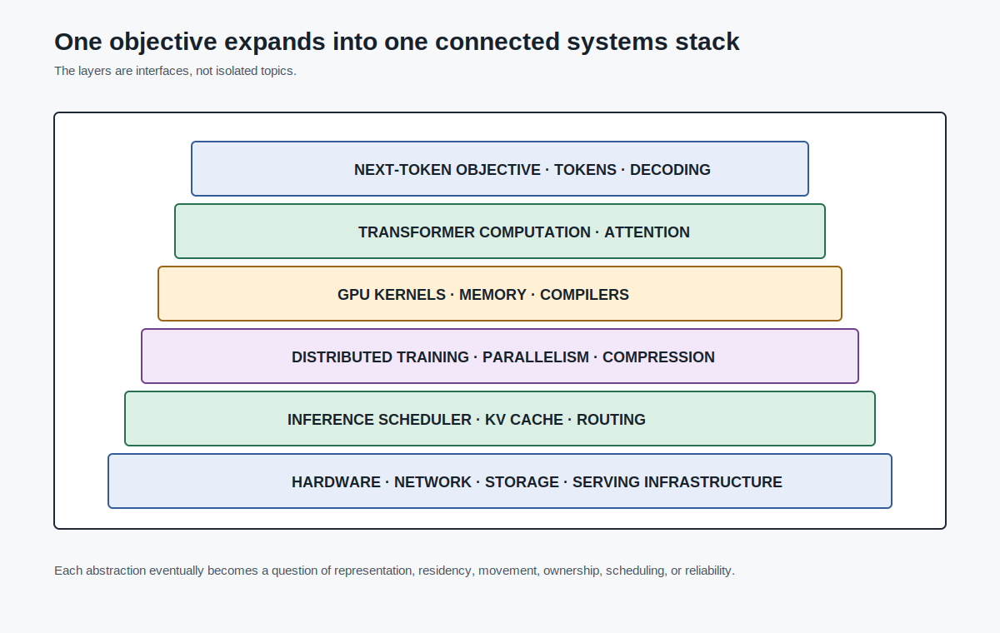
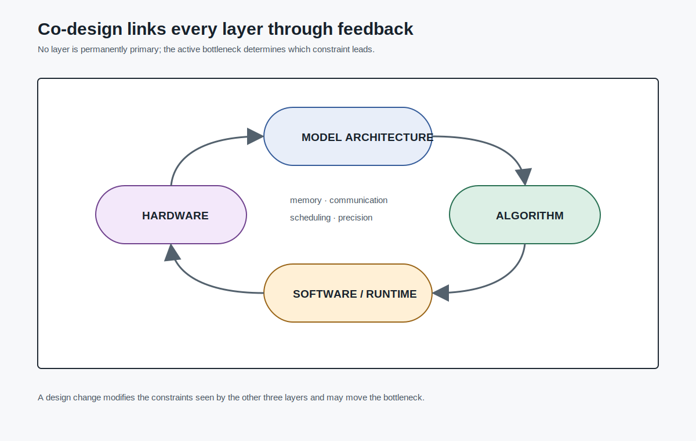
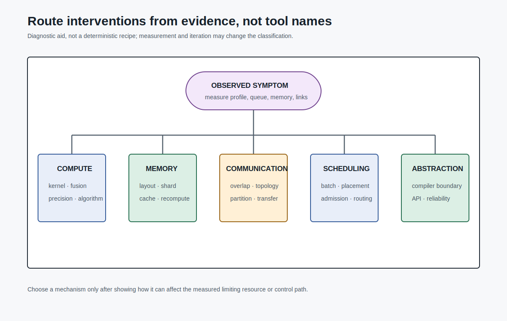
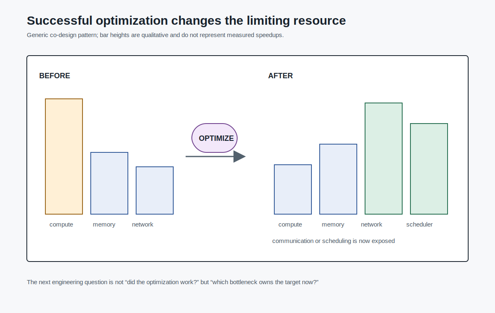

# Model-Algorithm-System Co-Design

The book began with a simple mathematical object:

```text
predict the next token
```

A language model assigns a probability to the next token conditioned on the prompt and previous generated tokens. \[CITE: llmsys-01-next-token-probability] Pretraining commonly turns that into cross-entropy loss for next-token prediction over raw text. \[CITE: llmsys-01-training-objective]

That objective is compact. The system that makes it useful is not.

To train and serve modern LLMs, the system has to decide how the model is represented, how tensors move, how kernels use hardware, how workers communicate, how memory is partitioned, how requests are scheduled, and how latency or training targets are measured.

The introductory lecture states the central systems claim: making computation fast is not enough. LLM systems require attention to compute, memory, data movement, communication, abstraction design, distributed systems, frameworks, operators, kernels, and compression. \[CITE: llmsys-01-system-challenges]

This final chapter is a design method for using the rest of the book.

## The Simple Objective Becomes a Stack

Decoder-only autoregressive models are presented in the course as the most popular architecture choice for modern LLMs. \[CITE: llmsys-01-decoder-only]



That architecture choice has system consequences:

```text
autoregressive decoding
  -> one token depends on previous tokens
  -> serving has sequential per-request decode
  -> batching must happen across requests
  -> prior keys and values become KV cache
  -> KV cache becomes a memory and routing object
```

The same pattern appears throughout the book. A choice at one level creates constraints at another level.

```text
objective:
  next-token prediction

architecture:
  decoder-only Transformer

operator graph:
  attention, MLPs, normalization, softmax

kernel layer:
  matmul, reductions, memory movement

training system:
  data parallelism, model parallelism, optimizer state

serving system:
  batching, KV cache, scheduling, routing, SLOs
```

This is the stack view. It is useful, but incomplete. Real engineering does not move only downward from objective to hardware. Constraints also move upward.

A GPU memory limit may force ZeRO-style sharding, quantization, or smaller batch sizes. A network bottleneck may change the parallelism plan. A serving SLO may favor prefill/decode disaggregation even when a simpler colocated system has higher raw utilization. A kernel limitation may decide whether a model feature is practical to deploy.

The correct mental model is not a stack of independent layers. It is a loop.

## Co-Design Means Joint Constraints

The introduction lecture states that LLMs need model-algorithm-system co-design across model architecture, algorithms, software optimization, and hardware acceleration. \[CITE: llmsys-01-codesign]



Co-design means the design variable may live at any layer:

```text
model architecture:
  attention pattern, MoE, head structure, context length

algorithm:
  FlashAttention, GPTQ, ZeRO, LoRA, PagedAttention

software/runtime:
  framework graph, compiler, scheduler, memory manager

hardware:
  GPU memory hierarchy, interconnect, tensor cores, CPU/SSD tiers
```

The reason to think this way is that local improvements often move bottlenecks.

Examples:

```text
faster attention kernel:
  may expose communication or MLP as the new bottleneck

larger serving batch:
  may improve compute utilization but increase KV cache pressure

quantized weights:
  may reduce memory bandwidth but require compatible kernels

prefill/decode disaggregation:
  may improve SLO control but introduce KV-transfer cost
```

The design question is therefore:

```text
Where is the bottleneck now,
and where will it move if we apply this optimization?
```

## Bottleneck Ownership

When an LLM system fails to meet a target, first name the bottleneck. Do not begin by naming a tool.



Use a small checklist:

```text
compute:
  are arithmetic units underfed or oversubscribed?

memory capacity:
  do parameters, optimizer state, activations, or KV cache fit?

memory bandwidth:
  are kernels mostly moving bytes instead of doing useful arithmetic?

communication:
  are workers waiting on all-reduce, all-gather, send/recv, or KV transfer?

scheduling:
  are requests or microbatches waiting because policy is mismatched to workload?

abstraction:
  does the framework/runtime prevent the expression or fusion the system needs?

reliability/operations:
  does the design survive failures, load changes, or heterogeneous hardware?
```

Then ask which layer owns the cheapest safe intervention:

```text
can the model change?
can the algorithm change?
can the runtime schedule differently?
can memory be laid out differently?
can data movement overlap with compute?
can the workload be routed differently?
```

The word "safe" matters. A technique that improves one benchmark may be a bad intervention if it breaks accuracy, violates an SLO, requires unavailable hardware, or creates operational complexity the system cannot carry.

## Synthesis Example: Long Context

Long context looks like a model feature. It quickly becomes a system problem.

Longer contexts increase attention work, memory movement, and KV cache state. FlashAttention-style attention acceleration is an algorithm/hardware co-design response to attention's memory behavior; it changes how attention is computed to reduce memory traffic while preserving the result. \[CITE: llmsys-21-modern-hardware-attention]

At serving time, the long-context problem changes shape. The model no longer only needs efficient prefill attention. It must keep KV state for active requests. The vLLM lecture frames KV cache management as central to high-throughput serving. \[CITE: llmsys-24-kv-cache-memory-management]

PagedAttention then changes the memory layout:

```text
instead of:
  one large contiguous KV reservation per request

use:
  fixed-size KV blocks
  logical-to-physical block tables
  attention kernels that read through indirection
```

PagedAttention is presented as application-level paging and virtualization for attention KV cache. \[CITE: llmsys-24-pagedattention-definition] Its kernel reads non-contiguous KV blocks through the block table rather than materializing gathered K/V tensors. \[CITE: llmsys-24-pagedattention-kernel]

At distributed serving scale, long context becomes a routing and storage problem. KV-aware routing considers whether useful cache state already exists on a worker. \[CITE: llmsys-26-kv-aware-routing] Disaggregated serving may need to transfer KV cache from prefill to decode workers. \[CITE: llmsys-29-disaggregation-challenges]

One user-visible feature has touched:

```text
attention algorithm
GPU kernel memory traffic
KV cache allocator
serving scheduler
distributed routing
memory hierarchy
```

That is co-design.

## Synthesis Example: Large Training Run

Large training begins with a memory and communication ledger.

Data parallelism replicates the model and averages gradients across workers. DDP uses gradient synchronization and can overlap communication with backward computation. \[CITE: llmsys-15-ddp-overlap]

When the model no longer fits cleanly, model parallelism enters. Tensor parallelism partitions matrix operations; pipeline parallelism partitions layers and introduces pipeline scheduling costs. \[CITE: llmsys-16-tensor-parallel-matmul] \[CITE: llmsys-16-pipeline-costs]

When optimizer state dominates memory, ZeRO partitions optimizer states, gradients, and parameters across data-parallel ranks. \[CITE: llmsys-18-zero-key-idea]

The naive question is:

```text
which parallelism is fastest?
```

The co-design question is:

```text
what memory must be resident?
what communication is introduced?
can it overlap with computation?
does the framework express the partition?
does the interconnect support the chosen topology?
what happens to batch size and optimizer behavior?
```

There is no useful answer without conditions. Model size, sequence length, batch size, precision, topology, optimizer, and framework all travel with the claim.

This is why Part III did not treat distributed training as a list of tricks. The mechanism matters because the correct intervention depends on the bottleneck:

```text
parameter memory too large:
  shard parameters or change precision

optimizer state too large:
  shard optimizer state

activation memory too large:
  checkpoint or rematerialize

communication too exposed:
  overlap, bucket, change parallelism, or change topology

load imbalance:
  change pipeline schedule, partitioning, or expert routing
```

The system is the interaction.

## Synthesis Example: Cheap Adaptation and Serving

Compression and adaptation show the same principle from another angle.

Quantization reduces tensor precision and can reduce memory pressure, but it introduces numerical error and depends on kernel/runtime support. \[CITE: llmsys-19-quantization-purpose] Direct quantization can lose information through rounding, clipping, and range mismatch. \[CITE: llmsys-19-direct-quantization-errors]

LoRA changes what is trainable. It freezes pretrained weights and trains a low-rank update. \[CITE: llmsys-23-lora-lowrank-update] The memory saving comes from reducing trainable state, gradients, and optimizer state for the adaptation path, not from making the base model disappear. \[CITE: llmsys-23-lora-training-state]

QLoRA combines a quantized base model with LoRA-style adaptation. \[CITE: llmsys-23-qlora-quantized-lora]

A product team might state the problem as:

```text
we need cheaper fine-tuning and serving
```

The co-design version is more precise:

```text
which memory term is too large?
  base weights?
  gradients?
  optimizer states?
  activations?
  KV cache?

which quality risk is acceptable?
  quantization error?
  low-rank adaptation limit?
  calibration mismatch?

which runtime supports the representation?
  low-bit kernels?
  adapter loading?
  multi-adapter batching?
  mixed precision paths?
```

The intervention changes the system contract. Quantization is not just smaller files. LoRA is not just fewer trainable parameters. Both change what the runtime must store, compute, and schedule.

## Synthesis Example: Goodput-Oriented Serving

Serving also shows why the target metric matters.

Raw throughput is not enough if many requests miss latency SLOs. The disaggregation lecture defines goodput as completed requests within SLO criteria. \[CITE: llmsys-29-goodput-definition]

Prefill and decode stress different resources: prefill is compute-bound, while decode is memory-bound and benefits from many batched requests. \[CITE: llmsys-29-prefill-decode-characteristics]

A colocated server may have high utilization and still produce poor user experience under some workloads. Prefill/decode disaggregation separates the phases so prefill instances can optimize TTFT and decode instances can optimize TPOT. \[CITE: llmsys-29-disaggregation-opportunity]

But the intervention creates a new cost: KV cache has to move or become accessible across the phase boundary. The disaggregation lecture names KV cache transmission overhead as a challenge. \[CITE: llmsys-29-disaggregation-challenges]

The co-design loop is visible:

```text
SLO target:
  TTFT and TPOT

algorithm/runtime response:
  separate prefill and decode

memory consequence:
  KV cache must transfer or be shared

distributed systems consequence:
  placement, routing, memory tiers, transfer substrate
```

Serving architecture is therefore not merely horizontal scaling. KV cache makes requests stateful, and state changes routing.

## Scaling Up and Scaling Down

The introduction lecture frames the system challenge as computing training and inference for larger LLMs on bigger datasets with fewer resources, including GPU, memory, and power. \[CITE: llmsys-01-system-challenges]



That sentence contains both directions:

```text
scale up:
  larger models
  larger datasets
  longer contexts
  more users
  more complex serving workloads

scale down:
  fewer GPUs
  lower memory
  lower power
  lower latency
  cheaper adaptation
```

The same co-design method applies to both.

Scaling up asks:

```text
what partitioning, memory layout, communication pattern,
and scheduler allow the larger system to run?
```

Scaling down asks:

```text
what approximation, compression, reuse, or specialization
preserves the useful behavior under a tighter budget?
```

The book's techniques are not independent recipes. They are possible moves in this search space.

## The Engineering Checklist

When facing an LLM systems problem, write down the conditions before choosing a solution.

```text
1. Workload
   training or serving?
   online or offline?
   prompt length?
   output length?
   batch size or arrival process?

2. Target
   loss?
   accuracy?
   TTFT?
   TPOT?
   goodput?
   cost?
   power?

3. Bottleneck
   compute?
   memory capacity?
   memory bandwidth?
   communication?
   scheduling?
   reliability?
   abstraction?

4. Current owner
   model architecture?
   algorithm?
   framework/compiler?
   kernel?
   distributed runtime?
   serving scheduler?
   hardware topology?

5. Candidate intervention
   partition?
   recompute?
   quantize?
   cache?
   fuse?
   overlap?
   route?
   disaggregate?

6. New bottleneck
   what gets worse?
   what state moves?
   what accuracy risk appears?
   what operational burden appears?

7. Evidence
   what source supports the claim?
   what conditions travel with the number?
   what remains uncertain?
```

This checklist is deliberately mechanical. It forces the claim to carry the workload, hardware, model, precision, sequence length, batch size, and software context that make it meaningful.

## What to Remember

The visible behavior of an LLM is produced by a stack of system decisions.

Next-token prediction creates the objective. Decoder-only Transformers define the computation pattern. GPUs reward particular memory and parallelism structures. Distributed training creates communication and state-partitioning problems. Compression changes numerical representation. Serving turns KV cache into persistent memory and routing state.

The final habit is to ask:

```text
What problem does this system solve?
Why does it become hard at LLM scale?
Which bottleneck does it target?
Which layer owns the intervention?
What conditions travel with the result?
What bottleneck moves next?
```

That is model-algorithm-system co-design.

Owner: Principal Author  
Purpose: Chapter 15 ready draft after source extraction, brief, technical review, and red-team review  
Evidence grade: A for course framing and cited prior chapter source cards; no new benchmark numbers used  
Assumptions: Chapter 15 synthesizes Chapters 1-14 rather than introducing a new subsystem  
Open questions: Whether to add a chapter-to-bottleneck summary table and heterogeneous-serving sidebar  
Handoff: Production can move to front-half gated reviews or book-level consistency audit
