\thispagestyle{empty}

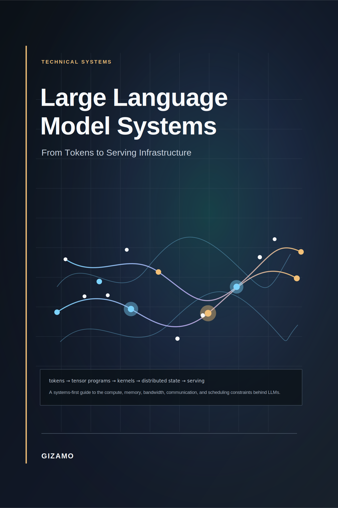{.book-cover width=85%}

\newpage

# Contents {#contents .contents-title}

- [Part I — The Shape of the Problem](#part-i-the-shape-of-the-problem)
  - [Chapter 1: Why LLMs Are Systems Problems](#chapter-1-why-llms-are-systems-problems)
  - [Chapter 2: From Next-Token Probability to Transformer Computation](#chapter-2-from-next-token-probability-to-transformer-computation)
  - [Chapter 3: Tokenization, Context, and Decoding](#chapter-3-tokenization-context-and-decoding)
- [Part II — Single-Device Computation](#part-ii-single-device-computation)
  - [Chapter 4: Inside the GPU Programming Model](#chapter-4-inside-the-gpu-programming-model)
  - [Chapter 5: Kernels, Memory, and Transformer Blocks](#chapter-5-kernels-memory-and-transformer-blocks)
  - [Chapter 6: FlashAttention and Attention Acceleration](#chapter-6-flashattention-and-attention-acceleration)
- [Part III — Training Systems](#part-iii-training-systems)
  - [Chapter 7: Deep Learning Frameworks, JAX, XLA, and TPU](#chapter-7-deep-learning-frameworks-jax-xla-and-tpu)
  - [Chapter 8: Distributed Training and Data Parallelism](#chapter-8-distributed-training-and-data-parallelism)
  - [Chapter 9: Model Parallelism](#chapter-9-model-parallelism)
  - [Chapter 10: ZeRO, MoE, and Training Memory](#chapter-10-zero-moe-and-training-memory)
- [Part IV — Adaptation and Compression](#part-iv-adaptation-and-compression)
  - [Chapter 11: Quantization and Parameter-Efficient Adaptation](#chapter-11-quantization-and-parameter-efficient-adaptation)
- [Part V — Inference and Serving](#part-v-inference-and-serving)
  - [Chapter 12: The Cost Model of LLM Inference](#chapter-12-the-cost-model-of-llm-inference)
  - [Chapter 13: KV Cache, PagedAttention, and vLLM](#chapter-13-kv-cache-pagedattention-and-vllm)
  - [Chapter 14: Scheduling, Caching, and Disaggregated Serving](#chapter-14-scheduling-caching-and-disaggregated-serving)
- [Part VI — System Design Synthesis](#part-vi-system-design-synthesis)
  - [Chapter 15: Model-Algorithm-System Co-Design](#chapter-15-model-algorithm-system-co-design)
- [References](#references)
- [Index](#index)

\newpage

# Part I — The Shape of the Problem {#part-i-the-shape-of-the-problem .part-title}

## Chapter 1: Why LLMs Are Systems Problems {#chapter-1-why-llms-are-systems-problems .chapter-title}

A user types a prompt. The model answers in fluent sentences. At the surface, the system looks like a language interface: translate this, summarize that, write a function, solve a word problem, polish an email.

Underneath that interface is a long chain of engineering decisions. Text must become tokens. Tokens must become vectors. Vectors must move through repeated Transformer blocks. Those blocks must run as matrix multiplications, reductions, normalizations, nonlinearities, and memory transfers. During training, the system must move parameters, gradients, activations, and optimizer states through many devices. During inference, it must keep latency low while serving many users whose requests have different prompt lengths, output lengths, and arrival times.

That stack is what this book means by **LLM systems**: the full system required to train, adapt, optimize, and serve large language models.

LLM systems work asks for three things: understanding the techniques behind modern LLM systems, implementing core components such as fast CUDA kernels, scalable training systems, and efficient inference, and identifying new systems challenges created by LLM scale. [CITE: llmsys-01-system-challenges]

The important word is **systems**. A large language model is not only a model. It is also a workload.

### The Simple Contract

The mathematical contract begins simply. A language model assigns a probability to the next token given the prompt and the previous tokens:

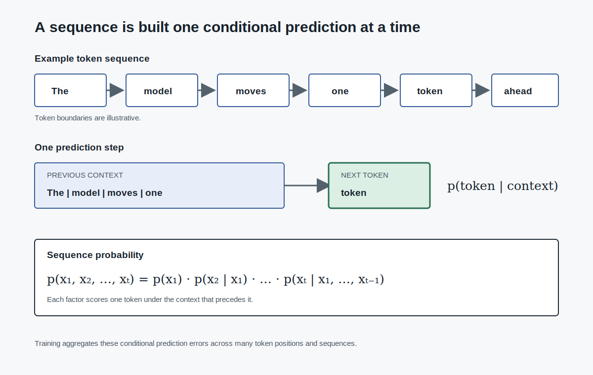

```text
P(next token | prompt, previous tokens)
```

This appears in next-word prediction form:

```text
P(next word y_t | Prompt x, previous words y_1:t-1)
```

In a modern LLM book, it is more precise to say token rather than word, because the model normally reads and writes subword, byte, or byte-pair units rather than human words. The conditional structure is the same. The model sees a prefix and scores possible continuations. \[CITE: llmsys-01-next-token-probability]

For a sequence, the model repeats the same idea. The probability of a sentence can be written as a product of conditional probabilities: first token, second token given the first, third token given the first two, and so on. Training pushes the model to assign high probability to the observed next token in real text. The common loss is cross-entropy for next-token prediction. \[CITE: llmsys-01-training-objective]

This simple contract explains why one model can appear to do many things. Translation, summarization, code generation, question answering, and style transfer can all be framed as: given this input sequence, produce a useful output sequence.

It does not explain why the system is hard.

### The Contract Becomes a Tensor Program

The next-token contract must be implemented as computation.

At each step, tokens index an embedding table. The resulting vectors pass through many network layers. In a Transformer-based model, those layers include attention, linear projections, nonlinear activation functions, normalization, softmax operations, and residual paths. At the bottom, these become a small set of repeated operator patterns:

- matrix and tensor multiplication;
- elementwise maps;
- reductions such as sums and averages;
- normalization;
- softmax;
- memory movement.

These are the common computation layers and low-level operators that show up in language models. \[CITE: llmsys-01-system-challenges]

Once the model is small, these details are implementation. Once the model is large, they become the main problem. The same next-token objective may require thousands of GPUs to train, careful partitioning to fit in memory, specialized kernels to keep hardware busy, and a serving runtime that can batch requests without breaking latency targets.

The model is a probability distribution. The system is the machinery that makes that distribution usable.

### The Dominant Shape: Decoder-Only Autoregression

Language models come in several architectural families. Encoder-only models, such as BERT-style masked language models, are built for representation and prediction over masked positions. Encoder-decoder models read an input sequence with an encoder and generate an output sequence with a decoder. Decoder-only models generate autoregressively, conditioning each next token on the previous tokens.

Decoder-only causal language models are the most common architecture choice for modern LLMs. \[CITE: llmsys-01-decoder-only]

That choice matters for systems. Autoregressive generation has a serial dependency: token `t + 1` depends on token `t`. During training, many positions can be processed in parallel under a causal mask. During inference, generation usually advances one token at a time for each sequence. That difference will later explain why training throughput, inference throughput, and user-visible latency are different system problems.

This book will mostly reason from the decoder-only case because it is the dominant shape of current general-purpose LLM serving. Encoder-decoder and encoder-only models still matter, especially for understanding the Transformer family, but they are not the center of the serving stack.

### Capability Is Not the Same as Infrastructure

Common LLM capabilities include translation, commonsense reasoning, math reasoning, code generation, text rewriting, and image-prompt generation. The point is not that every example is perfect, or that a model "understands" all tasks in a human sense. The point is that a broad set of AI tasks can be exposed through the same token interface.

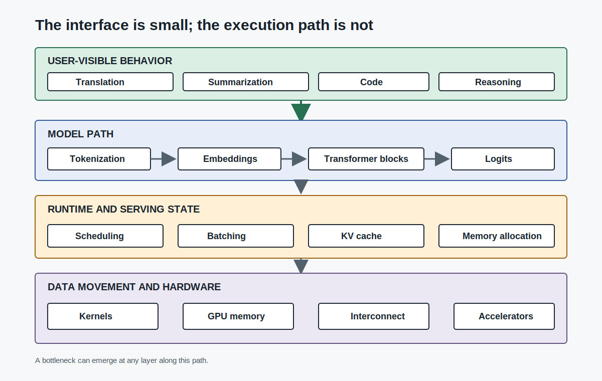

That interface hides a systems stack.

Suppose a user asks a model to write a small Python function. The visible work is a few lines of code. The hidden work includes:

1. tokenizing the prompt;
2. looking up embeddings;
3. running many Transformer layers over the prompt;
4. storing key/value tensors needed for later attention;
5. sampling or selecting the next token;
6. appending that token to the context;
7. repeating the process until the answer is complete;
8. scheduling the request alongside other requests;
9. moving data through GPU memory fast enough to avoid wasting compute.

The same request can be easy or hard depending on prompt length, output length, batch composition, model size, precision, hardware, and cache state.

That is why a model benchmark is not a serving system, and a serving demo is not a training system.

### The First Bottleneck: Resources

The practical question is simple: how many resources do you need to train a 100B model?

That question is deliberately larger than model architecture. To answer it, an engineer must account for:

- parameters;
- gradients;
- optimizer states;
- activations;
- batch size;
- sequence length;
- precision;
- GPU memory;
- GPU interconnect bandwidth;
- cluster network bandwidth;
- checkpointing;
- failure recovery;
- data loading.

The answer is not one number. It is a resource model.

This is the first habit of LLM systems work: translate model size and workload shape into compute, memory, bandwidth, and time.

### Computation Is Not Enough

A naive performance story says: make the math faster. That story is incomplete.

Making computation fast is not enough. Data transfer takes time. Large models have many parameters. Training moves gradients and optimizer states. Inference moves weights, activations, and KV cache tensors. Long-context LLMs require large working memory. [CITE: llmsys-01-system-challenges]

This distinction appears throughout the book.

Sometimes the limiting factor is arithmetic throughput: the hardware cannot multiply fast enough. Sometimes the limiting factor is memory bandwidth: the arithmetic units wait for data. Sometimes it is memory capacity: the tensors do not fit. Sometimes it is communication: devices spend too much time exchanging parameters, gradients, activations, or cache blocks. Sometimes it is scheduling: the system has enough total capacity but cannot shape work into efficient batches.

A good LLM systems engineer asks which bottleneck is active before optimizing.

### Abstractions Decide What Engineers Can Build

A useful abstraction hides one concern while still supporting a wide range of applications.

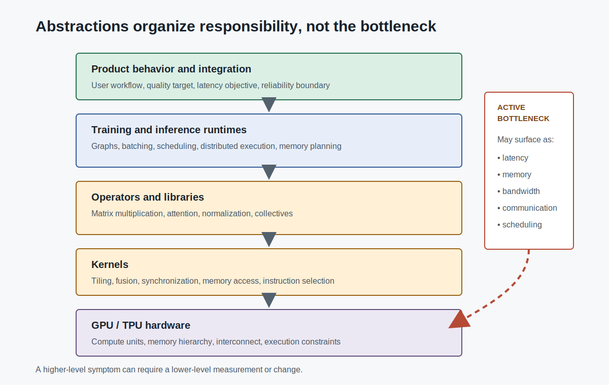

At the upper level, engineers integrate models into product systems and track quality over time. At the middle level, they build training and inference software, runtime systems, and streaming dataflows. At the lower level, they write kernels, compilers, and hardware-specific code. [CITE: llmsys-01-system-challenges]

Each level hides something.

A deep learning framework hides device execution details behind tensors and graphs. A distributed training library hides some communication patterns behind data parallel or model parallel APIs. A serving runtime hides batching, cache allocation, and scheduling behind an inference endpoint. A kernel library hides memory tiling and warp-level execution behind an operator call.

The abstraction is successful only if it hides complexity without hiding the bottleneck that matters.

That is why this book moves up and down the stack. The reader needs the model objective, because it explains the workload. The reader needs Transformer computation, because it explains the operators. The reader needs GPU memory hierarchy, because it explains kernel performance. The reader needs distributed training, because the model no longer fits comfortably on one device. The reader needs serving architecture, because generation is interactive, stateful, and latency-sensitive.

### Co-Design Is the Pattern

LLMs need model-algorithm-system co-design. Model architecture, training and inference algorithms, software optimization, and hardware acceleration must be designed together. [CITE: llmsys-01-codesign]

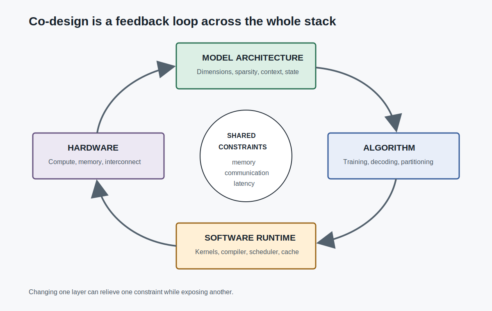

This is not a slogan. It is a constraint.

An attention variant that reduces asymptotic memory may still perform poorly if it maps badly to GPU memory access. A quantization method that reduces weight memory may not improve latency if decoding is dominated by KV cache bandwidth. A model-parallel strategy that fits the model may lose the gain through communication overhead. A batching strategy that improves throughput may harm tail latency for interactive users.

Every layer changes the tradeoff surface for the layers above and below it.

The rest of the book is organized around that fact.

Part I builds the shared vocabulary: tokens, probabilities, Transformer computation, tokenization, and decoding. Part II moves inside a single device: GPU programming, kernels, memory hierarchy, and attention acceleration. Part III studies training systems: frameworks, distributed data parallelism, model parallelism, ZeRO, and MoE. Part IV covers adaptation and compression. Part V turns to inference and serving: cost models, KV cache, vLLM, scheduling, disaggregation, and caching. Part VI returns to co-design as the durable engineering skill.

The visible product is language. The actual engineering object is a system that turns probability into service under resource constraints.

Owner: Principal Author  
Purpose: Chapter 1 ready draft after source extraction, brief, technical review, and red-team review  
Evidence grade: A for course-framing claims; no benchmark or historical model-scale numbers used  
Assumptions: The chapter should map the book and introduce bottlenecks without deriving formulas deeply  
Open questions: Whether to add a historical model-scale sidebar in a later revision  
Handoff: Production can move to book-level consistency audit

## Chapter 2: From Next-Token Probability to Transformer Computation {#chapter-2-from-next-token-probability-to-transformer-computation .chapter-title}

The previous chapter reduced language modeling to a simple contract:

```text
P(next token | previous tokens)
```

This chapter asks what that contract becomes when implemented.

The short answer is: a repeated tensor program. Tokens are converted to vectors. Those vectors pass through layers that mix information across positions, transform each position independently, normalize intermediate values, and finally produce logits over the vocabulary. During training, the program is run over many examples and optimized with cross-entropy. During inference, the same program is run repeatedly to extend a sequence one token at a time.

The Transformer is the dominant way to organize that computation. The original paper describes it as an attention-based encoder-decoder architecture that removes recurrence and convolution from the core sequence model, which is why it became the canonical baseline for later LLM systems. [CITE: vaswani-2017-attention-is-all-you-need]

### From Sequence Probability to Computation

The Transformer paper begins from sequence-to-sequence learning. In an encoder-decoder system, the model estimates the probability of a target sequence conditioned on a source sequence:

```text
p_theta(y | x) = product over t of p(y_t | x, y_1:t-1; theta)
```

That factorization says the decoder predicts each target token from the source and the previous target tokens. [CITE: llmsys-06-teacher-forcing]

Decoder-only LLMs remove the separate source/target split. The conditioning context is simply the prefix: prompt tokens plus already generated tokens. The same autoregressive idea remains. The model computes a distribution for the next token.

The implementation problem is to turn the prefix into a useful representation before scoring the vocabulary.

### Tokens Become Vectors

A neural network cannot directly multiply the string `"Pittsburgh"` or the token ID `19437`. It needs vectors.

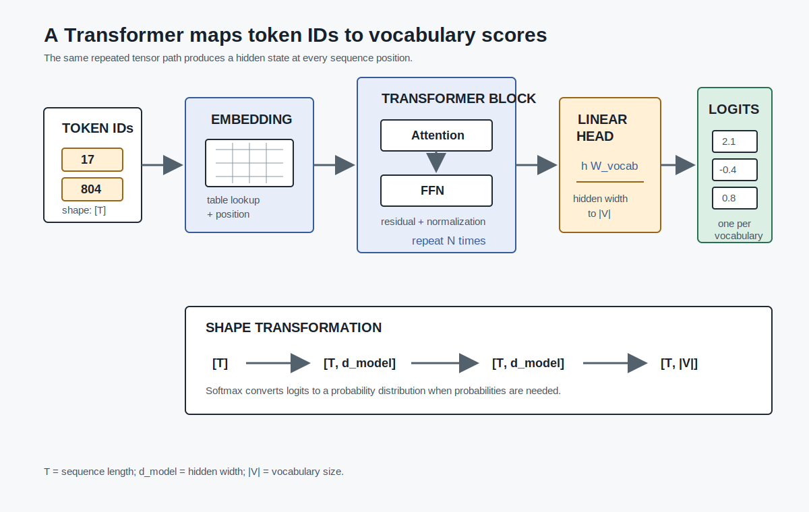

The first step is an embedding lookup. Each token ID indexes a learned row in an embedding table. If the model dimension is `d_model`, each token becomes a vector of length `d_model`.

At this point, the model knows which token appears at each position, but not enough about where it appears. The same token may mean different things at different positions. Transformer models therefore add some form of positional information to token embeddings. The original Transformer used sinusoidal positional encodings; modern LLMs often use relative-position mechanisms such as Rotary Positional Embeddings. The LLaMA paper uses RoPE in its decoder-only architecture, and the RoFormer paper gives the primary RoPE formulation. [CITE: llmsys-07-llama-architecture; su-2021-roformer-rope]

The exact positional method matters, but the system-level point is simpler: after tokenization and embedding, a sequence has become a matrix.

```text
sequence length x model dimension
```

Most of the rest of the model repeatedly transforms this matrix.

### Attention Mixes Positions

A token representation by itself is not enough. The representation for `"bridges"` should depend on whether the prefix is about Pittsburgh, dentistry, networking, or a card game.

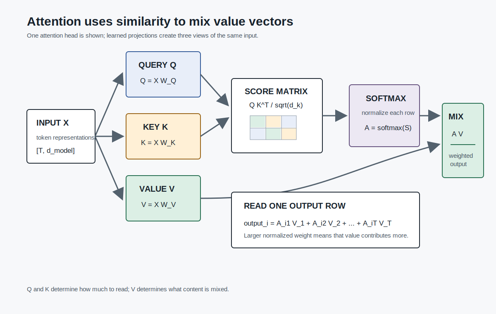

Attention is the mechanism that lets each position read from other positions.

For each input vector, the model computes three learned projections:

- query, or `Q`;
- key, or `K`;
- value, or `V`.

The query asks what the current position is looking for. The keys describe what other positions offer. The values carry the information to be mixed. In scaled dot-product attention, query-key scores are normalized with softmax and used as weights over values.

Multi-head attention splits representation space into multiple heads, applies attention per head, concatenates the results, and projects them back. The original Transformer paper is the primary source for that block structure. [CITE: llmsys-06-transformer-components; vaswani-2017-attention-is-all-you-need]

This is not just a modeling trick. It defines the model's central workload. Attention creates matrix multiplications, softmax operations, and memory reads/writes whose cost depends on sequence length, number of heads, and hidden dimension. Later chapters will return to this cost when discussing GPU kernels and FlashAttention.

### The Decoder Cannot Look Right

For an autoregressive decoder, attention needs a rule: position `t` may attend to positions `<= t`, but not to future positions.

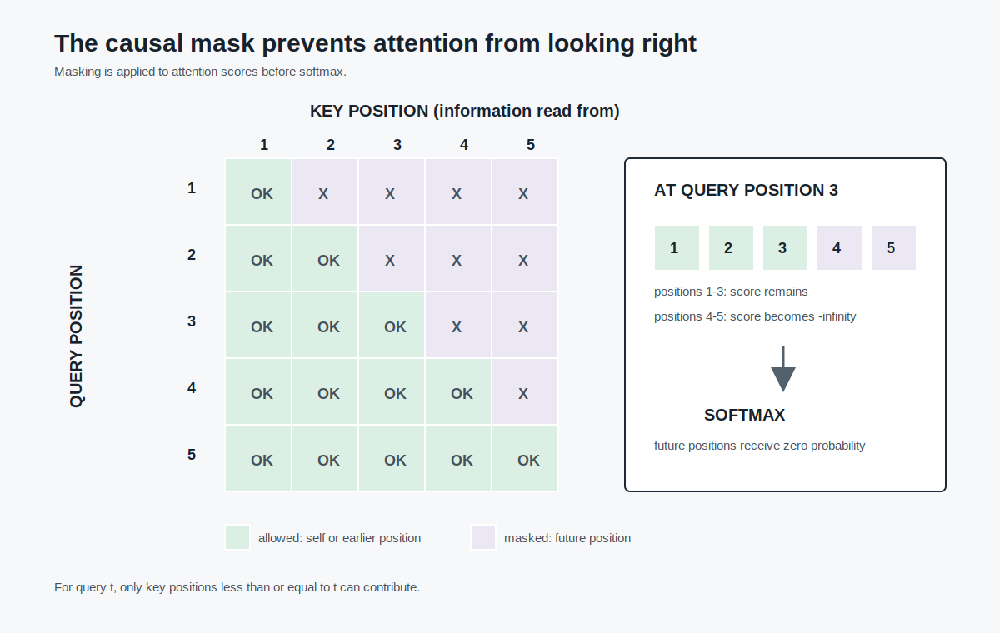

Decoder self-attention masks the right side before softmax by assigning those positions negative infinity. The original Transformer paper is the primary anchor for causal masking in the decoder. [CITE: llmsys-06-masked-self-attention; vaswani-2017-attention-is-all-you-need]

The mask enforces the probability factorization. If the model is training on:

```text
Pittsburgh is a city of bridges
```

then the representation used to predict `"bridges"` may see `"Pittsburgh is a city of"`, but the representation used to predict `"city"` must not see `"of bridges"`.

This distinction is easy to miss because training can process many positions in parallel under the mask. The mask blocks information, not computation. During inference, however, the next token is not known yet, so generation usually advances step by step. That gap between training parallelism and inference sequentiality will become central in the serving chapters.

### Feed-Forward Layers Transform Each Position

Attention mixes information across positions. The feed-forward network transforms each position's representation.

The Transformer block combines multi-head attention, feed-forward network, residual connections, and layer normalization. The original paper is the architectural baseline; the source cards are the systems-friendly explanation. [CITE: llmsys-06-transformer-components; vaswani-2017-attention-is-all-you-need]

Conceptually, the feed-forward part is a small neural network applied to each position. In many Transformer models, it expands the hidden dimension, applies a nonlinearity, and projects back. Older descriptions often use ReLU. Modern LLMs commonly use gated activations. The LLaMA paper uses SwiGLU as one of its architectural improvements. [CITE: llmsys-07-llama-architecture; touvron-2023-llama]

For systems work, the feed-forward network matters because it is often a large share of the model's arithmetic. A chapter that treats attention as the entire Transformer will mislead the reader. Attention is structurally distinctive; FFN layers are computationally heavy.

### Residuals and Normalization Keep the Stack Trainable

Large Transformers are deep stacks of repeated blocks. Each block modifies the representation, but it also passes information forward through residual connections. Layer normalization stabilizes intermediate activations.

Residual connection and layer normalization are core Transformer components, and the architecture distinguishes post-norm and pre-norm forms. [CITE: llmsys-06-transformer-components]

Modern decoder-only LLMs commonly use pre-normalization. The LLaMA paper is the primary anchor for that decoder-only variant. [CITE: llmsys-07-llama-architecture; touvron-2023-llama]

This is another example of a recurring pattern in LLM systems: a modeling choice changes the engineering envelope. Normalization placement affects training stability. Training stability affects how deep and large a model can be trained. How large the model becomes affects memory, parallelism, and serving cost.

### Training Uses Known Prefixes

During supervised sequence training, the decoder can be given the ground-truth prefix. [CITE: llmsys-06-teacher-forcing]

For a target sequence:

```text
I like singing and dancing
```

the model can be trained to predict each token using the true earlier tokens, not its own sampled mistakes. The loss sums the log-probability errors over positions.

Decoder-only language-model pretraining uses the same basic idea over raw text: predict the next token at each position from the previous tokens. Chapter 1 introduced this as cross-entropy next-token prediction. [CITE: llmsys-01-training-objective]

The system implication is useful: training can evaluate many token positions in one forward/backward pass. That is why training workloads are usually shaped around batches of sequences and large tensor programs. Inference for interactive generation has a different shape: many small serial extensions of active sequences.

### Encoder-Decoder, Decoder-Only, and Why the Difference Matters

The Transformer family includes more than one architecture.

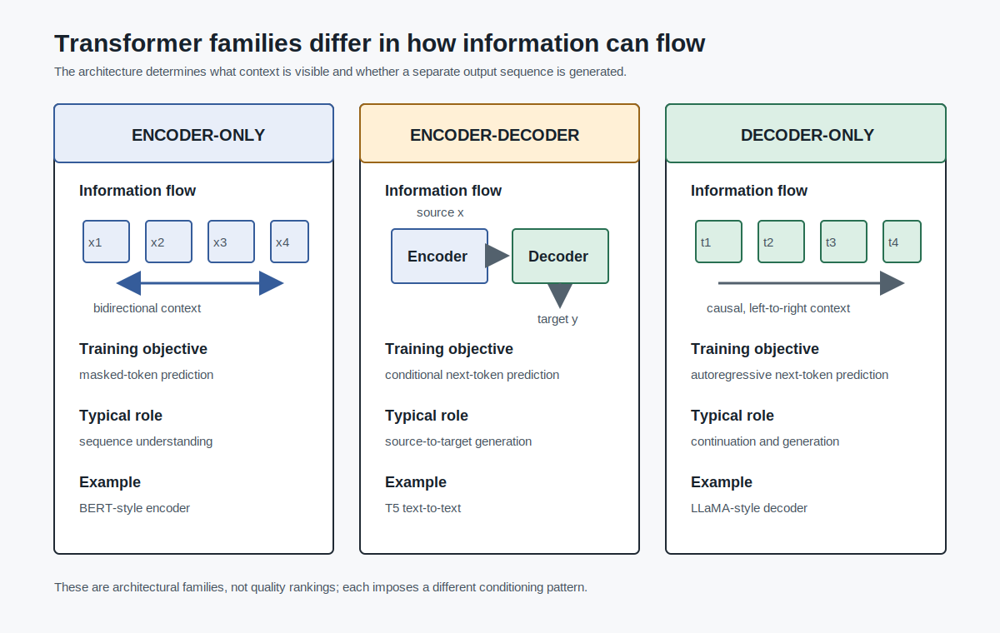

Encoder-decoder models read an input sequence with an encoder and generate an output sequence with a decoder. T5 uses a standard encoder-decoder Transformer using a unified text-to-text format, and the T5 paper is the primary source for that formulation. [CITE: llmsys-07-t5-text-to-text; raffel-2020-t5]

Decoder-only models use a causal Transformer decoder to model a single sequence from left to right. [CITE: llmsys-01-decoder-only]

For the rest of this book, that architectural distinction controls many system choices.

Encoder-decoder models naturally separate source encoding from target decoding. Decoder-only LLMs combine prompt and generated text into one growing context. In serving, that means the system must manage a context that expands token by token and reuse previous attention state efficiently. That reused state is the KV cache, which becomes a first-class memory object in later chapters.

### A Transformer Block as a Systems Object

It is tempting to describe a Transformer block only as a diagram in a paper:

```text
embedding -> attention -> add/norm -> FFN -> add/norm -> logits
```

For this book, that is only the first layer of understanding. A systems engineer sees additional questions:

- Which matrix multiplications dominate arithmetic?
- Which tensors dominate memory capacity?
- Which operations are bandwidth-bound?
- Which intermediate values must be saved for backward pass?
- Which tensors can be recomputed?
- Which work can be parallelized across devices?
- Which state must persist during decoding?

The Transformer is not merely an architecture. It is a workload template.

That template explains why the next chapters proceed in two directions. Chapter 3 studies the interface around the block: tokenization before it and decoding after it. The GPU chapters then study how the block runs efficiently on hardware. Training chapters study how to distribute the block and its state. Serving chapters study how to run the block repeatedly under latency and memory constraints.

The next-token objective is simple. The Transformer is how that objective becomes computation. LLM systems begin when that computation becomes too large, too stateful, or too latency-sensitive to treat as a single model call.

Owner: Principal Author  
Purpose: Chapter 2 ready draft after source extraction, brief, technical review, and red-team review  
Evidence grade: A for course lecture and primary-paper architecture claims; no benchmark numbers used  
Assumptions: This chapter should make Transformer computation legible and defer kernel-level detail  
Open questions: Whether to turn encoder-decoder versus decoder-only contrast into a compact table during later copyedit  
Handoff: Production can move to book-level consistency audit

## Chapter 3: Tokenization, Context, and Decoding {#chapter-3-tokenization-context-and-decoding .chapter-title}

The Transformer does not read text. It reads token IDs.

It also does not directly write prose. It produces a distribution over the next token. A decoding procedure turns that distribution into an actual sequence.

Those two interfaces, tokenization before the model and decoding after the model, shape almost every system property that follows. Tokenization changes sequence length, vocabulary size, embedding cost, multilingual behavior, and how text maps into model memory. Decoding changes quality, diversity, latency, batching behavior, and how much work must be done one step at a time.

This chapter is about the boundary around the Transformer block.

### Tokens Are Not Words

A tokenizer splits text into units that can index an embedding table. The token IDs are the model's discrete interface. [CITE: llmsys-08-tokenization-tradeoffs]

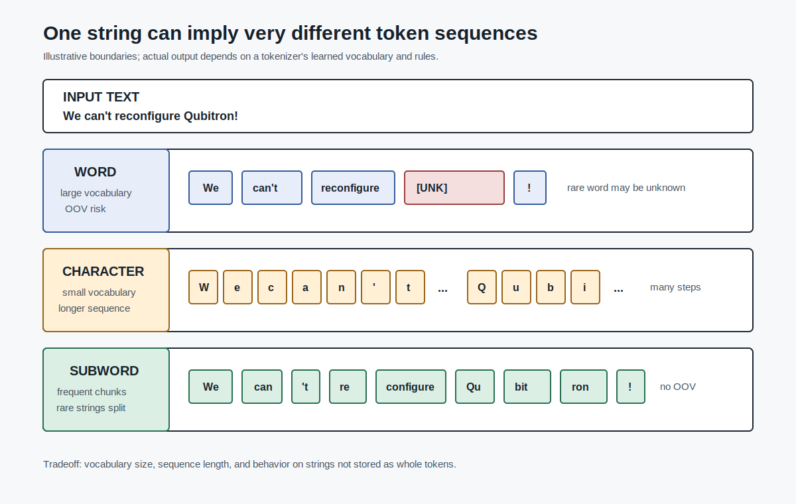

That sounds simple until the word "unit" is taken seriously.

Consider:

```text
Bob's handyman is a do-it-yourself kinda guy, isn't he?
```

Is `Bob's` one word or two? Is `do-it-yourself` one word, three words, or a compound? What about `isn't`? What about languages that do not use spaces between words?

Word boundaries are not a universal technical foundation. Word-level tokenization is easy for some languages and brittle for others. It creates out-of-vocabulary behavior: if a word was not in the vocabulary, the system needs an unknown token or another fallback. A larger vocabulary reduces unknowns but increases the number of learned embedding and output parameters. A smaller vocabulary is cheaper but loses coverage. The subword paper on rare-word translation is the primary source for that open-vocabulary motivation. [CITE: llmsys-08-tokenization-tradeoffs; sennrich-2016-bpe-rare-words]

Character-level tokenization avoids many unknown-token problems. Any word can be spelled as characters. But character sequences are longer. Longer sequences increase the amount of work the Transformer must do. Tokens also become less semantically compact: a single character often carries less meaning than a word or subword.

Subword tokenization is the compromise most modern LLM readers encounter. Frequent patterns can become tokens. Rare words can decompose into smaller units.

### BPE as a Compression Habit

Byte Pair Encoding, or BPE, starts from small units and repeatedly merges frequent adjacent pairs into new tokens until the vocabulary reaches a target size. The Sennrich paper is the primary anchor for this NMT use of subword units. [CITE: llmsys-08-bpe-algorithm; sennrich-2016-bpe-rare-words]

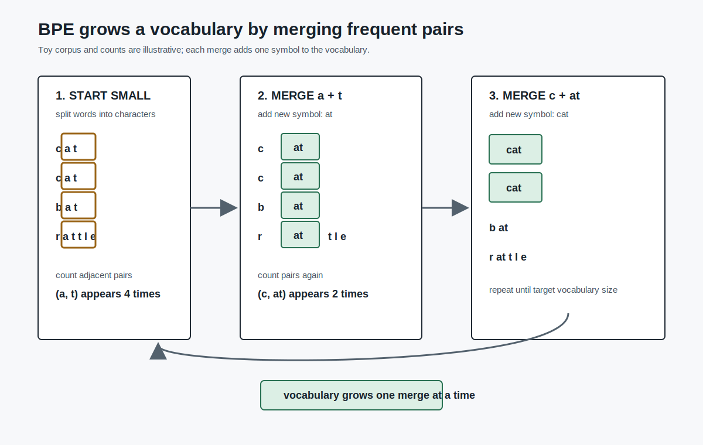

A small toy example is enough:

```text
cat
catch
rat
rattle
```

If `a` followed by `t` appears often, the tokenizer may merge `a` and `t` into `at`. If `c` followed by `at` appears often, it may merge into `cat`. Over many merges, common chunks become single tokens.

BPE tokens are not guaranteed to be linguistic units. They are artifacts of corpus statistics and merge rules. That is part of their usefulness. The tokenizer does not need a complete theory of morphology. It needs a vocabulary that keeps sequences manageable while still representing rare strings.

The systems consequence is direct:

```text
more tokens in the sequence -> more positions for the model to process
larger vocabulary -> larger embedding/output tables
```

Neither side is free.

### Vocabulary Size Is a Systems Choice

Tokenizer design affects at least four costs.

First, it affects sequence length. If a language, domain, or notation is over-tokenized, a short human string becomes a long model sequence. That increases attention work, KV cache size, and latency.

Second, it affects vocabulary size. A larger vocabulary means larger embedding and output projection structures. It may shorten sequences, but it also increases the dimension of the final token distribution.

Third, it affects data distribution. Tokenization choices can make code, numbers, and multilingual text easier or harder for the model to represent.

Fourth, it affects downstream adaptation. If a tokenizer poorly represents a language or domain, fine-tuning has to work against the representation.

Practical LLM tokenization includes corpus deduplication and filtering, handling code, handling numbers, multilingual vocabulary capacity, vocabulary sharing, and tokenizer-free alternatives. SentencePiece is the primary source for raw-sentence subword training, and the LLaMA paper anchors the modern decoder-only example. [CITE: llmsys-08-practical-tokenization; kudo-richardson-2018-sentencepiece; touvron-2023-llama]

This book will not treat those as preprocessing footnotes. Tokenization defines the first resource model of an LLM request: how many tokens enter the system.

### Context Is a Budget

Once text is tokenized, context length becomes a budget.

A model that accepts `N` tokens does not accept `N` words. It accepts `N` tokenizer outputs. The same paragraph may cost different numbers of tokens in different languages, domains, or tokenizers. Code and math notation may behave differently from ordinary prose. A multilingual system may give some languages a shorter representation than others.

That budget matters during both training and inference.

During training, sequence length affects activation memory and attention computation. During inference, prompt length affects prefill work and KV cache size. During decoding, every generated token extends the context and adds new cache state.

This is why tokenization belongs in a systems book. A tokenizer choice can show up later as a memory problem, a throughput problem, or a fairness problem across languages.

### Decoding Turns Probabilities Into Text

The model produces logits for the next token. Decoding decides what to do with them.

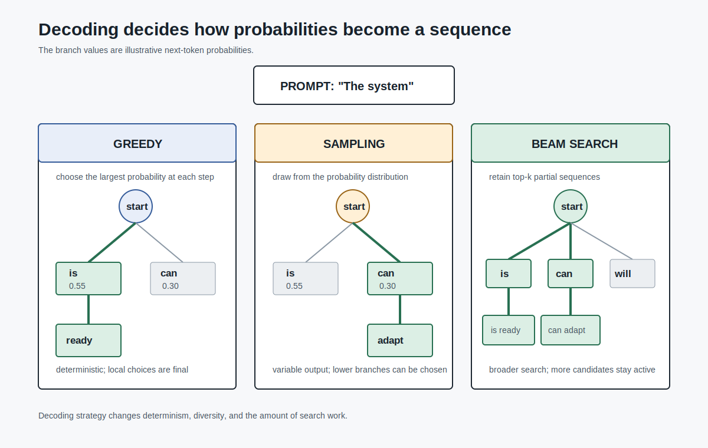

Sequence decoding asks for:

```text
argmax_y P(y | x)
```

The exhaustive search over all possible sequences is too expensive. With vocabulary size `V` and sequence length `N`, the naive search space grows exponentially. The speculative decoding paper is the primary source for that acceleration strategy. [CITE: llmsys-09-autoregressive-decode-latency; leviathan-2022-speculative-decoding]

Practical systems use approximate procedures.

Greedy decoding chooses the highest-probability next token at each step. It is simple and cheap, but each local decision is final. Sampling draws from the model's distribution, often with additional controls. Beam search keeps multiple partial candidates and expands them step by step. Beam search keeps the top `k` partial sequences at each step and expands them with one more forward generation. [CITE: llmsys-09-beam-search]

Each method expresses a different tradeoff:

- greedy decoding favors determinism and low overhead;
- sampling favors diversity;
- beam search favors approximate sequence-level search at higher compute cost.

These are not only quality choices. They affect runtime behavior.

### Autoregression Is Serial

The main system constraint in decoding is that the model usually cannot generate token `t + 1` until token `t` has been selected.

LLM autoregressive decoding is slow because generation proceeds one token at a time, and producing `N` tokens normally requires `N` forward passes. [CITE: llmsys-09-autoregressive-decode-latency; leviathan-2022-speculative-decoding]

This serial dependency separates LLM inference from many throughput-oriented neural network workloads. A vision classifier can process an image and finish. A language model serving request may remain active for hundreds or thousands of decode steps. Each step is small compared with the full prompt prefill, but it is latency-sensitive and stateful.

That is why later serving chapters will distinguish prefill from decode. Prefill processes the input context. Decode extends it.

### Speculative Decoding Changes the Work Shape

Speculative decoding attacks the serial bottleneck by adding another model.

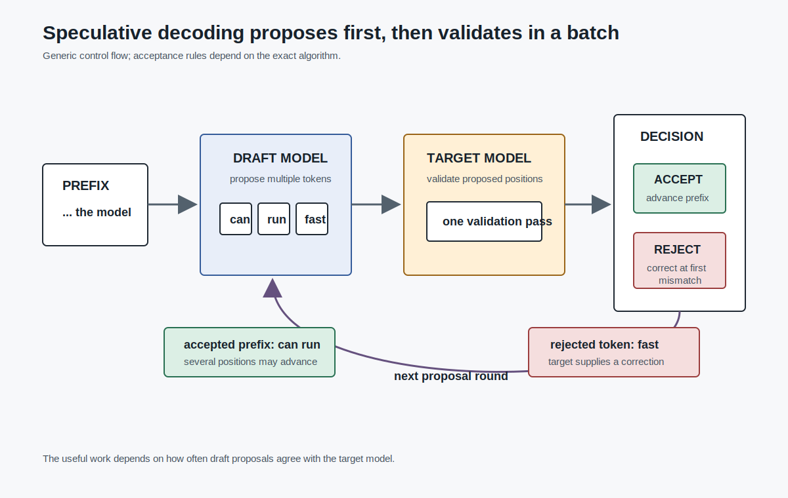

The basic idea is to use a smaller draft model to propose several tokens, then use the larger target model to validate them. The primary speculative decoding paper keeps the target distribution exact. [CITE: llmsys-09-speculative-decoding; leviathan-2022-speculative-decoding]

The intuition is:

```text
small model proposes several likely next tokens
large model checks those proposed tokens
accepted tokens advance the sequence faster
rejected tokens force correction
```

The benefit depends on alignment between draft and target models. If draft tokens are often accepted, the system can reduce latency. If they are often rejected, the extra draft work may not help. Common draft lengths such as `N = 4` or `N = 8` should be treated as workload-dependent rather than universal. [CITE: llmsys-09-speculative-decoding; chen-2023-speculative-sampling]

For this chapter, speculative decoding is mainly a preview. The deeper serving question is how to schedule many active requests, each with different prompt lengths, decode lengths, cache states, and latency targets.

### Advanced Sidebar: EAGLE as a Hint of the Direction

EAGLE predicts final-layer features rather than directly predicting next tokens with a separate small language model. It uses the original model's embedding and language-model head, a small Transformer layer, and tree attention for efficient implementation. [CITE: llmsys-09-speculative-decoding; li-2024-eagle]

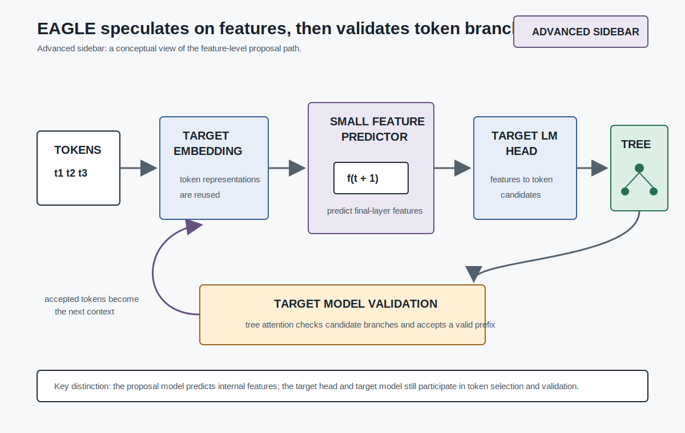

The details are advanced enough to defer. The important lesson is that decoding acceleration is not only about choosing a different search algorithm. It can change the internal representation being predicted, the attention mask used for validation, and the shape of the work presented to the hardware.

Decoding is part of system design.

### The Boundary Becomes the Workload

Tokenization and decoding sit on opposite sides of the Transformer, but they meet in the same resource model.

Tokenization determines how long the input is. Decoding determines how long generation runs. Together they shape:

- how much prefill work is needed;
- how large the KV cache becomes;
- how many decode steps remain active;
- how requests batch together;
- how much memory is consumed per user;
- how output quality trades against latency.

The model's next-token distribution is only the center of the system. The full LLM workload includes everything required to feed that distribution and turn it into text.

The next part of the book moves down a layer. Once text has become token matrices and decoding has created a workload, the question becomes how that workload runs on hardware. The next chapters enter the GPU.

Owner: Principal Author  
Purpose: Chapter 3 ready draft after source extraction, brief, technical review, and red-team review  
Evidence grade: A for course lecture and primary-paper tokenization/decoding claims; no benchmark numbers used  
Assumptions: This chapter introduces decoding concepts and defers serving architecture to Chapters 12-14  
Open questions: Whether tokenizer-free models belong as a later sidebar  
Handoff: Production can move to book-level consistency audit

# Part II — Single-Device Computation {#part-ii-single-device-computation .part-title}

## Chapter 4: Inside the GPU Programming Model {#chapter-4-inside-the-gpu-programming-model .chapter-title}

The previous chapters turned text into a workload. Tokens become vectors. Vectors pass through attention, feed-forward layers, normalization, softmax, and output projections. Decoding repeats part of that computation one token at a time.

This chapter asks where that computation runs.

A GPU is not a magic box for matrix multiplication. It is a parallel processor with its own memory, execution hierarchy, programming model, and failure modes. To use it well, a program must expose parallel work, map that work onto threads, keep data movement under control, and respect the hardware's memory hierarchy.

The goal here is not to write a production Transformer kernel. The goal is to make the GPU programming model legible enough that later chapters can talk precisely about memory bandwidth, kernel fusion, tiling, FlashAttention, and serving bottlenecks.

### Operators Become Kernels

From the model's point of view, a Transformer block contains familiar operations:

- matrix multiplication;
- elementwise operations such as add, scale, and activation functions;
- reductions such as sum and average;
- normalization;
- softmax;
- memory movement.

These are the same low-level operator families that appear in simpler neural networks. A feed-forward classifier may use embeddings, linear layers, ReLU, average pooling, and softmax. A Transformer uses larger and more structured versions of the same computational ingredients. [CITE: llmsys-02-low-level-operators]

On a GPU, these operators run as kernels. A kernel is a function executed by many GPU threads. The source code for a single thread may look serial, but the launch creates many instances of that code running across different data elements. [CITE: llmsys-02-cuda-programming-model]

This is the first shift in thinking: GPU programming is not mainly about writing one clever loop. It is about describing a large set of similar operations so the device can run them in parallel.

### Host and Device

CUDA programs have two sides.

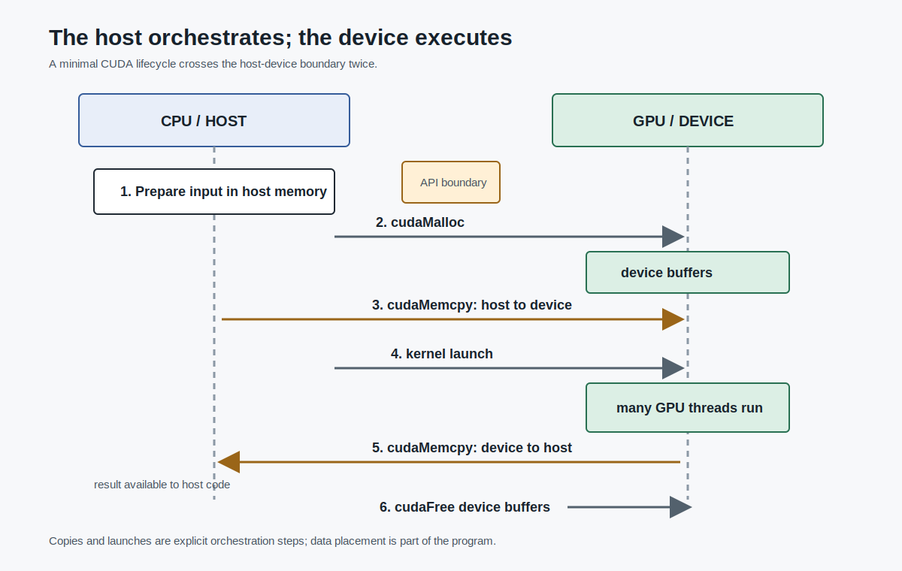

The CPU is the **host**. It runs the ordinary program, prepares data, allocates memory, launches kernels, and coordinates the computation. The GPU is the **device**. It runs kernel code over many threads. [CITE: llmsys-02-cuda-programming-model]

A minimal CUDA workflow looks like this:

```text
allocate device memory
copy input data from host memory to device memory
launch a kernel on the device
copy output data from device memory to host memory
free device memory
```

The common CUDA calls in that lifecycle are `cudaMalloc`, `cudaMemcpy`, kernel launch syntax, and `cudaFree`. [CITE: llmsys-03-cuda-memory-lifecycle]

This lifecycle is simple, but it already contains the performance trap. Copying data between CPU memory and GPU memory is not free. If a program repeatedly moves small tensors across the host-device boundary, it may spend more time moving data than computing. [CITE: llmsys-02-cpu-gpu-data-movement]

For LLM systems, this lesson scales up. We care not only about how many floating-point operations a model requires, but also where tensors live and how often they move. A serving system that constantly moves weights, activations, or KV cache blocks across slow paths will waste hardware even if the math kernels are fast.

### Launching Parallel Work

A kernel launch specifies how many GPU threads should run and how those threads are grouped.

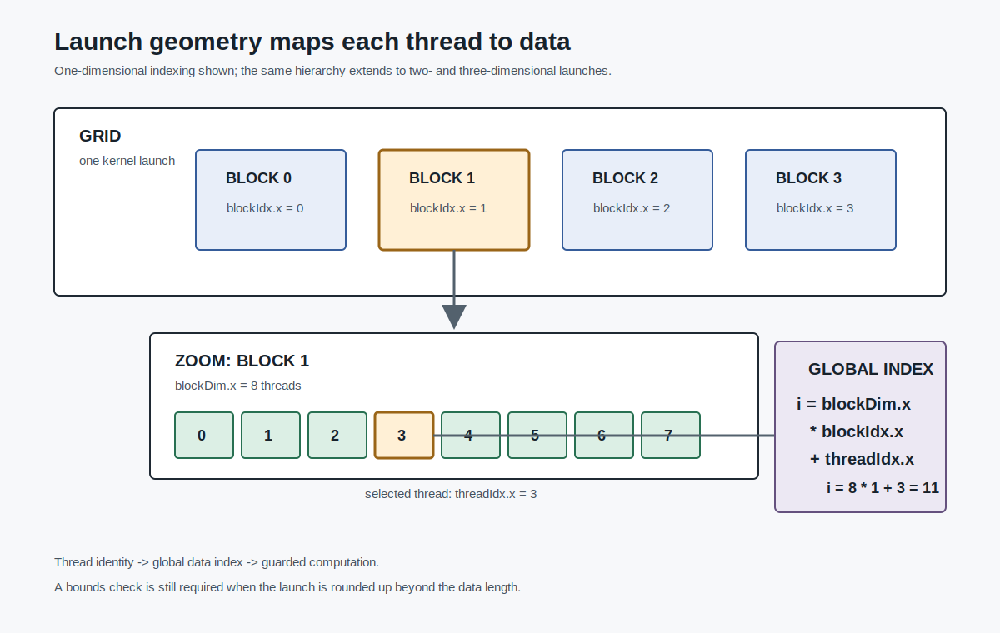

CUDA organizes work as:

```text
grid -> blocks -> threads
```

A grid contains many thread blocks. A block contains many threads. The host chooses the grid dimensions and block dimensions when it launches the kernel. [CITE: llmsys-02-warp-execution; llmsys-03-launch-configuration]

The launch configuration is not decoration. It decides how the program's logical work is divided across the device. A vector operation with one million elements needs enough threads to cover one million outputs. A matrix operation often uses two-dimensional blocks and grids so that thread coordinates map naturally to rows and columns.

The key idea is that each thread needs to know which piece of data it owns.

### One Thread, One Output

Vector addition is the smallest useful CUDA example. Given arrays `A`, `B`, and `C`, each output element can be computed independently:

```text
C[i] = A[i] + B[i]
```

On the GPU, a common mapping is one thread per output element. Each thread computes its global index from its block and thread position:

```cuda
int i = blockDim.x * blockIdx.x + threadIdx.x;
if (i < n) {
  C[i] = A[i] + B[i];
}
```

The built-in variables expose the launch structure. `blockIdx.x` identifies the block. `threadIdx.x` identifies the thread within that block. `blockDim.x` tells the thread how many threads are in each block. [CITE: llmsys-03-thread-indexing; llmsys-03-vector-addition]

The bounds check matters because launches are usually rounded up. If `n = 1000` and the program launches blocks of 256 threads, it needs four blocks, or 1024 total threads. The last 24 threads do not own valid output elements. They must exit without writing.

This tiny example contains the core CUDA habit:

```text
thread identity -> data index -> guarded computation
```

Most GPU kernels are more complex, but they still begin with this mapping problem.

### From Vectors to Matrices

For a matrix, one-dimensional indexing is no longer the most natural shape. A matrix element has a row and a column.

A two-dimensional launch can map one thread to one matrix element:

```cuda
int row = blockIdx.y * blockDim.y + threadIdx.y;
int col = blockIdx.x * blockDim.x + threadIdx.x;

if (row < n && col < n) {
  C[row * n + col] = A[row * n + col] + B[row * n + col];
}
```

The principle is unchanged. Each thread computes an identity from the launch geometry and uses that identity to decide which output element to write. [CITE: llmsys-03-matrix-indexing]

Matrix addition is still not matrix multiplication. It has little data reuse and little arithmetic per element. Matrix multiplication is more interesting because each output element depends on many input elements, and good performance depends on reusing data that would otherwise be read repeatedly. That is a Chapter 5 problem.

For now, the important point is that tensors are not abstract once they reach the GPU. Their shape affects the launch shape. Their layout affects memory access. Their reuse pattern affects whether the kernel is limited by arithmetic or by data movement.

### SMs, Warps, and SIMT

Threads do not float around independently. GPU hardware groups and schedules them.

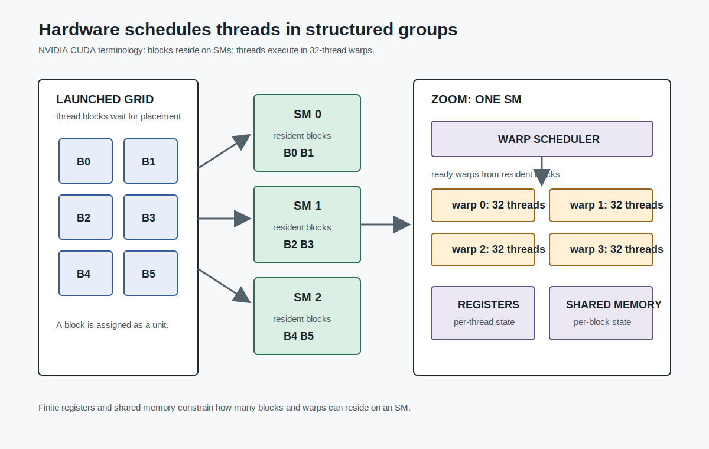

NVIDIA GPUs are built from streaming multiprocessors, or SMs. Thread blocks are assigned to SMs. Within an SM, threads execute in groups called warps. In CUDA, a warp contains 32 threads. Those threads execute in a single-instruction, multiple-thread style: the warp issues one instruction across its active threads. [CITE: llmsys-02-gpu-architecture; llmsys-02-warp-execution]

This model explains several later performance ideas.

First, a GPU needs enough active warps to hide latency. If one warp waits for memory, the scheduler can run another warp. This is why occupancy matters, although high occupancy alone does not guarantee high performance.

Second, branch behavior matters. If threads in the same warp take different branches, execution may have to cover both paths for different active lanes. That can reduce efficiency.

Third, resource use matters. Registers and shared memory are limited. A kernel that uses too many per-thread or per-block resources may reduce how many warps can reside on an SM at once.

This chapter does not need every scheduler detail. It needs the durable mental model: the GPU runs many threads, but the hardware schedules them in structured groups with finite local resources.

### Memory Is Part of the Program

A fast GPU program often starts by avoiding unnecessary movement.

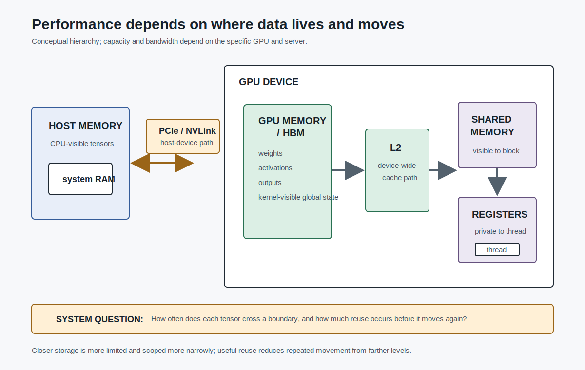

The memory hierarchy includes several levels:

- registers, private to a thread and very fast;
- shared memory, visible to threads in a block;
- global GPU memory, visible across kernels and threads;
- caches such as L2;
- host system memory, reached through CPU-GPU transfer paths.

Registers, shared memory, global GPU memory, L2 cache, system memory, and interconnect bandwidth belong to the same performance story. [CITE: llmsys-02-gpu-architecture; llmsys-02-cpu-gpu-data-movement]

This is where a correct CUDA program can be far from a fast CUDA program.

A naive kernel may launch many threads and still perform poorly because each thread reads scattered data from global memory. Another kernel may do the same arithmetic but load tiles into shared memory, reuse them, and reduce global-memory traffic. Another may fuse several elementwise operations so intermediate tensors never need to be written out and read back.

These choices are not micro-optimizations for LLM systems. They determine whether Transformer blocks run near hardware capability or spend most of their time waiting for data.

### The GPU Server Is a System

An LLM usually runs on a server, not on an isolated GPU diagram.

A modern GPU server includes CPUs, system memory, storage, GPUs, GPU memory, and interconnects such as PCIe or NVLink. [CITE: llmsys-02-gpu-server-components]

That matters because LLM workloads cross boundaries:

- input data moves from storage and host memory toward the GPU;
- training gradients may move between GPUs;
- model-parallel layers may exchange activations;
- inference systems may move KV cache blocks or route requests across devices;
- checkpoints may move large parameter states through storage and network paths.

Chapter 1 framed LLM systems as compute, memory, bandwidth, communication, and scheduling. The GPU programming model gives those words a concrete substrate. There is device memory, host memory, interconnect bandwidth, SM scheduling, warp execution, and kernel launch overhead.

Once these are visible, "make it faster" becomes a sharper question: faster arithmetic, fewer memory reads, better data reuse, fewer host-device transfers, more useful occupancy, less synchronization, or better scheduling?

### Correct Is Not Fast

The first goal of GPU programming is correctness: launch enough threads, index the right elements, avoid out-of-bounds writes, copy the right data, and free memory when done.

The second goal is performance. That is harder.

A correct vector-add kernel teaches the programming model, but it does not teach high-performance LLM kernels. Transformer workloads need better answers to harder questions:

- How are matrix multiplications tiled?
- Which tensors fit in shared memory?
- Which operations are memory-bandwidth bound?
- Which elementwise operations can be fused?
- Which intermediate values must be materialized?
- Which memory layout gives coalesced access?
- How much parallelism is available at a given sequence length and batch size?

Those questions belong to the next two chapters. Chapter 5 studies kernels, memory movement, and Transformer blocks. Chapter 6 uses FlashAttention as a concrete case where algorithm design and GPU memory hierarchy meet.

The point of this chapter is the foundation: a GPU program is a host-orchestrated, device-executed, massively threaded program whose performance is shaped as much by memory movement and execution layout as by arithmetic.

Owner: Principal Author  
Purpose: Chapter 4 ready draft after source extraction, brief, technical review, and red-team review  
Evidence grade: A for course lecture claims and official CUDA documentation cards; no benchmark numbers used  
Assumptions: Chapter 4 uses minimal CUDA snippets, not full compilable examples  
Open questions: Decide whether runnable CUDA examples belong in appendix or examples directory  
Handoff: Production can move to front-half Chapter 1-3 reviews or book-level consistency audit

## Chapter 5: Kernels, Memory, and Transformer Blocks {#chapter-5-kernels-memory-and-transformer-blocks .chapter-title}

Chapter 4 made a GPU program concrete. The host launches a kernel. The device runs many threads. Threads are grouped into blocks and warps. Each thread maps its identity to data.

That is enough to write a correct CUDA program. It is not enough to write a fast one.

The next question is performance: what is the GPU waiting for? Sometimes it waits for arithmetic. Often it waits for data. Transformer blocks are large tensor programs, but their performance is not determined only by peak FLOPs. It is shaped by memory bandwidth, data reuse, access layout, synchronization, launch overhead, precision, and intermediate tensor storage.

This chapter turns the GPU programming model into performance reasoning.

### Memory-Bound Is a Real Category

A GPU can advertise enormous arithmetic throughput and still run a kernel slowly. The reason is simple: arithmetic units need data. If data arrives too slowly, the compute units wait.


One useful question is:

```text
How much useful arithmetic does the kernel perform for each byte moved from global memory?
```

This is often called arithmetic intensity or compute-to-memory-access ratio. The exact model can become sophisticated, but the first-order lesson is enough for now: a kernel with little computation per byte loaded is likely to be memory-bound. [CITE: llmsys-04-memory-access-efficiency]

Vector addition is the simplest example:

```text
C[i] = A[i] + B[i]
```

Each element performs one addition, but it loads two values and stores one result. There is little reuse. Making the addition unit faster does not help much if the kernel is already waiting for memory traffic.

Transformer systems encounter the same pattern in less obvious places. Elementwise adds, dropout masks, residual connections, simple reshapes, and some normalization steps can move large tensors while doing relatively little arithmetic.

### Naive Matrix Multiplication Wastes Reuse

Matrix multiplication has more arithmetic, but a naive implementation can still waste memory bandwidth.


A simple kernel assigns one output element to one thread:

```cuda
float acc = 0.0;
for (int k = 0; k < N; k++) {
  acc += A[row * N + k] * B[k * N + col];
}
C[row * N + col] = acc;
```

Each output element re-reads a row of `A` and a column of `B`. Neighboring threads often need overlapping data, but the naive kernel does not explicitly reuse it. A simplified accounting gives two floating-point operations for two FP32 global-memory reads, yielding `0.25 FLOP/B` under that model. [CITE: llmsys-04-naive-matmul-intensity]

That number should be read as intuition, not as a complete performance model. Real GPUs have caches, vectorized loads, tensor cores, scheduling effects, and library kernels with much more sophisticated structure.

The important point is durable: if a kernel repeatedly fetches the same data from global memory, peak FLOPs will not save it.

### Tiling Turns Bandwidth Into Reuse

Tiling is a standard answer to that problem.

Instead of having each thread independently read all operands from global memory, a thread block cooperatively loads a small tile of `A` and a small tile of `B` into shared memory. Threads synchronize. Then they reuse the tile data to update partial sums. The block repeats this process across the `k` dimension until the output tile is complete. [CITE: llmsys-04-tiling-shared-memory]

The shape is:

```text
load A tile and B tile into shared memory
wait for the block to finish loading
compute partial sums using shared memory
wait before reusing shared memory
move to the next tile
```

The key change is not the mathematical formula. It is where data lives while it is reused.

Global memory is large but relatively expensive to access. Shared memory is smaller but closer to the SM. Tiling spends coordination and shared-memory capacity to reduce repeated global-memory traffic.

This is why Chapter 4's memory hierarchy matters. If all memory looked the same, tiling would be less important. On GPUs, the distance between registers, shared memory, caches, and global memory is part of the algorithm.

### Layout Decides Whether Warps Load Efficiently

Tiling is about reuse. Coalescing is about access shape.


When neighboring threads in a warp access neighboring memory addresses, the hardware can combine those accesses efficiently. When those same threads access scattered or strided addresses, the hardware may need more memory transactions. [CITE: llmsys-04-coalesced-access]

Matrix transpose is the clean example. Reading a row-major matrix by rows gives adjacent threads adjacent addresses. Writing the transposed output can turn that pattern into strided writes. The kernel may be correct, but its memory behavior can be poor.

Shared memory can help here too. A block can load a tile from global memory in a coalesced pattern, transpose the tile in shared memory, then write it back in a more favorable pattern. This does not change the mathematical operation. It changes the route data takes through the memory hierarchy.

There is another layer inside shared memory: bank conflicts. Shared memory is divided into banks. Certain access patterns can cause multiple threads to hit the same bank in a way that serializes access. Padding a shared-memory tile can avoid some conflict patterns. [CITE: llmsys-04-bank-conflict]

This is an advanced detail, but the lesson is simple: performance depends not only on which data a kernel accesses, but also on how a warp's addresses line up with the memory system.

### Libraries Are Part of the Design

High-performance dense linear algebra is hard. Production GEMM kernels use deep hardware knowledge: tiling across memory levels, vectorized instructions, tensor cores, scheduling, and many shape-specific choices.

That is why systems often rely on optimized libraries for standard dense operations. cuBLAS provides CUDA BLAS routines, including vector dot product, matrix-vector multiplication, and matrix-matrix multiplication. [CITE: llmsys-04-cublas]

For LLM systems, this creates a practical boundary.

If the operation is a standard dense GEMM, the first answer is usually not "write a custom kernel." It is to use a mature library or framework path that dispatches to one.

But Transformer blocks are not only GEMM. They also contain elementwise operations, reductions, reshapes, masks, dropout, residual additions, normalization, softmax, cross entropy, and memory-management decisions. That is where custom kernels and fusion become important.

### Transformer Blocks Are Mixed Workloads

A Transformer block contains GEMM-heavy work:


- projections to `Q`, `K`, and `V`;
- attention output projection;
- feed-forward network linear layers;
- vocabulary projection.

These are natural library-kernel territory.

It also contains non-GEMM work:

- bias addition;
- dropout;
- residual addition;
- LayerNorm;
- softmax;
- reshape and transpose;
- masking;
- cross entropy during training;
- memory allocation and reuse.

For systems work, this stack separates into GEMM, custom elementwise operators, and custom reduction operators. [CITE: llmsys-10-transformer-operator-stack]

This distinction prevents a common misunderstanding. Attention and FFN layers may be dominated by matrix multiplication in some regimes, but end-to-end Transformer performance also depends on all the smaller operations around those GEMMs. A system that calls fast GEMM kernels and then spills many intermediate tensors through global memory can still leave performance on the table.

### Kernel Fusion Removes Unnecessary Boundaries

Kernel fusion combines multiple simple operations into one kernel.


Suppose a program computes:

```text
C = A + B
E = C + D
```

Two separate kernels must write `C` to memory and then read `C` back. A fused kernel can compute:

```text
E = A + B + D
```

It loads the inputs, performs the arithmetic, and writes the final output once. The benefit is reduced launch overhead and less extra memory access. [CITE: llmsys-10-kernel-fusion]

Transformer blocks have many opportunities of this kind. Bias addition, dropout, residual addition, scaling, masks, and simple activations often surround larger operations. Fusing them can reduce intermediate writes and reads.

The fused embedding example follows the same idea. Word embedding lookup, positional embedding lookup, scaling, and dropout can be organized as one fused path instead of several separate launches with intermediate tensors. [CITE: llmsys-10-fused-embedding]

Fusion is not free. A fused kernel may become more complex, use more registers, reduce occupancy, or be less reusable across shapes. The point is not to fuse everything. The point is to remove boundaries that exist only because the framework represented an expression as several separate operators.

### Reductions Are Synchronization Problems

Some Transformer operators are difficult because they require reductions.

LayerNorm computes statistics across a hidden dimension. Softmax computes row-wise normalization, usually involving a maximum for numerical stability and a sum of exponentials. These are not simple one-thread-per-output elementwise operations. Threads need to cooperate, exchange partial results, and synchronize. [CITE: llmsys-10-layernorm-reduction-rewrite; llmsys-10-softmax-reduction]

This makes reduction-heavy operators sensitive to shape and implementation.

A softmax over a short row may need a different kernel strategy from a softmax over a long row. The number of columns, rows, warps per block, and memory layout all affect performance. Softmax launch parameters are therefore shape-dependent. [CITE: llmsys-10-softmax-reduction]

LayerNorm has a similar character. The algebra can sometimes be rearranged to reduce synchronization. For example, variance can be expressed using mean of squares minus square of mean, which changes the reduction structure. The final formula and numerical details need careful technical review before publication, but the systems point is already clear: algebraic form affects synchronization. [CITE: llmsys-10-layernorm-reduction-rewrite]

This is one reason ML systems work sits between algorithms and hardware. A mathematically equivalent expression can produce a different execution plan.

### Mixed Precision Changes the Resource Model

Precision is a systems choice as well as a numerical one.

Modern GPUs support lower-precision formats such as FP16, BF16, FP8 on some hardware, and specialized tensor operations. Lower precision can reduce storage, reduce memory traffic, and increase effective compute throughput. [CITE: llmsys-10-mixed-precision]

But lower precision cannot simply be applied everywhere without thought. Training often keeps some optimizer state or update arithmetic in FP32 for stability. Forward/backward low-precision computation and FP32 optimizer updates serve different roles. [CITE: llmsys-10-mixed-precision]

The important habit is to ask what each tensor is used for:

- Is it an activation used briefly during forward pass?
- Is it a gradient accumulated across steps or devices?
- Is it a parameter copy used for updates?
- Is it a cache that persists across decode steps?
- Is it part of a numerically sensitive reduction?

Different answers justify different precision choices.

### Memory Reuse Depends on Liveness

Another optimization pattern is memory reuse.

During training, the backward pass needs some forward activations but not all intermediates forever. During inference, the system usually does not need gradients at all. If a tensor is no longer needed, its storage can be reused for another tensor. [CITE: llmsys-10-memory-reuse]

This turns memory management into a liveness problem:

```text
When is this value last used?
Can its buffer be reused safely?
Would recomputing it be cheaper than storing it?
```

Transformer attention backward is a dense example because it creates many intermediate gradients and temporary tensors. Serving has a different version of the same issue: KV cache persists, while many intermediate activations can be discarded after a decode step.

This pattern will reappear in ZeRO, activation checkpointing, KV cache management, and serving systems. The details change, but the question remains the same: which tensors must exist at the same time?

### The Chapter 5 Pattern

The techniques in this chapter are different on the surface:

- tiling;
- coalesced access;
- library GEMM;
- kernel fusion;
- reduction rewrites;
- mixed precision;
- memory reuse.

They are all responses to the same pressure: the Transformer block is a large computation whose bottleneck changes by operator, shape, precision, and hardware.

The engineer's job is to identify which resource is active:

- arithmetic throughput;
- global-memory bandwidth;
- shared-memory capacity;
- register pressure;
- synchronization;
- kernel launch overhead;
- intermediate tensor storage;
- numerical precision.

Chapter 6 narrows this pattern to attention. FlashAttention is useful not just because it is a faster attention kernel, but because it shows the full co-design loop: change the algorithm so the GPU memory hierarchy sees a better workload.

Owner: Principal Author  
Purpose: Chapter 5 ready draft after source extraction, brief, technical review, and red-team review  
Evidence grade: A for course lecture claims and official cuBLAS documentation card; no benchmark numbers used  
Assumptions: Chapter 5 explains performance patterns and defers FlashAttention details to Chapter 6  
Open questions: Add primary LightSeq/LightSeq2 cards if the final chapter keeps named case-study detail  
Handoff: Production can move to front-half Chapter 1-3 reviews or book-level consistency audit

## Chapter 6: FlashAttention and Attention Acceleration {#chapter-6-flashattention-and-attention-acceleration .chapter-title}

Chapter 5 introduced the recurring GPU performance pattern: a correct tensor program may still be slow if it moves too much data. Tiling, coalescing, fusion, reduction-aware kernels, mixed precision, and memory reuse are all ways to change the shape of memory traffic.

Attention is where those ideas become unavoidable.

The mathematical expression is compact:

```text
O = softmax(QK^T)V
```

The standard implementation is not compact. It creates large intermediate matrices, applies row-wise softmax, and then multiplies by `V`. FlashAttention is important because it does not merely optimize one kernel in isolation. It reorganizes the attention algorithm around the GPU memory hierarchy while still computing exact attention.

That is why FlashAttention is a systems case study, not only an attention trick.

### Standard Attention Materializes the Problem

For one attention head, let:


```text
Q: N x d
K: N x d
V: N x d
```

Here `N` is sequence length and `d` is head dimension.

Standard attention computes:

```text
S = QK^T
P = softmax(S)
O = PV
```

The score matrix `S` has shape `N x N`. The probability matrix `P` also has shape `N x N`. Standard implementations materialize these matrices in HBM. [CITE: dao-2022-standard-attention-materialization]

This is the key systems fact. The modeler sees attention weights. The GPU sees a large matrix written to and read from relatively slow memory.

As context grows, `N x N` grows quickly. A sequence twice as long creates four times as many score entries. The arithmetic grows, but the memory traffic and intermediate storage also grow. For long sequences, materializing attention can become the limiting factor before the rest of the model is the issue.

### IO-Awareness

FlashAttention starts from a different performance question:

```text
How many reads and writes occur between HBM and on-chip SRAM?
```

The original paper names this principle IO-awareness: account for traffic between memory levels, not only floating-point operations. [CITE: dao-2022-flashattention-io-awareness]

This is exactly the lesson from Chapter 5, applied to attention. HBM is large but slower. On-chip SRAM is much smaller but much faster. A good attention algorithm should avoid repeatedly writing and reading the `N x N` attention matrix through HBM if the computation can be organized around smaller on-chip blocks.

That statement is stronger than "use a faster kernel." It says the algorithm should be shaped by the memory hierarchy.

### Tiling Attention

FlashAttention splits the inputs into blocks. Blocks of `Q`, `K`, and `V` are loaded from HBM into SRAM. The kernel computes attention contributions for those blocks, updates the output, and proceeds to the next block. [CITE: dao-2022-flashattention-tiling]


The rough shape is:

```text
load Q block
for each K,V block:
  load K,V block
  compute local scores
  update softmax statistics
  update output block
write output block
```

The goal is not to change attention from dense to sparse. The goal is to avoid writing the full score matrix and full probability matrix to HBM.

This is the same tiling idea from matrix multiplication, but the softmax makes it harder. In matmul, partial sums can be accumulated directly. In attention, softmax normalizes across a whole row. If the row is processed block by block, the kernel must still produce the same answer as if it had seen the whole row at once.

### Online Softmax Makes Blocks Exact

The challenge is the denominator of softmax.

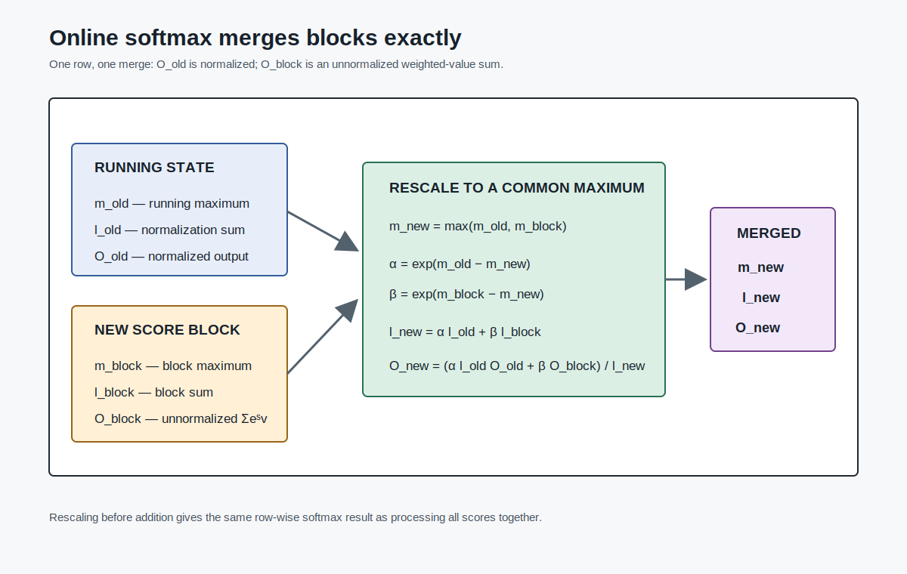

For one row of scores, softmax needs a normalization term over all columns. If the kernel sees only one block of columns at a time, a local softmax over that block is not enough. It would use the wrong denominator.

FlashAttention keeps extra row-wise statistics while processing blocks: a running maximum and a running normalization term. When a new block arrives, the algorithm updates those statistics and rescales the accumulated output so it remains consistent with the global row-wise softmax. [CITE: dao-2022-online-softmax]

For one row, let the old blocks have running maximum `m_old`, normalization sum `l_old`, and accumulated output `O_old`. Let the new block have scores `s_block` and values `V_block`.

The block computes:

```text
m_block = max(s_block)
p_block = exp(s_block - m_block)
l_block = sum(p_block)
O_block = p_block V_block
```

Then the merged maximum is:

```text
m_new = max(m_old, m_block)
```

The old and new contributions must be rescaled to the same denominator:

```text
l_new =
  exp(m_old - m_new) * l_old
  + exp(m_block - m_new) * l_block
```

The output update follows the same rescaling:

```text
O_new =
  (exp(m_old - m_new) * l_old * O_old
   + exp(m_block - m_new) * O_block)
  / l_new
```

Here `O_old` is the normalized accumulated output for earlier blocks, while `O_block` is the unnormalized weighted value sum from the new block.

The invariant is:

```text
after each block, the partial output is scaled as if all blocks seen so far
had been normalized together
```

That is what makes the tiled algorithm exact. It is not an approximation to attention, and it is not a sparse attention pattern. It computes the same attention result while changing the order and location of intermediate computation.

The formulas are compact, but the systems meaning is the important part: online softmax turns a global row-wise normalization into a blockwise computation with correct rescaling.

### Backward Uses Recomputation

Training needs gradients. A naive backward pass would like to reuse the attention probabilities from forward. Standard implementations may therefore store large `N x N` intermediates.

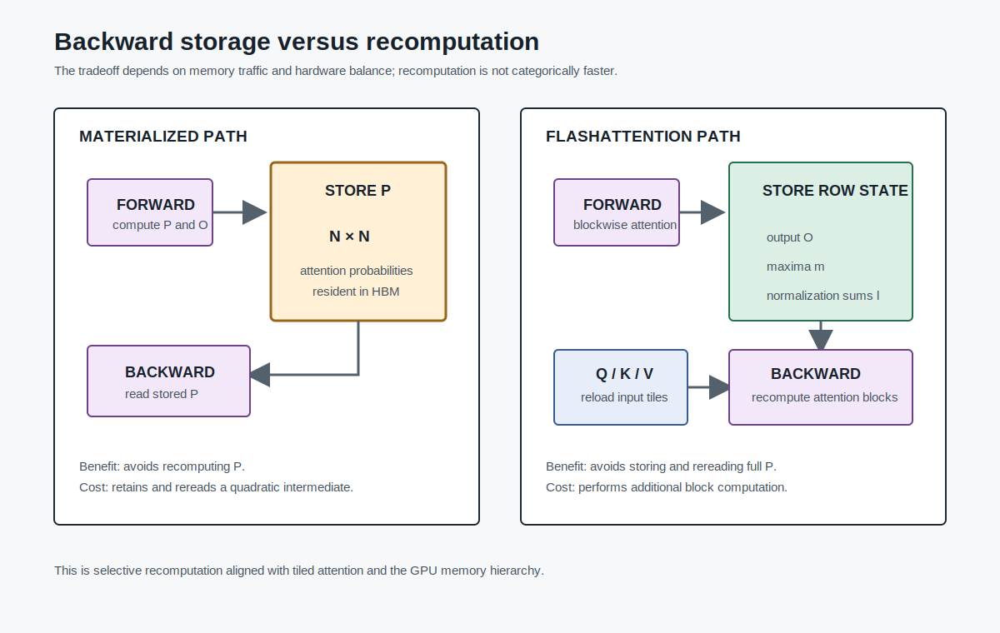

FlashAttention chooses a different tradeoff. It stores the output and softmax normalization statistics from the forward pass, then recomputes attention blocks during backward from `Q`, `K`, and `V` as needed. [CITE: dao-2022-backward-recomputation]

This adds some computation. But it avoids storing and rereading the full attention matrix through HBM.

That tradeoff should now feel familiar:

```text
more arithmetic
less HBM traffic
lower memory footprint
```

In many GPU workloads, that is a good trade. If the bottleneck is memory movement rather than arithmetic throughput, recomputation can make the program faster and smaller at the same time.

This is not generic checkpointing as a slogan. It is selective recomputation aligned with the attention algorithm and GPU memory hierarchy.

### IO Complexity Is the Argument

The FlashAttention paper does not only report speedups. It analyzes HBM accesses. The claim is that FlashAttention requires fewer HBM reads and writes than standard attention for the relevant SRAM sizes. [CITE: dao-2022-io-complexity]

For this book, the exact asymptotic expression matters less than the reasoning habit:

```text
count the scarce memory traffic, not only the FLOPs
```

Standard attention materializes `N x N` intermediates in HBM. FlashAttention keeps block computation on chip, stores smaller row-wise statistics, and writes the final output. The result is lower memory use and lower HBM traffic while preserving exactness.

This is the strongest case study so far for model-algorithm-system co-design. The model operation is attention. The algorithm is blockwise online softmax plus recomputation. The system target is the GPU memory hierarchy.

### Benchmarks Need Conditions

FlashAttention is often summarized as "faster attention with less memory." That is true as a direction, but publication-quality writing needs conditions.

The original paper reports benchmark results under specific settings: hardware, sequence lengths, head dimensions, batch sizes, masking, dropout, baselines, and whether the measurement covers forward, backward, or both. [CITE: dao-2022-benchmark-context]

This chapter therefore does not use a universal speedup number. The robust claim is narrower and stronger:

```text
FlashAttention reduces HBM traffic by reorganizing exact attention around SRAM-resident blocks.
```

Performance follows from that design when the workload is bottlenecked by the avoided memory traffic. The exact gain depends on shape, hardware, precision, masking, dropout, and implementation.

### Why This Belongs in a Systems Book

FlashAttention is not only a clever attention implementation.

It changes the boundary between algorithm and kernel. In a framework-level expression, attention looks like three operations:

```text
matmul -> softmax -> matmul
```

That decomposition materializes the wrong intermediate for the hardware. FlashAttention fuses the full attention computation into a memory-aware kernel structure. It keeps the mathematical operation but changes the schedule, storage, and recomputation plan.

This is why high-level tensor code can be too coarse for some LLM systems problems. The expression is correct, but the implied memory behavior is expensive. A better system sometimes requires changing the algorithmic schedule itself.

### Modern Hardware Keeps Moving

Later FlashAttention work continues the same pattern on newer GPUs. FlashAttention-2 improves work partitioning and parallelism. FlashAttention-3 targets Hopper-era asynchrony and low precision. FlashAttention-4 targets Blackwell-era asymmetric hardware scaling. [CITE: dao-2023-flashattention-2; shah-2024-flashattention-3; zadouri-2026-flashattention-4]

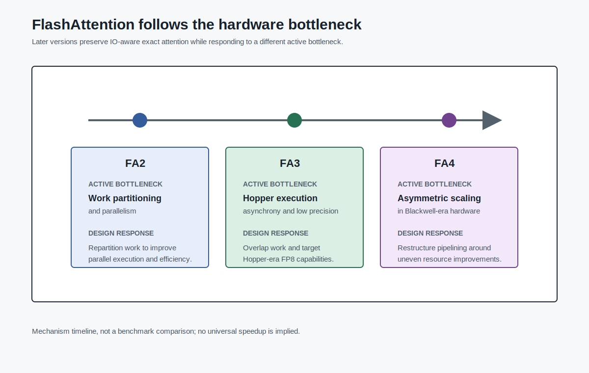

Those details are not the main thread of this chapter. They should stay as sidebar direction unless the chapter expands into a version-by-version treatment.

The broader lesson is recurring: hardware changes which algorithmic schedule is favorable. When tensor cores get faster, another unit may become the bottleneck. When memory movement becomes asynchronous, kernels can overlap work differently. When precision formats change, the numerical and layout choices change with them.

FlashAttention is therefore not a single frozen trick. It is an example of attention being redesigned around the active bottleneck.

### Decode Attention Is Different

Most of this chapter has described training or prefill-like attention, where `Q`, `K`, and `V` blocks can be large.

Decoding has a different shape. The query length may be only one or a few tokens, while the KV context can be very long. [CITE: llmsys-21-decoding-attention-shape]

That changes GPU occupancy and memory behavior. There may not be enough query-side work to fill the GPU unless the implementation splits or packs work differently. This issue will return in the serving chapters, where KV cache, batching, and decode scheduling become central.

For now, the point is simply that "attention optimization" is not one workload. Training, prefill, and decode expose different shapes to the same hardware.

### The Case Study

FlashAttention ties together the first six chapters.

From Part I, it uses the Transformer operation that makes context interaction possible. From Chapter 4, it depends on the GPU execution and memory model. From Chapter 5, it uses tiling, fusion, reductions, and recomputation. Its contribution is to combine those ideas into an exact attention algorithm whose memory behavior is better aligned with hardware.

The lesson is not "memorize FlashAttention." The lesson is the engineering move:

```text
find the active bottleneck
change the algorithmic schedule
preserve the mathematical contract
map the new schedule to the hardware
```

That pattern will repeat in later chapters on frameworks, distributed training, ZeRO, vLLM, KV cache, and serving.

Owner: Principal Author  
Purpose: Chapter 6 ready draft after source extraction, brief, technical review, formula check, and red-team review  
Evidence grade: A for FlashAttention v1 primary-paper claims, course lecture, later-generation primary cards, and formula-check memo; no benchmark numbers used  
Assumptions: Chapter 6 explains IO-aware exact attention and avoids unqualified benchmark claims  
Open questions: Decide whether final publication should keep the one-row online-softmax derivation or use paper notation  
Handoff: Production can move to front-half Chapter 1-3 reviews or book-level consistency audit

# Part III — Training Systems {#part-iii-training-systems .part-title}

## Chapter 7: Deep Learning Frameworks, JAX, XLA, and TPU {#chapter-7-deep-learning-frameworks-jax-xla-and-tpu .chapter-title}

The previous chapters moved downward through the stack. A Transformer became tensor operations. Tensor operations became kernels. Kernels became memory traffic, tiling, reductions, fusion, and attention schedules.

Now move back up one level.

Most model authors do not write kernels directly. They write Python:

```python
def train_step(params, batch):
    logits = model(params, batch["tokens"])
    loss = cross_entropy(logits, batch["labels"])
    grads = grad(loss)(params)
    return optimizer_update(params, grads)
```

That code is not what the accelerator runs. The accelerator needs a scheduled program: operations, buffers, layouts, device transfers, collectives, compiled kernels, and sometimes custom code for a specific memory hierarchy.

This is the central problem of deep learning frameworks:

```text
turn a Python-level model expression into an executable accelerator program
```

A framework is therefore not only a convenience library. It is a staging system. It captures computation, transforms it, differentiates it, optimizes it, lowers it toward hardware, and decides when the abstraction is too high and the programmer needs a kernel-level escape hatch.

### The Model Is Python; the Machine Wants a Program

A training step has several kinds of work:


- forward computation;
- loss computation;
- backward computation;
- optimizer update;
- device memory allocation and reuse;
- communication if the tensors are sharded or replicated.

The author would like to write the mathematical structure once. The system must produce the executable work.

This gap is not accidental. Python is a productive language for model construction, but Python itself is not a good representation for accelerator scheduling. The accelerator does not want arbitrary control flow, dynamic objects, interpreter overhead, or hidden side effects. It wants a constrained program over arrays.

The usual solution is to create an intermediate representation of the computation. The course lecture on deep learning frameworks introduces this as a computation graph: a graph of primitive operators whose edges carry tensor values. [CITE: llmsys-05-computation-graph]

For a tiny expression:

```text
y = (a * b) + c
```

the graph is:

```text
a ----\
       multiply ----\
b ----/             add ---- y
c ------------------/
```

That graph is already more useful to a system than the original Python expression. It exposes primitive operations. It exposes dependencies. It gives the runtime or compiler something to schedule.

The same idea scales to neural networks. A Transformer layer is not one primitive operation. It is a graph containing matrix multiplications, reshapes, transposes, masks, normalization, softmax, elementwise operations, and residual connections. Once represented as a graph, the system can ask questions that Python source code does not answer directly:

```text
Which operations can be fused?
Which tensors must remain live?
Which buffers can be reused?
Which shapes are known?
Which device should hold this array?
Which communication must happen before this matmul can run?
```

Those are systems questions, not modeling questions.

### Autodiff Is a Program Transformation

Training requires gradients. A framework must compute derivatives of the loss with respect to parameters. For LLMs, doing that by hand is not realistic. The model graph is too large, and the implementation changes constantly.


Automatic differentiation solves this by turning the forward computation into a related backward computation. The lecture frames autodiff as building gradient calculation from primitive operations in the computation graph. [CITE: llmsys-05-automatic-differentiation]

Use the small expression again:

```text
y = (a * b) + c
```

Let:

```text
t = a * b
y = t + c
```

The local derivatives are:

```text
dy/dt = 1
dy/dc = 1
dt/da = b
dt/db = a
```

Reverse-mode autodiff propagates an upstream gradient from `y` backward through the graph:

```text
g_y = 1
g_t += g_y * 1
g_c += g_y * 1
g_a += g_t * b
g_b += g_t * a
```

The important point is not the arithmetic in this toy example. The important point is that each primitive operation carries a rule for how gradients flow through it. The framework can compose those local rules to build a backward program.

That backward program has its own systems behavior. It reads saved forward values, writes gradients, performs reductions, and may consume more memory than the forward pass. The framework must decide which intermediates to store and which to recompute. That connects directly to Chapter 6's FlashAttention backward pass: recomputation is a memory tradeoff, not a mystical property of attention.

Gradient checking with finite differences is useful for validation. For a scalar parameter `x`, one can estimate:

```text
df/dx ≈ (f(x + ε) - f(x - ε)) / (2ε)
```

The framework lecture notes finite differences as a way to check gradient calculations. [CITE: llmsys-05-gradient-checking] But finite differences are not how large models are trained. They require extra function evaluations per parameter and suffer from numerical sensitivity. Autodiff is the scalable mechanism; finite differences are a correctness probe.

### Dynamic, Static, and Functional Interfaces

Frameworks differ in how much of the computation they expose to the system ahead of execution.

In a dynamic or eager style, operations execute as the Python program runs. This is convenient for debugging and Python-native control flow. In a static graph style, the program first constructs a graph, then executes an optimized version of that graph. The framework lecture contrasts PyTorch, TensorFlow, JAX, and NumPy along these programming-model lines, with PyTorch associated with dynamic computation, TensorFlow historically associated with static graphs, JAX with functional transformations, and NumPy without built-in autograd. [CITE: llmsys-05-framework-programming-models]

This should be read as a conceptual comparison, not a permanent product matrix. Frameworks evolve. PyTorch has compiler paths. TensorFlow has eager execution. JAX has its own sharp edges around tracing and staging.

The durable systems distinction is:

```text
How much of the program is visible to the optimizer before it runs?
```

If the system sees only one operation at a time, it can dispatch good kernels but has limited opportunity to optimize across operator boundaries. If it sees a larger graph, it can fuse operations, plan memory, specialize shapes, and lower to a target-specific executable.

TensorFlow-style graph execution makes this explicit: define a symbolic dataflow graph, then execute an optimized computation graph on available devices. [CITE: llmsys-05-tensorflow-graph-execution]

That separation is the bridge to compilers. The graph is no longer just a debugging picture. It is an input to optimization.

### JAX as Staged Array Programming

This chapter uses JAX, XLA, and TPU as a case study because the boundaries are visible: Python functions are transformed, lowered, compiled, and sometimes replaced with explicit kernels. That is not a claim that every LLM system should use this stack, or that other framework/compiler stacks lack the same systems problems.

JAX is a clean case study because its user-facing model makes transformations central. Official JAX documentation describes it as array-oriented numerical computation with automatic differentiation and just-in-time compilation, and highlights CPU, GPU, and TPU execution, gradients, and vectorization. [CITE: official-jax-quickstart-transformations]

The course lecture summarizes the same core transformations:

```text
jit()
grad()
vmap()
```

`grad` transforms a function into a gradient function. `vmap` transforms a function so it maps over a batch dimension. `jit` stages a function for compilation. [CITE: llmsys-12-jax-transformations]

For example:

```python
def f(x):
    return x * x + 2 * x

g = grad(f)
compiled_f = jit(f)
batched_f = vmap(f)
```

The surface syntax is small, but the system contract is strong. JAX transformations work well when the function can be represented as operations over arrays with behavior that the tracer understands.

That is why JAX is not simply "NumPy on accelerators." The NumPy-like surface is the entry point. The deeper idea is staged array programming: write a Python function, trace the array operations it performs, represent them in an intermediate form, transform that representation, and compile it.

### Tracing Turns Python into JAXpr

When a JAX function is staged, JAX does not run it in the ordinary sense for every concrete value. It traces it. The lecture describes tracing as abstract execution that captures primitive operations into JAXpr, JAX's internal expression language. [CITE: llmsys-12-jax-tracing-jaxpr]

Take:

```python
def f(x, y):
    z = x @ y
    return z + 1
```

The Python source contains names, local variables, and operators. The traced representation instead records a small program over array primitives:

```text
dot_general x y -> z
add z 1 -> out
```

That simplified sketch omits details, but it exposes the key change. The compiler sees array operations, shapes, dtypes, and dependencies. It does not need to interpret arbitrary Python every time the function runs.

Tracing also explains why some Python patterns surprise users. If a branch depends on an ordinary Python boolean known at trace time, it may be resolved during tracing. If a branch depends on an array value only known at runtime, it must be expressed with traceable control-flow primitives. The model author writes Python, but the staged part must become an array program.

This is one of the main tradeoffs of the chapter:

```text
staging gives the compiler a program it can optimize,
but the staged program must obey the tracer's rules
```

### StableHLO and HLO Are Compiler Boundaries

After tracing, the program must move into compiler IR.


The lecture describes a path:

```text
Python/JAX tracing → JAXpr → StableHLO → HLO → optimized executable
```

[CITE: llmsys-12-xla-compilation-pipeline]

StableHLO sits at an important boundary. Official OpenXLA documentation describes StableHLO as a portability layer between ML frameworks and ML compilers, with a versioned operation set and compatibility goals. [CITE: official-openxla-stablehlo-portability]

That matters because a framework/compiler stack has two sides:

```text
frontend:  capture model programs from user frameworks
backend:   compile those programs for target hardware
```

If every frontend and backend used a private representation, the ecosystem would fragment. A stable intermediate representation gives frontends and compilers a common contract.

XLA is the compiler side of this story. Official OpenXLA documentation describes XLA as compiling StableHLO model graphs into target-optimized executables through target-independent optimization, backend-specific optimization, and target-specific code generation. [CITE: official-openxla-xla-architecture]

The practical pipeline is:

```text
model function
  ↓ tracing
JAXpr
  ↓ lowering
StableHLO
  ↓ XLA internal conversion and optimization
HLO
  ↓ backend-specific optimization/code generation
executable for CPU/GPU/TPU backend
```

Real implementations may include caches, frontend-specific paths, runtime dispatch layers, and backend-specific shortcuts. The diagram is a teaching path for the main abstractions, not a promise that every compiled program visits every named layer in exactly this order.

This is not merely a format conversion. Each stage enables different decisions. A frontend cares about user language semantics and transformations. A compiler IR cares about operations, shapes, layouts, buffers, and target behavior.

### Shapes and Layouts Are Systems Information

The framework author sees an array shape as a type-like fact:

```text
x: f32[batch, sequence, hidden]
```

The compiler sees more:

```text
how large is the buffer?
which dimension is contiguous?
can this operation be fused?
does this layout feed the target matrix unit efficiently?
can this intermediate be eliminated?
```

The lecture emphasizes that HLO uses compile-time array dimensions to reason about memory allocation and layout. [CITE: llmsys-12-hlo-static-shapes]

That claim needs a caveat in final prose: modern compiler stacks may support forms of dynamic shape or shape polymorphism, so the draft should not claim that every dimension is always fixed in every XLA use. The safe systems point is narrower:

```text
the more shape and layout information the compiler has,
the more aggressively it can plan memory and specialize execution
```

XLA optimization passes include graph simplification, fusion, layout and tiling decisions, buffer/copy insertion, and memory-space assignment. [CITE: llmsys-12-xla-optimization-passes]

These are the compiler versions of ideas from Chapters 4–6:

- fusion removes unnecessary intermediate writes;
- tiling changes data reuse;
- buffer assignment decides what storage is live;
- layout controls memory access patterns;
- memory-space assignment chooses where data should reside.

The difference is where the decision is made. In Chapter 5, a kernel author explicitly fused operations or tiled memory. In this chapter, the compiler may do some of that work from a higher-level graph.

### Fusion Is a Memory Decision

Consider a simple sequence:


```text
y = gelu(x + bias)
z = dropout(y) + residual
```

If implemented as separate kernels, the system may write `x + bias`, read it for `gelu`, write `y`, read it for dropout, write another intermediate, and so on. A compiler or framework fusion pass can reduce those round trips.

The XLA architecture page names execution speed and memory usage as central objectives, including fusing pipelined operations to reduce memory overhead and analyzing memory usage to eliminate intermediate storage buffers. [CITE: official-openxla-xla-architecture]

That connects directly to the recurring rule:

```text
operator boundaries are not free
```

In Python, writing three functions may be clearer than writing one. On the accelerator, three materialized operators may be expensive. The compiler tries to preserve the high-level expression while removing unnecessary runtime boundaries.

The same principle applies to attention-like code, but attention is harder. The Chapter 7 lecture includes examples where XLA attention or softmax fusion can avoid materializing large intermediates under specific compiled shapes and backend behavior. [CITE: llmsys-12-xla-attention-fusion]

That should be used carefully. A compiler can fuse some attention patterns, but it is not safe to claim that arbitrary high-level attention code will always avoid materialization. The result depends on shapes, backend, precision, compiler version, and the exact expression. Chapter 6 remains the stronger source for FlashAttention as an algorithmic/kernel reorganization.

### TPU Shows Why the Backend Matters

So far the chapter has treated the compiler target abstractly. TPU makes the target concrete.


A TPU is designed around dense linear algebra. The lecture describes TPU matrix multiply units using systolic-array-style dataflow: operands move through a grid of compute elements, and the compiler must organize data movement and scheduling so the matrix units stay fed. [CITE: llmsys-12-tpu-systolic-mxu]

Do not overread that as a full TPU hardware specification. Hardware details vary by generation and need official documentation or source-level evidence before publication-level claims. The chapter-level lesson is stable:

```text
backend code generation is shaped by the hardware's execution model
```

For a matrix multiply, the compiler must care about:

- operand layout;
- tile size;
- local memory capacity;
- data movement into the matrix unit;
- vector/scalar work around the matrix multiply;
- synchronization and scheduling.

That is why the IR cannot be just "multiply these arrays" at the final stage. The backend needs enough structure to map logical tensor operations onto physical compute and memory resources.

The same idea applies across accelerators. A GPU backend will make different choices from a TPU backend. A future accelerator may need a different layout, memory-space model, or code generator. The compiler stack exists partly so model code can stay higher level while backends specialize the executable.

### Compilation Is Also a Runtime Contract

Compilation does not eliminate runtime. It changes what the runtime does.

A staged function may compile the first time it sees a new combination of shapes, dtypes, or sharding constraints. Later calls may reuse the compiled executable. Inputs must be transferred or made available on devices. Outputs may be device-resident arrays whose values are not copied back to the host until needed.

This matters for performance measurement. Timing a compiled function once may include compilation. Timing it many times may mostly measure execution. Moving an array to the host for printing can synchronize work that was otherwise asynchronous.

This is why the chapter should avoid casual claims like:

```text
jit makes code faster
```

The defensible claim is conditional:

```text
jit can improve repeated accelerator execution when compilation overhead is amortized
and the compiler can optimize the staged array program
```

The conditions are part of the claim.

### Sharding Turns Compilation into Distributed Execution

Single-device compilation is not the end of the story. LLM training quickly reaches multi-device execution.

The Chapter 7 lecture introduces JAX sharding annotations and shows them lowering into distributed SPMD execution where the compiler can insert collectives such as all-gather. [CITE: llmsys-12-jax-sharding-spmd]

The minimal example is a matrix multiplication where one operand is partitioned across devices. A local device may not have all columns or rows needed for its part of the result. The system has choices:

```text
replicate data
partition data
insert all-gather
insert reduce-scatter
change the layout
change the computation order
```

Those choices are the beginning of distributed training systems. Chapter 8 will treat data parallelism directly. Chapter 9 will treat model parallelism. Chapter 10 will treat memory partitioning through ZeRO and MoE.

Here, the point is narrower: once tensors are sharded, the compiler/runtime boundary includes communication. A tensor expression may imply a collective. The model author may see a matmul; the system may see local matmuls plus all-gather or reduce-scatter.

That is a major abstraction shift:

```text
array layout becomes a distributed-systems decision
```

### When the Compiler Is Not Enough

Automatic compilation is powerful, but it has an abstraction ceiling.

Sometimes the programmer knows the schedule that should happen:

- which tile should move from HBM to local memory;
- when the next tile should be prefetched;
- which scratch buffer should hold partial sums;
- which grid coordinate owns which block;
- which sparse attention blocks should be skipped.

The generic compiler may not infer that schedule, or it may infer a legal schedule that is not the one the kernel author wants.

Pallas is one answer in the JAX ecosystem. Official JAX documentation describes Pallas as an experimental extension for writing custom GPU and TPU kernels with fine-grained control over generated code while retaining JAX tracing and `jax.numpy` ergonomics. [CITE: official-jax-pallas-experimental]

The experimental status matters. A book draft should not treat Pallas APIs as stable without checking the current docs and source. But as a systems concept, Pallas is useful: it shows the layer below automatic array compilation and above hand-written low-level backend code.

### Pallas: Grid, Blocks, and Memory Movement

The Pallas lecture frames the problem as explicit memory hierarchy control. Pallas exposes memory spaces such as HBM and VMEM on TPU, and gives the kernel author tools to orchestrate movement between them. [CITE: llmsys-13-pallas-memory-hierarchy]


The core programming shape is:

```text
pallas_call(
  kernel,
  grid=...,
  in_specs=BlockSpec(...),
  out_specs=BlockSpec(...)
)
```

`grid` defines the iteration space. `BlockSpec` maps global tensors to per-program blocks. The kernel receives references to those local blocks and computes on them. [CITE: llmsys-13-pallas-blockspec]

For a matrix multiplication, a simplified 3D grid might look like:

```text
grid = (M_blocks, N_blocks, K_blocks)
```

where:

- the first axis selects output row blocks;
- the second axis selects output column blocks;
- the third axis iterates through the reduction dimension.

This is the same tiling logic from Chapter 5, but expressed in a JAX-integrated kernel language rather than CUDA C++.

The memory reason is direct. LLM-sized tensors do not fit wholesale into local memory. The Pallas lecture shows VMEM capacity as a real constraint and motivates tiling because loading entire large tensors into VMEM can fail. [CITE: llmsys-13-pallas-vmem-constraint]

The systems invariant is:

```text
only the tile needed for this program instance should occupy scarce local memory
```

### Pipelining Hides Transfer Latency

Tiling solves capacity and reuse. It does not automatically solve latency.


If a kernel waits for every HBM-to-VMEM transfer before doing compute, the compute units may sit idle. Pipelining overlaps data movement with computation: while the current tile is being processed, the next tile is being fetched. The Pallas lecture describes this as overlapping HBM and VMEM transfer with active computation. [CITE: llmsys-13-pallas-pipelining]

The shape is:

```text
load tile 0
compute tile 0 while loading tile 1
compute tile 1 while loading tile 2
...
write final output
```

This is not free. Pipelining consumes buffers. It adds scheduling complexity. It may require careful tile sizes so transfer and compute overlap usefully. But it expresses a recurring accelerator principle:

```text
latency is often hidden by arranging independent work around it
```

Pallas also includes mechanisms such as output aliasing, where output can reuse an input buffer under valid aliasing constraints. [CITE: llmsys-13-pallas-output-aliasing] The high-level idea is familiar from memory reuse: avoid allocations and extra movement when the program can safely update existing storage.

### Tile Size Is a Performance Parameter

Tile size is not a cosmetic choice.

Small tiles may fit comfortably in local memory but create many program invocations and more scheduling overhead. Large tiles may improve reuse and reduce overhead but exceed local memory or reduce parallelism. The Pallas lecture includes tile-size tuning examples and emphasizes that grid shape and tile size affect invocation count and throughput for a given workload. [CITE: llmsys-13-pallas-tile-size-tuning]

This draft deliberately avoids quoting the lecture's speedup numbers. To use those numbers responsibly, the chapter would need to carry shape, precision, tile size, device generation, measurement method, and baseline. The source card marks the numeric claim as high risk for exactly that reason.

The durable takeaway does not require the number:

```text
the same mathematical matmul can have different performance
because tile shape changes memory pressure, reuse, and scheduling overhead
```

That is the same lesson as Chapters 4–6, now expressed at the framework/compiler boundary.

### Splash Attention as a Boundary Case

Splash Attention is useful here as a boundary case, not as a replacement for Chapter 6's FlashAttention discussion.

The Pallas lecture frames Splash Attention as combining FlashAttention-style tiling and fusion with sparse block execution. Instead of processing every attention block, sparse metadata identifies which blocks matter, and the kernel maps that metadata to work. [CITE: llmsys-13-splash-attention-sparse-flash; llmsys-13-splash-attention-mask-metadata]

This combines several systems concerns:

- algorithmic structure: attention can be tiled;
- sparsity: some blocks may be skipped;
- metadata: the kernel needs active row/column information;
- memory hierarchy: blocks should fit local memory;
- scheduling: grid coordinates map to useful work.

That is why custom kernel interfaces matter. A generic high-level expression may not expose the sparse execution plan or memory schedule. A lower-level kernel can.

But the boundary should stay clear. Chapter 6 owns the attention algorithm. This chapter uses Splash Attention only to show why compiler and kernel abstractions affect what systems can express.

### The Tradeoff: Abstraction Boundary

Every layer in this chapter buys something and costs something.

Python buys expressiveness and model-author productivity. It costs the system visibility.

Computation graphs buy scheduling and autodiff structure. They cost some flexibility.

JAX transformations buy staged compilation, vectorization, and differentiation. They cost tracing constraints and a sharper programming model.

StableHLO/HLO buy compiler portability and optimization. They cost another semantic boundary that must preserve enough information without overfitting to one frontend.

XLA backends buy target-specific performance. They cost backend complexity.

Pallas buys explicit kernel control. It costs portability and API stability risk, especially because the official docs mark it experimental. [CITE: official-jax-pallas-experimental]

The point is not to choose one layer as the "right" layer. The point is to know which layer owns which decision.

For an LLM systems engineer, the reusable test is:

```text
If performance is poor, ask which abstraction boundary hid the bottleneck.
```

Maybe the Python code prevented tracing. Maybe a shape change forced recompilation. Maybe an operator boundary caused unnecessary HBM traffic. Maybe the compiler picked a layout that was legal but not ideal. Maybe the attention pattern needs a custom kernel. Maybe the tensor sharding implies a collective the model author did not notice.

Frameworks and compilers are the machinery that makes LLM work productive. They are also part of the performance model.

### What to Remember

Deep learning frameworks turn model expressions into executable systems.

The chapter's mechanism is:

```text
Python function
  → traced array program
  → autodiff/vectorized/compiled representation
  → StableHLO/HLO compiler IR
  → optimized backend executable
  → optional custom kernel path when the compiler abstraction is too high
```

The chapter's bottleneck is programmability under hardware constraints. The model author wants clean Python. The accelerator wants scheduled work with explicit memory and communication behavior.

The misconception to discard is:

```text
the framework is just a library call layer
```

For LLM systems, the framework is part of the system design. It decides what computation is visible, what can be transformed, what can be fused, what can be sharded, what can be compiled, and where the programmer must take back control.

Owner: Principal Author  
Purpose: Chapter 7 ready draft after source extraction, brief, draft, technical review, and red-team review  
Evidence grade: A for course lecture claims and official JAX/OpenXLA/Pallas documentation; no benchmark numbers used  
Assumptions: The chapter uses JAX/XLA/TPU as a case study for framework/compiler/runtime design, not as a recommendation that all LLM systems should use JAX  
Open questions: Add narrower cards only if later revisions introduce precise JAXpr internals, Pallas `BlockSpec` API behavior, TPU backend microarchitecture, or exact StableHLO compatibility guarantees  
Handoff: Production can move to Chapter 8 source extraction

## Chapter 8: Distributed Training and Data Parallelism {#chapter-8-distributed-training-and-data-parallelism .chapter-title}

Chapter 7 ended with a single training step becoming an executable program. That is still a one-replica view of training. Large models and large datasets quickly force a wider question:

```text
How do several devices cooperate on one training step?
```

The simplest answer is data parallelism. Copy the model to several workers. Split the batch. Let every worker run forward and backward on its shard. Then combine the gradients so every replica applies the same update.

That description is correct, but it hides the systems problem.

The expensive part is not making copies of the model. The expensive part is synchronizing gradients at the end of every step without turning the network into the critical path. Data parallelism scales only when communication is scheduled as carefully as computation.

This chapter is about that schedule.

### Replicating the Model Is the Easy Part

Suppose there are `W` workers. Each worker has a replica of the same model parameters `θ`. A global batch is split into `W` local batches:

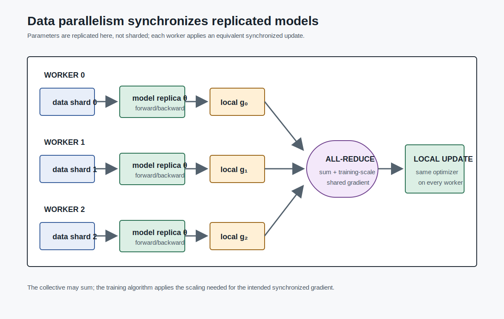

```text
B = B_0 ∪ B_1 ∪ ... ∪ B_{W-1}
```

Worker `i` computes a local loss and local gradient:

```text
g_i = ∇θ L(θ; B_i)
```

For synchronous data parallel training, the workers need a shared gradient before the optimizer step. The usual averaged gradient is:

```text
g = (1/W) * Σ_i g_i
```

Then every worker applies the same optimizer update locally:

```text
θ ← optimizer_update(θ, g)
```

The course lecture on distributed training presents this pattern as data partitioning, local gradient computation, all-reduce to compute an average gradient, and local parameter updates. [CITE: llmsys-14-data-parallel-allreduce]

This is why data parallelism is attractive. Each worker performs the same model computation as single-device training, just on different data. The model code does not need to be partitioned across layers or tensors.

But the gradient vector is large. For dense training, each worker must communicate information proportional to the parameter gradients it owns. If communication happens after all backward computation finishes, step time becomes:

```text
step time ≈ forward + backward + gradient synchronization + optimizer
```

The synchronization term is now on the critical path.

### All-Reduce Is the Central Collective

Distributed training relies on collective communication. NCCL is a common GPU communication library; the lecture introduces NCCL as providing inter-GPU communication APIs, including collective and point-to-point primitives. [CITE: llmsys-14-nccl-communication] NVIDIA's NCCL documentation lists collective operations including all-reduce, broadcast, reduce, all-gather, and reduce-scatter. [CITE: official-nvidia-nccl-collectives]

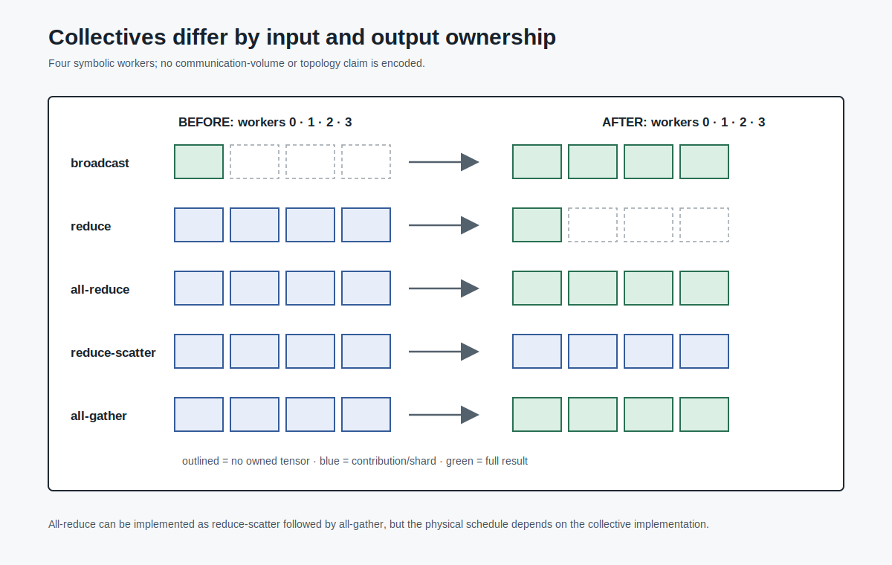

The key collective for synchronous data parallelism is all-reduce.

In a reduce operation, several ranks contribute values and one rank receives the reduced result. In a broadcast, one rank sends a value to all ranks. All-reduce combines those ideas: every rank contributes, the values are reduced, and every rank receives the result. The lecture defines all-reduce this way and also presents all-reduce as reduce-scatter followed by all-gather. [CITE: llmsys-14-allreduce-semantics]

For gradients, each worker begins with:

```text
rank 0: g_0
rank 1: g_1
rank 2: g_2
rank 3: g_3
```

After all-reduce with summation, every worker has:

```text
g_sum = g_0 + g_1 + g_2 + g_3
```

If the framework averages gradients, it divides by `W`:

```text
g = g_sum / W
```

That average matters. PyTorch's DDP documentation warns that gradient magnitude depends on whether loss is summed or averaged locally. [CITE: official-pytorch-ddp-docs] The chapter should therefore avoid saying "sum" and "average" interchangeably. The communication primitive may sum; the training algorithm often wants an average or an equivalent scaling.

### Ring All-Reduce Is a Schedule

An all-reduce call looks like one operation at the API level. Underneath, it is a communication schedule.

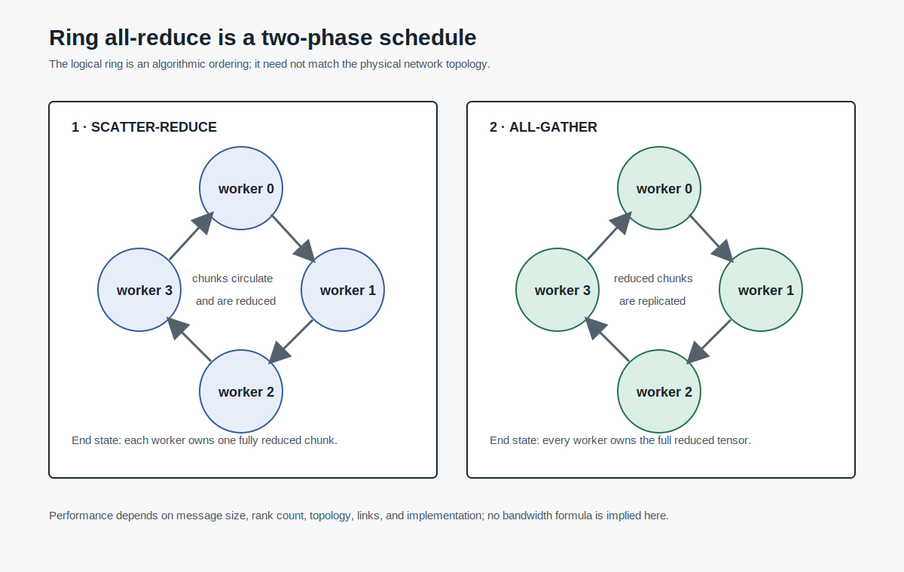

The distributed training lecture explains ring all-reduce through two phases: scatter-reduce and all-gather. [CITE: llmsys-14-ring-allreduce-phases]

Imagine each gradient vector is split into chunks:

```text
g_i = [g_i0, g_i1, g_i2, g_i3]
```

In the scatter-reduce phase, workers send chunks around a ring. Each chunk is reduced as it moves, so after enough steps each worker owns one fully reduced chunk. In the all-gather phase, those reduced chunks move around the ring so every worker obtains the full reduced gradient.

The mechanism matters more than the exact diagram:

```text
all-reduce is not magic;
it is chunk movement plus reduction plus redistribution
```

This chapter deliberately avoids ring all-reduce bandwidth formulas. They are useful, but easy to misuse without stating message size, number of ranks, topology, algorithm variant, per-rank versus aggregate accounting, and whether links are full-duplex. The reliable claim here is qualitative: all-reduce performance is controlled by communication volume, latency, topology, and implementation.

### Parameter Server Versus All-Reduce

A parameter-server design centralizes part of the update. Workers send gradients to a server, the server updates parameters, and workers receive new parameters. The lecture contrasts that with all-reduce data parallelism, where workers synchronize gradients and then update locally. [CITE: llmsys-14-parameter-server-vs-allreduce]

This is not a universal judgment that all-reduce is always better. Parameter-server systems, sharded optimizers, and hybrid designs can be reasonable under different constraints.

The distinction for this chapter is simpler:

```text
parameter server: central update/distribution path
all-reduce data parallelism: collective gradient synchronization, local update
```

PyTorch DDP follows the all-reduce data-parallel pattern.

### The Naive DDP Critical Path

PyTorch `DistributedDataParallel` implements module-level data parallelism with gradient synchronization across model replicas. The official docs define it as data parallelism based on `torch.distributed` and note that the user is responsible for splitting inputs across participating GPUs. [CITE: official-pytorch-ddp-docs]

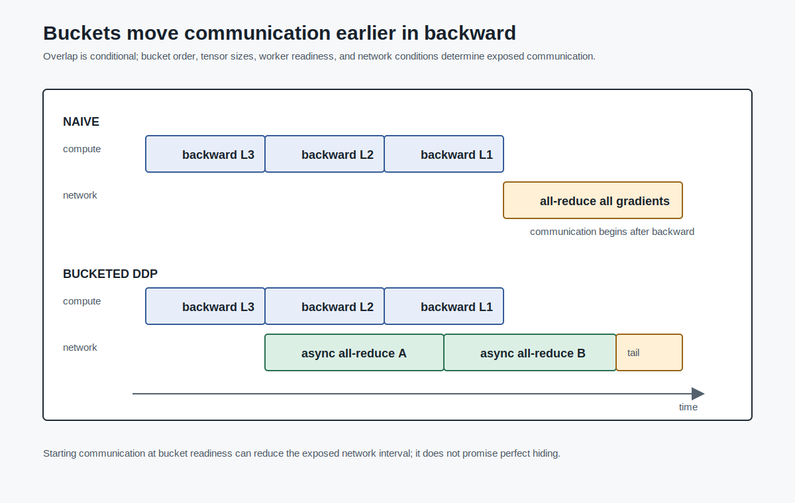

The DDP lecture describes the standard structure: replicas run forward and backward independently, gradients are averaged across nodes, and optimizers run locally with identical updates. [CITE: llmsys-15-ddp-replica-gradient-average]

A naive implementation waits until the entire backward pass completes, then all-reduces all gradients. [CITE: llmsys-15-ddp-naive-allreduce]

The timeline looks like:

```text
forward
backward layer N
backward layer N-1
...
backward layer 1
all-reduce all gradients
optimizer step
```

That is correct, but it creates a communication tail. The network sits mostly idle during backward, then the GPU waits for communication before the optimizer can run.

The key DDP idea is to start communication before backward is over.

### Gradient Buckets

DDP cannot all-reduce every parameter as soon as its gradient appears. That would create many tiny communication operations, and latency would dominate.

It also should not wait for one giant gradient buffer at the end if it can avoid it.

The compromise is bucketing. DDP groups parameter gradients into buckets. The lecture notes that bucket size can be configured with `bucket_cap_mb`, and that bucket assignment is determined at construction time based on bucket size and parameter sizes. [CITE: llmsys-15-ddp-bucketing] The official PyTorch DDP signature also exposes `bucket_cap_mb`. [CITE: official-pytorch-ddp-docs]

A bucket becomes ready when all gradients assigned to it are ready. Then DDP can launch all-reduce for that bucket while backward continues computing other gradients.

This changes the timeline:

```text
backward late layers
bucket A ready -> async all-reduce A
backward middle layers while A communicates
bucket B ready -> async all-reduce B
backward early layers while A/B communicate
finish remaining communication
optimizer step
```

The communication has not disappeared. It has been moved under computation where possible.

### Autograd Hooks Make Communication Timely

Chapter 7 described frameworks as systems that can intercept computation. DDP is a concrete example.

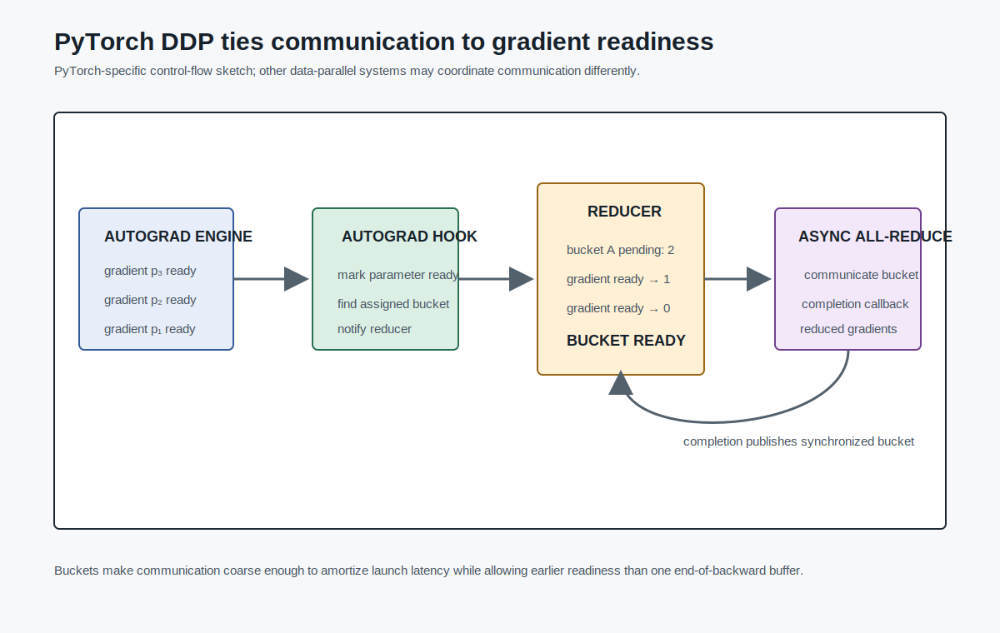

The DDP lecture shows reducer pseudocode built around autograd hooks. When a parameter's gradient has accumulated, an `autograd_hook` marks the variable ready. Buckets track pending gradients. When a bucket's pending count reaches zero, DDP marks the bucket ready and launches communication for that bucket. [CITE: llmsys-15-ddp-autograd-hooks]

In simplified form:

```text
on gradient ready(parameter):
  bucket = bucket_for(parameter)
  bucket.pending -= 1
  if bucket.pending == 0:
    all_reduce(bucket.gradients)
```

This is the "interceptive" side of DDP's design. The lecture cites DDP design goals as non-intrusive for user training scripts and interceptive enough for the implementation to trigger internal algorithms promptly. [CITE: llmsys-15-ddp-design-goals]

The Li et al. paper frames the same systems difficulty: data parallelism is conceptually straightforward, but dependencies between computation and communication make efficient training non-trivial. It identifies bucketing gradients and overlapping computation with communication as DDP acceleration techniques. [CITE: li-2020-pytorch-ddp]

### Overlap Is Conditional

It is tempting to summarize DDP as "communication is hidden by backward." That is too strong.

Overlap depends on several conditions:

- the order in which gradients become ready;
- how parameters are assigned to buckets;
- bucket size;
- gradient tensor sizes;
- network bandwidth and latency;
- GPU compute time per layer;
- whether communication contends with computation for resources;
- whether all workers reach bucket readiness at similar times.

The lecture states that DDP overlaps backward computation with all-reduce when buckets are ready. [CITE: llmsys-15-ddp-overlap] That is the safe claim. It can reduce exposed communication time when communication for earlier buckets runs concurrently with remaining backward computation. It does not guarantee perfect hiding.

A useful mental model is:

```text
exposed communication = communication not covered by useful computation
```

DDP bucketing tries to reduce exposed communication. The last bucket, stragglers, small models, small batches, or slow interconnects can still leave communication on the critical path.

### What Controls Scaling

Data parallelism increases the amount of compute available per step. It also increases synchronization work.

Scaling depends on at least:

- model parameter size, which drives gradient communication volume;
- local batch size, which affects compute per worker;
- number of workers;
- interconnect topology and bandwidth;
- collective implementation;
- precision and gradient dtype;
- bucket size and bucket readiness order;
- optimizer semantics and gradient scaling;
- stragglers.

This chapter does not quote a universal scaling number. The Li et al. paper reports evaluation results under specific PyTorch and hardware settings, but those numbers should be used only with their experimental conditions. [CITE: li-2020-pytorch-ddp]

The robust lesson is:

```text
data parallelism is a race between extra local compute and extra synchronization
```

When local computation is large relative to communication, scaling can be favorable. When communication dominates, adding workers can reduce hardware efficiency or even increase step time.

### Boundary to Model and State Parallelism

Data parallelism replicates model parameters on every worker. It also usually replicates optimizer state unless another technique is used. That is acceptable while the model and optimizer state fit per device.

When the model does not fit, Chapter 9 will partition the model itself. When optimizer state and gradients dominate memory, Chapter 10 will introduce ZeRO-style partitioning. Those techniques change what is replicated.

So Chapter 8's boundary is:

```text
data parallelism splits data, not the model
```

That boundary is why DDP is often the first distributed training idea to learn. It preserves the single-model program and adds a communication schedule around gradients. But it is not the whole distributed-training stack.

### What to Remember

The core data-parallel step is simple:

```text
replicate model
split batch
compute local gradients
all-reduce gradients
apply equivalent local updates
```

The systems work is in the middle:

```text
when do gradients become ready?
how are they bucketed?
which collective synchronizes them?
how much communication is exposed on the critical path?
```

DDP is important because it connects framework internals to communication scheduling. Autograd hooks tell the reducer when gradients are ready. Buckets make communication coarse enough to be efficient but early enough to overlap. All-reduce makes every replica agree on the update.

The misconception to discard is:

```text
distributed data parallelism is just running the same script on more GPUs
```

Running the script is the easy part. Synchronizing the gradients without wasting the step is the system.

Owner: Principal Author  
Purpose: Chapter 8 ready draft after source extraction, brief, draft, technical review, and red-team review  
Evidence grade: A for course lecture claims, NVIDIA NCCL docs, PyTorch DDP docs, and Li et al. DDP paper; no benchmark numbers used  
Assumptions: Chapter 8 focuses on synchronous data parallelism and DDP, leaving model/state partitioning to Chapters 9–10  
Open questions: Add ring all-reduce byte-count formulas only if a later revision can carry topology/message-size/full-duplex/per-rank assumptions  
Handoff: Production can move to Chapter 9 source extraction

## Chapter 9: Model Parallelism {#chapter-9-model-parallelism .chapter-title}

Chapter 8 stopped at a hard boundary:

```text
data parallelism splits data, not the model
```

That boundary is useful while every worker can hold a full model replica, its gradients, its activations, and whatever optimizer state the training loop needs. Once that assumption fails, adding more data-parallel workers does not solve the local memory problem. Every worker is still trying to host the whole model.

Model parallelism changes the object being split. Instead of copying the whole model onto every device, it partitions model computation across devices. The course lecture frames model-parallel training as partitioning the forward pass, backward pass, and update computation across multiple workers, motivated by models that no longer fit in one GPU's memory. [CITE: llmsys-16-model-parallel-motivation]

There are two main ideas in this chapter:

```text
pipeline parallelism: split layers or blocks across devices
tensor parallelism: split individual tensor operations across devices
```

Both ideas solve a memory or compute-exposure problem by creating a scheduling and communication problem. The design question is not just "where do the weights fit?" It is:

```text
which device owns which computation,
what tensors cross device boundaries,
and when can each device do useful work?
```

### Data Parallelism Replicates; Model Parallelism Partitions

In synchronous data parallelism, every worker stores the same parameters `θ`. Each worker sees a different local batch, computes gradients, participates in gradient synchronization, and applies an equivalent local update.

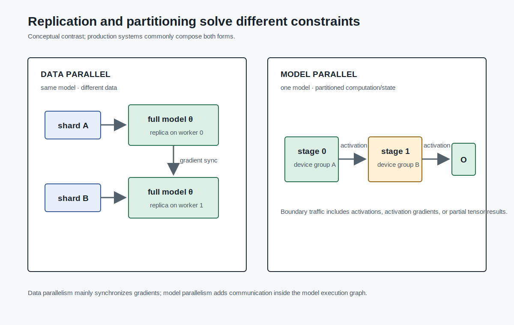

Model parallelism breaks that symmetry. Device 0 may own early layers, device 1 may own middle layers, and device 2 may own later layers. Or several devices may jointly compute one large matrix multiplication inside a Transformer block.

The difference is visible in what each device stores:

```text
data parallel:
  GPU 0: full model, batch shard 0
  GPU 1: full model, batch shard 1
  GPU 2: full model, batch shard 2

model parallel:
  GPU 0: part of model
  GPU 1: part of model
  GPU 2: part of model
```

This does not remove distributed training communication. It moves the communication to different edges. In data parallelism, the main synchronization object is usually gradients. In model parallelism, the system must also move activations, activation gradients, partial matrix results, or reduced tensor-parallel outputs at specific points in the forward and backward graphs.

### Pipeline Parallelism Splits the Layers

Pipeline parallelism partitions the model into stages. A stage is a contiguous or otherwise assigned subset of the model that runs on a device or device group. The lecture introduces pipeline parallelism through layer-wise partitioning: different layers execute on different GPUs. [CITE: llmsys-16-layerwise-pipeline]

A simple four-stage pipeline might look like this:

```text
input
  -> stage 0: embedding + early Transformer blocks
  -> stage 1: next Transformer blocks
  -> stage 2: next Transformer blocks
  -> stage 3: final blocks + output head
  -> loss
```

During the forward pass, stage 0 computes activations and sends boundary activations to stage 1. Stage 1 computes its part and sends activations onward. During the backward pass, gradients flow in the reverse direction. Each stage computes parameter gradients for the layers it owns.

The memory benefit is direct: no single stage needs to store every model parameter. But the cost is also direct: each stage depends on tensors produced by neighboring stages. Pipeline parallelism therefore introduces point-to-point activation and gradient communication at partition boundaries.

### The Naive Pipeline Wastes Devices

The first attempt at pipeline parallelism is often too literal:

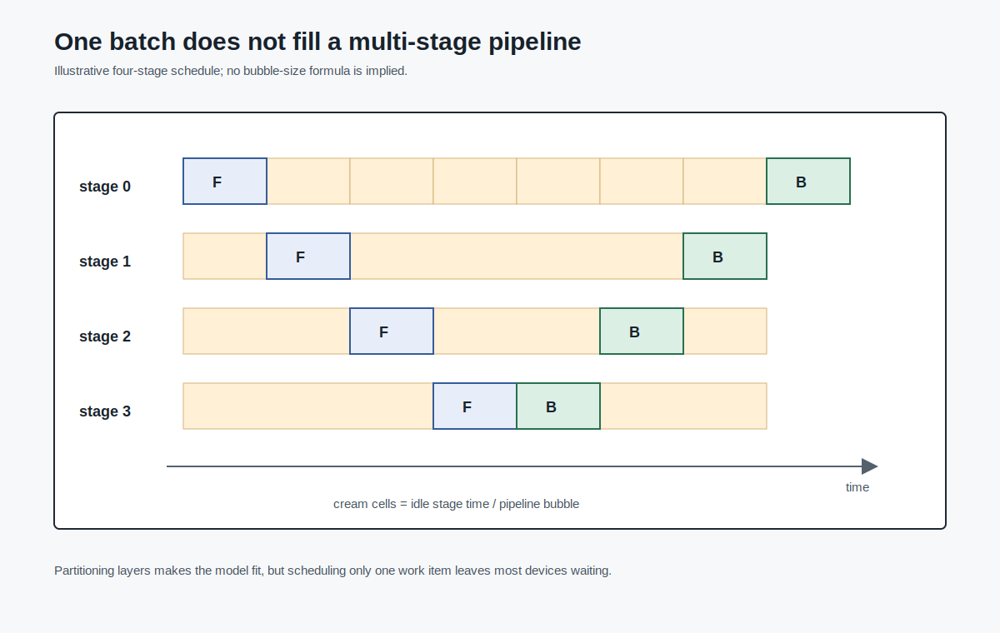

```text
run the whole batch through stage 0
then stage 1
then stage 2
then stage 3
```

That schedule partitions the model but does not keep the devices busy. While stage 0 is running, stages 1-3 are idle. While stage 1 is running, stages 0, 2, and 3 are idle. The lecture calls out this problem: in a naive pipeline, all but one GPU can be idle at a given moment. [CITE: llmsys-16-naive-pipeline-idle]

The issue is not that layer partitioning is wrong. The issue is that a batch is too large a unit of scheduling. A pipeline needs several independent work items in flight so one stage can process item `k+1` while the next stage processes item `k`.

This is the same systems pattern that appeared in Chapter 8. DDP improves when communication can overlap with backward computation. Pipeline parallelism improves when stages can overlap different micro-batches.

### Micro-Batching Fills the Pipeline

GPipe-style pipeline parallelism divides a mini-batch into smaller micro-batches. [CITE: llmsys-16-gpipe-microbatching] The GPipe paper describes partitioning a network across accelerators and using batch-splitting pipeline parallelism to improve utilization. [CITE: huang-2018-gpipe]

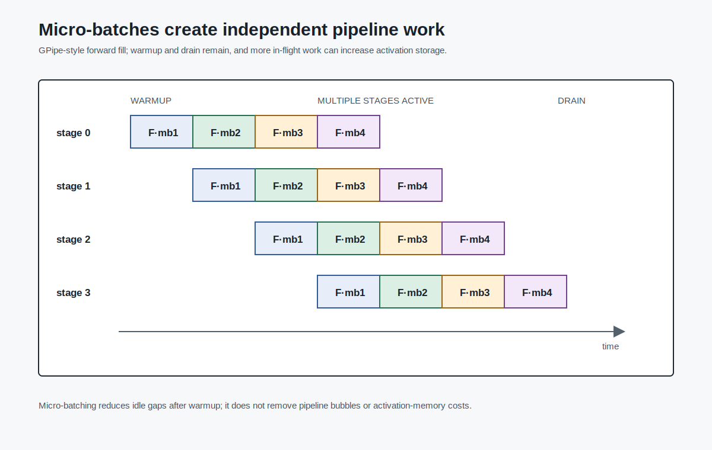

The scheduling idea is easier to see as a timeline:

```text
time ->

stage 0:  mb0  mb1  mb2  mb3
stage 1:       mb0  mb1  mb2  mb3
stage 2:            mb0  mb1  mb2  mb3
stage 3:                 mb0  mb1  mb2  mb3
```

The beginning and end still contain bubbles. At the start, later stages wait for the first micro-batch to arrive. At the end, earlier stages run out of new micro-batches while later stages drain the pipeline. The lecture identifies bubble overhead as a core pipeline cost. [CITE: llmsys-16-pipeline-costs]

This chapter intentionally does not state a bubble formula. Such formulas depend on stage count, micro-batch count, schedule, whether forward and backward are both included, and how the timeline accounts for warmup and drain. The safe lesson is qualitative:

```text
more micro-batches can improve pipeline occupancy,
but they also affect activation memory, launch overhead, and scheduling complexity
```

Micro-batching is therefore not a free knob. It changes how much work is available to fill the pipeline and how many intermediate tensors may be in flight.

### Activation Memory Becomes a Schedule Problem

Backpropagation needs forward activations. In a pipeline, several micro-batches may be in flight before their backward passes run. That means stages may need to keep activations for multiple micro-batches.

The lecture lists activation memory as one of the costs of pipeline parallelism and introduces gradient checkpointing/rematerialization as a way to reduce activation storage. [CITE: llmsys-16-pipeline-costs] [CITE: llmsys-16-gradient-checkpointing]

Checkpointing trades memory for computation. Instead of storing every intermediate activation, the system stores selected checkpoints and recomputes omitted activations during backward.

```text
without checkpointing:
  store many forward activations
  backward can reuse them directly

with checkpointing:
  store fewer activations
  recompute missing activations during backward
```

The tradeoff is not abstract. It changes the pipeline schedule. Recompute work consumes GPU time that might otherwise run forward or backward computation for another micro-batch. The right choice depends on memory pressure, stage balance, micro-batch count, and compute headroom.

### 1F1B Starts Backward Earlier

One way to reduce in-flight activation pressure is to start backward as soon as useful backward work is available. The lecture describes 1F1B as a schedule that starts backward as soon as possible, reducing activation memory relative to schedules that run many forwards before backward. [CITE: llmsys-16-one-f-one-b]

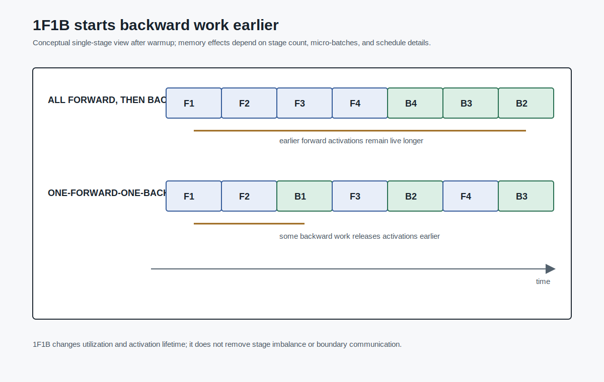

The name means "one forward, one backward" in the steady state. A simplified view is:

```text
warm up pipeline with forward micro-batches
then alternate forward and backward work where dependencies allow
drain remaining backward work
```

PipeDream is a representative system in this design space. The PipeDream paper describes pipelining forward and backward passes across model partitions to keep devices productive. [CITE: harlap-2018-pipedream]

The important distinction is between partitioning and scheduling:

```text
partitioning decides which stage owns which layers
scheduling decides when each stage runs forward or backward for each micro-batch
```

1F1B changes the schedule. It does not eliminate boundary communication, and it does not remove the need to balance stage compute. A slow stage can still throttle the pipeline.

### Interleaving and Chunking Reduce Imbalance

A pipeline stage does not have to be one contiguous chunk assigned once to one device. The lecture discusses chunking or interleaving stages as a way to improve pipeline behavior. [CITE: llmsys-16-pipeline-chunking]

Megatron-LM is a useful source for this broader composition. Its paper discusses combining tensor, pipeline, and data parallelism and includes interleaved pipeline scheduling as part of its distributed training design. [CITE: narayanan-2021-megatron-lm]

Interleaving can help when a simple stage assignment leaves bubbles or imbalance, but it also makes the schedule harder to reason about. More chunks mean more dependencies, more sends and receives, and more opportunities for implementation details to matter.

The robust rule is:

```text
pipeline efficiency is controlled by stage balance, pipeline occupancy, communication, and schedule
```

Layer partitioning alone is only the placement decision.

### Pipeline APIs Expose the Runtime Contract

PyTorch's pipeline parallelism documentation describes a runtime built around pipeline stages and schedules. The docs note that `torch.distributed.pipelining` is alpha, and describe `PipelineStage` as managing buffers and communication operations for a stage. They also list schedules such as GPipe, 1F1B, interleaved 1F1B, and looped BFS. [CITE: official-pytorch-pipeline-parallelism]

The API details may change, but the runtime contract is stable enough to learn from:

```text
a stage needs static expectations about inputs and outputs
a schedule decides which micro-batch work runs next
the runtime manages sends, receives, and buffers at stage boundaries
```

This is why pipeline parallelism belongs in a systems book. It is not just a model refactor. It is an execution protocol.

### Tensor Parallelism Splits the Matrix

Pipeline parallelism splits the model by layers or blocks. Tensor parallelism splits computation inside an operation.

The lecture introduces tensor parallelism as splitting matrix computation across GPUs. [CITE: llmsys-16-tensor-parallel-matmul] For a linear layer:

```text
Y = X A
```

one can split the weight matrix by columns:

```text
A = [A0 A1]

Y0 = X A0
Y1 = X A1
Y  = [Y0 Y1]
```

Each device computes a slice of the output features. If the next operation can consume those slices independently, communication can be delayed. If the next operation needs the full `Y` on every device, an all-gather-like communication step is needed.

Alternatively, split by rows:

```text
A = [A0
     A1]

X = [X0 X1]

Y = X0 A0 + X1 A1
```

Now devices compute partial sums that must be reduced. The communication pattern depends on the partition. That is the central tensor-parallel lesson:

```text
the matrix split determines the collective
```

### Transformer FFN Tensor Parallelism

A Transformer feed-forward network has two linear projections with a nonlinearity between them. In simplified form:

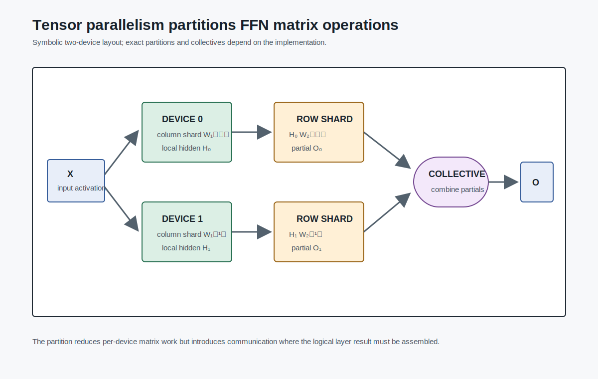

```text
H = activation(X A)
Z = H B
```

where `A` expands the hidden dimension and `B` projects back down.

The lecture describes splitting the first projection over columns and the second projection over rows. [CITE: llmsys-16-tensor-parallel-ffn]

With two partitions:

```text
A = [A0 A1]

H0 = activation(X A0)
H1 = activation(X A1)
```

The nonlinearity is elementwise, so each partition can apply it locally to its slice. Then the second projection can be split so each partition produces a partial contribution:

```text
Z = H0 B0 + H1 B1
```

The final output requires combining those partial contributions. In practice, that combination is a reduction across the tensor-parallel group.

The mechanism matters because it avoids materializing the full expanded intermediate on one device. The expanded hidden dimension is distributed across devices while the elementwise activation remains local.

### Attention Head Parallelism

Self-attention has a natural partition boundary: heads. Multi-head attention computes several attention heads and then combines their outputs.

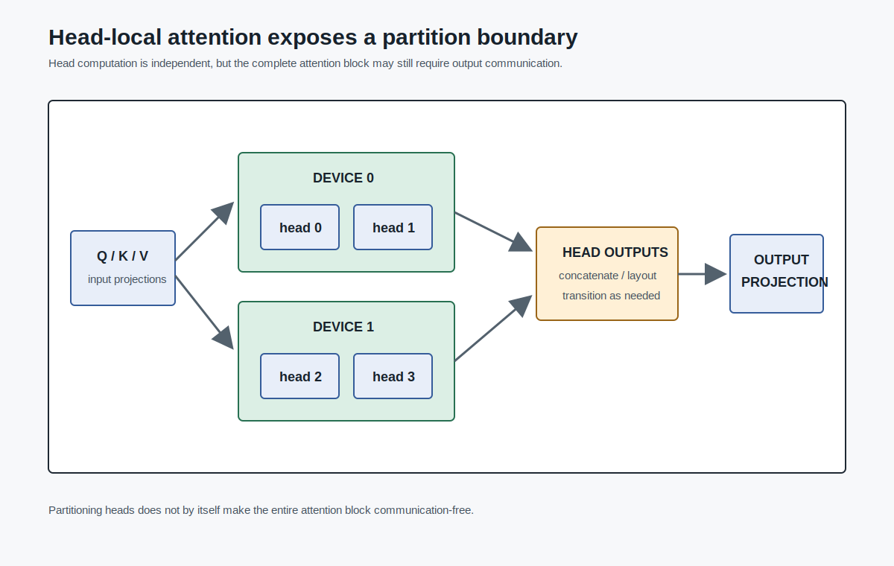

The lecture describes splitting attention weights over columns or heads and notes that the head-local computation does not require all-reduce. [CITE: llmsys-16-tensor-parallel-attention]

That statement needs a boundary. It is safe for the per-head attention work:

```text
head i:
  Q_i, K_i, V_i
  attention_i = softmax(Q_i K_i^T) V_i
```

Different heads can be computed on different devices because one head's score matrix does not depend on another head's score matrix.

It is not safe to claim that the entire attention block is communication-free. After head outputs are produced, the model usually combines them through an output projection. Depending on how that projection is partitioned and what the following layer expects, the system may need a reduction, all-gather, or another layout transition.

The useful rule is:

```text
head-local attention is parallel-friendly;
block-level tensor layout still has to match the next operation
```

### Embeddings Are a Special Case

Embedding layers can also be partitioned, but they are easy to explain imprecisely. The lecture distinguishes communication behavior for input and output embeddings, including cases that require all-reduce or all-gather and cases where output embedding work can be fused with cross-entropy to reduce communication. [CITE: llmsys-16-tensor-parallel-embeddings]

For this chapter, the main point is limited:

```text
not every tensor-parallel layer has the same communication pattern
```

Embedding tables, output logits, and loss computation interact with vocabulary partitioning. Those details are implementation-sensitive enough that they should be treated as an advanced design point, not a universal recipe.

### Combining Tensor, Pipeline, and Data Parallelism

Large training runs often combine several parallelism axes:

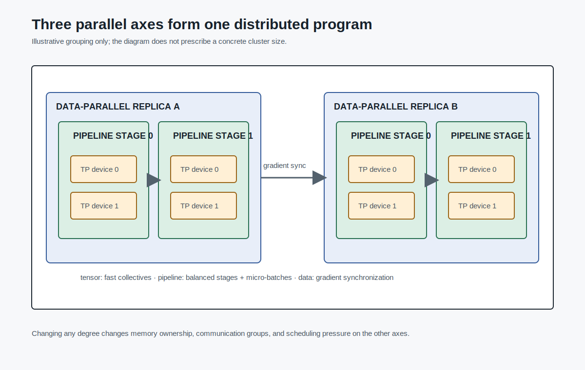

```text
tensor parallelism: split operations inside a layer
pipeline parallelism: split layers or blocks into stages
data parallelism: replicate those partitions over batch shards
```

The lecture presents tensor, pipeline, and data parallelism as composable, with tensor parallelism often used within a server and pipeline parallelism extending across servers, then data parallelism scaling to additional replicas. [CITE: llmsys-16-parallelism-composition]

That is guidance, not a law. The correct placement depends on hardware topology, interconnect bandwidth, model shape, batch size, sequence length, precision, and framework/runtime support.

A practical mental model is:

```text
tensor parallelism wants fast collectives
pipeline parallelism wants balanced stages and enough micro-batches
data parallelism wants enough local compute to amortize gradient synchronization
```

The axes interact. Increasing tensor-parallel degree can reduce per-device parameter memory but increase collective communication. Increasing pipeline stages can make a model fit but increase bubbles or boundary traffic. Increasing data-parallel replicas can improve throughput only if synchronization remains manageable.

### What to Remember

Model parallelism is not one technique. It is a family of partitioning and scheduling choices.

Pipeline parallelism asks:

```text
which layers belong to which stage,
how do micro-batches move through the stages,
and how much idle time remains?
```

Tensor parallelism asks:

```text
which tensor dimension is split,
which partial results are local,
and which collective reconstructs the needed value?
```

The common misconception is:

```text
model parallelism just makes big models fit
```

Fitting is only the first constraint. The system also has to keep devices busy, store or recompute activations, move tensors across partition boundaries, and compose with data parallelism. At LLM scale, the model is not merely a neural network. It is a distributed program whose partitioning decisions determine memory pressure, communication, and schedule efficiency.

Owner: Principal Author
Purpose: Chapter 9 ready draft after source extraction, brief, technical review, and red-team review
Evidence grade: A for course lecture claims, GPipe/PipeDream/Megatron papers, and PyTorch pipeline docs; no benchmark numbers used
Assumptions: Chapter 9 covers pipeline and tensor parallelism; ZeRO, optimizer-state partitioning, and MoE remain Chapter 10
Open questions: Add formulas for pipeline bubbles or activation memory only if a later revision carries explicit schedule assumptions
Handoff: Production can move to Chapter 10 source extraction

## Chapter 10: ZeRO, MoE, and Training Memory {#chapter-10-zero-moe-and-training-memory .chapter-title}

Chapter 9 partitioned model computation. Pipeline parallelism split layers. Tensor parallelism split matrix operations. Those techniques answer one question:

```text
How can several devices jointly execute one model?
```

This chapter starts from a different question:

```text
What must each device keep in memory while training?
```

That question matters because distributed training does not only store weights. A worker may also hold gradients, optimizer state, activations, temporary communication buffers, and fragmented allocations. At LLM scale, the memory ledger is as important as the compute graph.

ZeRO and MoE attack different entries in that ledger.

```text
ZeRO: reduce redundant training state across data-parallel workers
MoE: increase parameter capacity while activating only selected experts per token
```

Both are systems techniques. Neither makes memory pressure disappear. ZeRO trades resident memory for partitioning and communication. MoE trades dense activation for routing, all-to-all communication, and load balancing.

### The Memory Ledger After Model Parallelism

Data parallelism is attractive because every worker runs a normal model program on a local batch shard. The price is replication. Chapter 8 focused on gradient synchronization. Now look at what each worker stores.

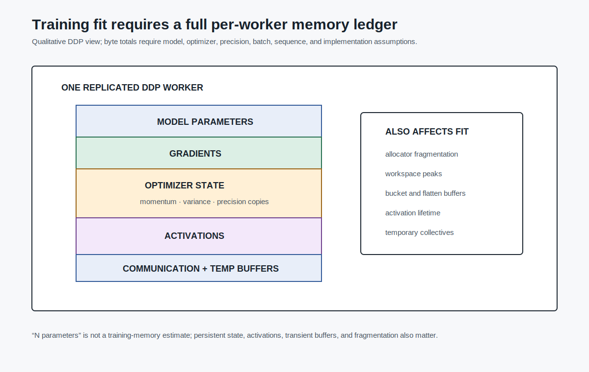

The ZeRO lecture describes mixed-precision DDP memory as including FP16 parameters, FP16 gradients, FP32 optimizer-related states, activations, temporary buffers, and fragmentation. [CITE: llmsys-18-ddp-memory-accounting]

For Adam-style training under the lecture's mixed-precision framing, the important categories are:

```text
parameters
gradients
optimizer states
activations
temporary buffers
fragmentation / allocator overhead
```

Parameters are only the first line item. Adam keeps state such as momentum and variance. Mixed-precision training may also maintain higher-precision copies of values used by the optimizer. Activations are needed for backward. Communication libraries and framework reducers may flatten or bucket tensors into temporary buffers. Allocators may leave memory unusable because of fragmentation.

This is why "the model has N parameters" is not enough to decide whether training fits. The fit question is:

```text
resident memory per worker =
  parameters
  + gradients
  + optimizer state
  + activations
  + temporary buffers
  + fragmentation
  + implementation-specific overhead
```

Model parallelism can reduce how much of the model computation sits on one device. It does not automatically remove every replicated data-parallel state. ZeRO targets that redundancy directly.

### ZeRO: Remove Redundant State

ZeRO stands for Zero Redundancy Optimizer. The lecture states the key idea as eliminating data redundancy in DDP by partitioning optimizer states, gradients, and parameters across stages: ZeRO-1, ZeRO-2, and ZeRO-3. [CITE: llmsys-18-zero-key-idea]

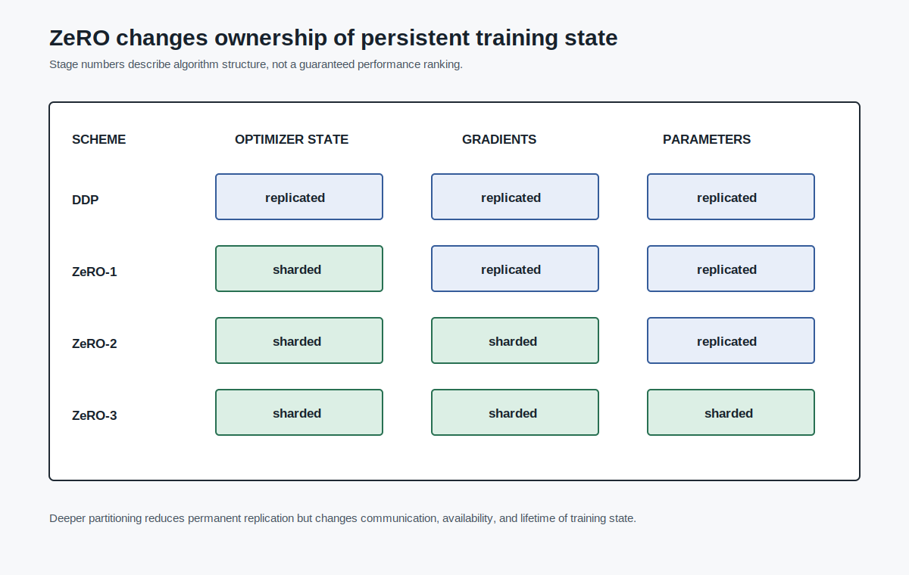

The original ZeRO paper frames the same goal as eliminating memory redundancies while retaining useful computational granularity and communication properties. [CITE: rajbhandari-2019-zero]

The core idea is simple:

```text
DDP: every worker stores the same training state
ZeRO: workers share responsibility for pieces of that state
```

ZeRO does not mean the model no longer trains data-parallel. Workers still process different data shards. The difference is that not every worker must permanently store every optimizer state, gradient, and parameter tensor.

The stages are easiest to understand as progressively removing replicated state:

```text
ZeRO-1: partition optimizer states
ZeRO-2: partition optimizer states + gradients
ZeRO-3: partition optimizer states + gradients + parameters
```

Each stage reduces a different memory category. Later stages save more resident memory but require more careful communication and scheduling.

### ZeRO-1 Partitions Optimizer States

Optimizer state can dominate training memory. For Adam-style optimizers, each parameter can have associated state such as momentum and variance. In mixed-precision setups, optimizer-side state may be stored at higher precision than the model copy used for forward and backward.

ZeRO-1 partitions optimizer states across `K` workers. The lecture describes stage 1 as partitioning optimizer states into `K` parts, with each GPU processing one partition, while FP16 parameters are still used for forward and backward. [CITE: llmsys-18-zero-stage1-optimizer]

Conceptually:

```text
DDP:
  worker 0: all optimizer state
  worker 1: all optimizer state
  worker 2: all optimizer state
  worker 3: all optimizer state

ZeRO-1:
  worker 0: optimizer state shard 0
  worker 1: optimizer state shard 1
  worker 2: optimizer state shard 2
  worker 3: optimizer state shard 3
```

Forward and backward still need model parameters. Gradients still have to be computed. But the optimizer update responsibility is partitioned: each worker owns the optimizer state for a shard of the parameters.

The design point is that optimizer state is large, persistent, and redundant under ordinary DDP. It is a natural first target.

### ZeRO-2 Partitions Gradients

ZeRO-2 extends the idea to gradients. The lecture states that each GPU computes all parameter gradients for its data partition, but stores only one partition of gradients instead of all gradients. Gradients outside a worker's responsibility are passed to the responsible GPU. [CITE: llmsys-18-zero-stage2-gradients]

This distinction matters:

```text
computed temporarily does not mean retained persistently
```

During backward, a worker may produce gradient values for many parameters. But after the relevant reduction/transfer, it only needs to keep the shard it owns.

In a four-worker example:

```text
gradient shard 0 -> worker 0 owns final shard
gradient shard 1 -> worker 1 owns final shard
gradient shard 2 -> worker 2 owns final shard
gradient shard 3 -> worker 3 owns final shard
```

Other workers may hold temporary buffers while computing or reducing those gradients, but they do not keep the full gradient set after ownership is resolved.

ZeRO-2 is therefore not just "smaller gradients." It is a change in lifetime and ownership:

```text
temporary local gradient computation
  -> reduce or send to owner
  -> release unowned gradient storage
```

That lifetime management is the systems mechanism.

### ZeRO-3 Partitions Parameters

ZeRO-3 partitions parameters themselves. The lecture describes partitioning parameters into `K` parts and communicating parameter partitions during forward and backward. [CITE: llmsys-18-zero-stage3-parameters]

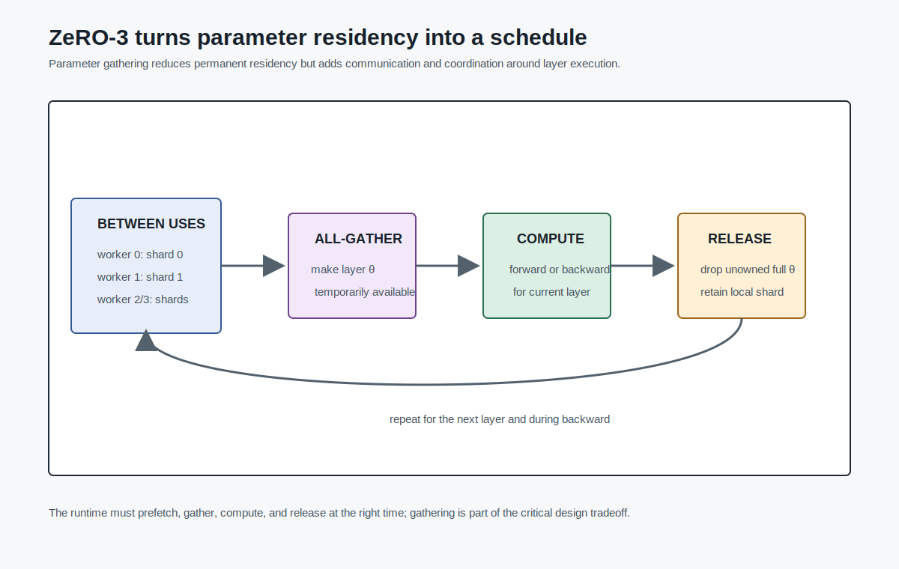

This is a stronger memory reduction because parameters are no longer fully resident on every worker. But the model computation still needs parameter values at the moment a layer runs. That means the runtime must make parameter shards available when needed and release unowned shards when they are no longer needed.

A simplified view:

```text
before computing a layer group:
  gather or broadcast needed parameter shard

compute forward or backward for that layer group

after the computation:
  keep owned shard
  release temporary unowned shards when safe
```

The important tradeoff is explicit in the lecture: ZeRO-3 reduces memory at the cost of additional parameter transfer. [CITE: llmsys-18-zero-communication-cost]

That tradeoff is not a footnote. It is the whole design problem. ZeRO-3 turns parameter residency into a schedule:

```text
which parameter shard is needed next?
which worker owns it?
when should it be communicated?
when can temporary copies be freed?
```

The memory saving is only useful if the communication can be scheduled without dominating the step.

### A Conditional Memory Formula

The lecture gives a compact symbolic memory accounting for ZeRO stages. This box is useful, but only under its assumptions. [CITE: llmsys-18-zero-memory-formulas]

Assume:

```text
N = number of model parameters
M = optimizer-state bytes per parameter
K = number of data-parallel workers
```

Use the lecture's simplified mixed-precision-style state accounting, where the formula tracks model-state categories and excludes activations, temporary buffers, fragmentation, and implementation-specific overhead.

Under those assumptions:

```text
Original DDP: 4N + M*N
ZeRO-1:       4N + M*N/K
ZeRO-2:       2N + (2+M)*N/K
ZeRO-3:       (4+M)*N/K
```

The formula should not be read as total training memory. It does not include activation memory, sequence-length effects, micro-batch size, framework buffers, allocator behavior, or communication staging.

What the formula does show is the direction of the stages:

```text
ZeRO-1 divides optimizer state
ZeRO-2 also divides gradient state
ZeRO-3 also divides parameter state
```

The reliable takeaway is not a universal byte count. It is the accounting habit: identify each resident state category, then ask whether it is replicated, partitioned, temporary, or recomputed.

### Beyond the Three Stages

The lecture also lists other memory optimizations: partitioned activation checkpointing, constant-size buffers, memory defragmentation, memory reuse, and communication reduction techniques. [CITE: llmsys-18-zero-other-memory-optimizations]

This matters because real training memory is not just long-lived tensors.

Activations can dominate for long sequences or large micro-batches. Checkpointing trades recomputation for lower activation storage, as Chapter 9 introduced. Communication buffers can spike memory during reductions or parameter transfers. Fragmentation can make nominally free memory unusable for a large allocation.

So ZeRO should be understood as part of a runtime memory manager:

```text
partition long-lived state
control temporary buffers
reduce activation residency
avoid fragmentation
schedule communication around computation
```

That is why ZeRO belongs after DDP and model parallelism. It is not another way to split layers. It is a way to split the training state that DDP would otherwise replicate.

### MoE: Store Capacity, Activate Sparsely

ZeRO reduces memory by partitioning training state. Mixture-of-Experts changes a different axis: which parameters are activated for each token.

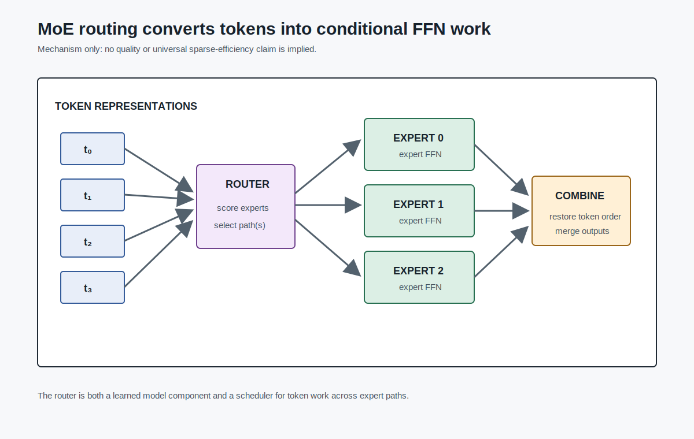

The MoE lecture defines Transformer MoE as replacing a single dense FFN with multiple expert FFNs and a router or gating network that selects one or more experts. [CITE: llmsys-17-moe-ffn-router]

In a dense Transformer block, every token passes through the same FFN parameters:

```text
token hidden state -> FFN -> output
```

In an MoE Transformer block:

```text
token hidden state -> router
                   -> selected expert FFN(s)
                   -> combined output
```

The system may store many expert FFNs, but each token activates only a subset. Switch-style MoE is a simple version: the lecture describes one token being passed through one selected FFN. [CITE: llmsys-17-switch-top1-routing] The Switch Transformer paper frames sparse expert selection as choosing different parameters for incoming examples, while also emphasizing complexity, communication cost, and training instability as practical barriers. [CITE: fedus-2021-switch-transformer]

The key distinction is:

```text
total parameters: all experts plus shared model components
activated parameters per token: selected expert path plus shared components
```

These are not the same number. That is why MoE can increase model capacity without making every token pay for every expert. It is also why parameter count alone is misleading for MoE cost.

### Routing Is a Systems Problem

The router is part of the model, but it also behaves like a scheduler. It decides where tokens go.

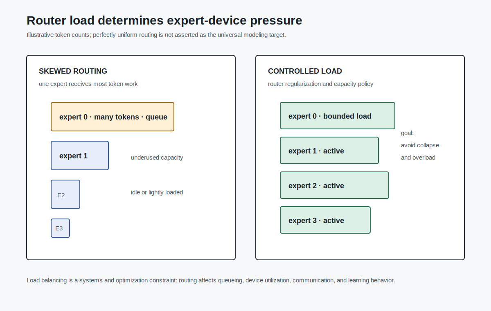

For each token, the router scores experts and chooses one or more expert paths. If many tokens choose the same expert, that expert's device becomes overloaded while others may sit underused. If the router spreads tokens more evenly, the system can use expert devices more effectively.

This is not only a throughput issue. The lecture notes that MoE training uses load-balancing losses to avoid routing collapse to experts and to balance computation across experts or devices. [CITE: llmsys-17-moe-load-balancing]

A useful way to think about the router:

```text
model role:
  choose expert computation for token representation

systems role:
  assign token work to expert devices
```

The same routing decision influences gradient flow, expert specialization, device utilization, communication volume, and queueing at expert owners.

This is why MoE is not just "a sparse FFN." It is conditional computation with a runtime placement problem.

### Expert Parallelism and All-to-All

MoE becomes a distributed-systems problem when experts are placed on different devices. The lecture describes expert parallelism as splitting experts across devices while replicating non-expert components, and it states that expert parallelism requires all-to-all communication. [CITE: llmsys-17-expert-parallelism]

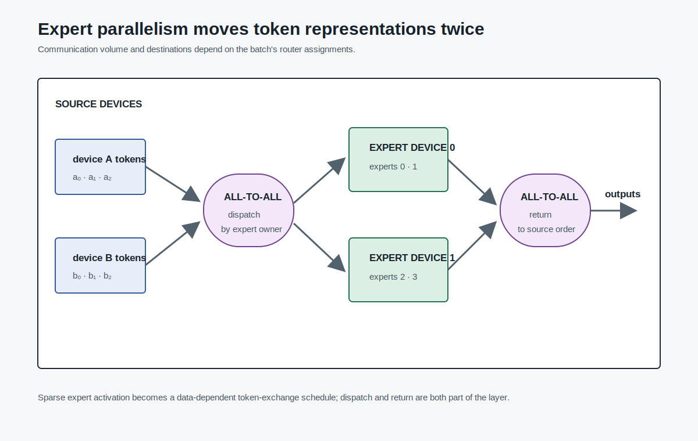

The flow is:

```text
1. each device starts with a batch of token hidden states
2. router chooses expert assignments
3. tokens are dispatched to devices that own selected experts
4. expert FFNs run
5. expert outputs return to the devices/layers that need them
```

The dispatch and return are the communication bottleneck. Unlike DDP all-reduce, where every worker combines corresponding gradient tensors, MoE expert parallelism moves token representations according to routing decisions. The communication pattern depends on the batch's token-to-expert assignment.

GShard is one important source for this style of system. The GShard paper combines conditional computation and automatic sharding for large sparse MoE Transformers. [CITE: lepikhin-2020-gshard]

The main lesson is:

```text
expert parallelism converts sparse activation into token exchange
```

Sparse compute helps only if token exchange, expert load, and kernel execution are scheduled efficiently.

### All-to-All Is Not a Detail

The MoE lecture states that expert parallelism creates all-to-all communication and discusses optimized all-to-all patterns such as hierarchical or parallelism-coordinated communication schedules. [CITE: llmsys-17-moe-alltoall-optimization]

That claim needs conditions. All-to-all cost depends on:

- number of expert-parallel devices;
- token count per batch or micro-batch;
- hidden dimension;
- routing fanout;
- token skew across experts;
- interconnect topology;
- implementation of the collective or point-to-point exchange;
- overlap with computation.

This chapter therefore avoids topology-free latency claims. The safe statement is:

```text
MoE communication is data-dependent:
the router determines which token representations move where
```

This makes MoE sensitive to batch shape and routing skew in a way that dense FFNs are not.

### Shared and Fine-Grained Experts

Modern MoE designs do not have to use only one set of routed experts. The lecture describes shared-routed expert designs, where an always-used shared expert captures common computation and routed experts handle token-specific computation. [CITE: llmsys-17-shared-routed-experts]

DeepSeekMoE is an example of this design direction. The paper proposes fine-grained expert segmentation and shared experts to improve expert specialization. [CITE: dai-2024-deepseekmoe]

At this chapter's level, the mechanism is:

```text
shared expert:
  always active path for common capacity

routed experts:
  selected paths for token-specific capacity

fine-grained experts:
  smaller expert units allow more flexible combinations
```

This is not a license to quote model-quality or compute-reduction numbers without experiment conditions. The useful systems point is that MoE architecture choices change routing granularity, expert load, and communication patterns.

### MoE Inference Preview

The lecture notes that MoE inference performance depends on overall model size, number of activated experts, memory bandwidth, token grouping, communication scheduling, and MoE kernels. [CITE: llmsys-17-moe-inference-bottlenecks]

DeepSpeed-MoE frames MoE as an end-to-end training and inference systems problem, including the difficulty of serving sparse expert models efficiently. [CITE: rajbhandari-2022-deepspeed-moe]

This chapter will not turn into a serving chapter. Part V covers serving, scheduling, KV cache, and inference memory in detail. The reason to mention inference here is to prevent a misconception:

```text
sparse activation reduces some compute,
but MoE still has memory bandwidth, routing, communication, and kernel costs
```

Training and inference both have to move token representations through expert paths. The exact bottleneck changes with workload and hardware, but the systems shape remains.

### ZeRO and MoE Solve Different Problems

ZeRO and MoE are often discussed together because both are used in large-model training stacks. But they solve different memory problems.

ZeRO asks:

```text
Which training state is redundantly stored on every data-parallel worker?
Can optimizer states, gradients, or parameters be sharded instead?
```

MoE asks:

```text
Does every token need to use the same dense FFN parameters?
Can the model store more expert capacity while activating only selected experts?
```

The bottlenecks differ:

```text
ZeRO bottleneck:
  parameter/gradient/optimizer-state residency
  plus communication to make shards available

MoE bottleneck:
  router decisions, expert load, token exchange,
  all-to-all communication, and memory bandwidth
```

They can also compose with the techniques from earlier chapters. A system may use tensor parallelism inside layers, pipeline parallelism across blocks, data parallelism across replicas, ZeRO to shard training state, and expert parallelism for MoE layers. That combination is powerful, but it is no longer "just training a Transformer." It is a distributed runtime with several interacting schedules.

### What to Remember

The central object in this chapter is not a layer or a kernel. It is a memory ledger.

For ZeRO:

```text
identify replicated state
partition ownership
communicate shards when needed
release temporary copies when safe
```

For MoE:

```text
store many experts
route each token to selected experts
move token representations to expert owners
balance load so sparse compute remains useful
```

The misconception to discard is:

```text
larger models are only a compute-scaling problem
```

At LLM scale, training is also a residency problem. The system must decide what lives on each device, what is temporary, what is partitioned, what is recomputed, and what must cross the network. ZeRO and MoE are two different answers to that residency problem: one partitions training state; the other sparsifies activated model capacity.

Owner: Principal Author
Purpose: Chapter 10 ready draft after source extraction, brief, technical review, and red-team review
Evidence grade: A for course lecture claims and primary papers; no benchmark numbers used
Assumptions: ZeRO formulas are presented only under the lecture's simplified `N`, `M`, `K` model-state accounting and exclude activations, buffers, fragmentation, and implementation overhead
Open questions: Whether to add PyTorch FSDP or ZeRO++ source cards in a later revision
Handoff: Production can move to Chapter 11 source extraction

# Part IV — Adaptation and Compression {#part-iv-adaptation-and-compression .part-title}

## Chapter 11: Quantization and Parameter-Efficient Adaptation {#chapter-11-quantization-and-parameter-efficient-adaptation .chapter-title}

Chapter 10 treated memory as a training-systems ledger. ZeRO changed where optimizer states, gradients, and parameters live. MoE changed which expert parameters each token activates.

This chapter keeps the same accounting habit, but changes the problem:

```text
The base model already exists.
How do we store it, run it, and adapt it without carrying unnecessary cost?
```

Two families of techniques matter here.

```text
quantization:
  change how tensors are represented

parameter-efficient fine-tuning:
  change which parameters are trainable
```

Quantization reduces precision. PEFT reduces trainable state. Both can reduce memory pressure. Neither is free. Quantization can introduce numerical error and require special kernels. PEFT can constrain adaptation capacity and add adapter-management complexity.

The systems question is:

```text
which memory category was reduced,
and what new numerical or runtime condition appeared?
```

### Compression and Adaptation Reopen the Memory Ledger

A trained LLM is expensive in several modes.

For inference, the base weights must be loaded and moved through memory. For adaptation, the system may need gradients, optimizer states, activations, and updated weights. Full fine-tuning brings the training ledger back: weights, gradients, optimizer states, activations, and temporary buffers.

The PEFT lecture states that full-parameter fine-tuning updates all model parameters and requires large GPU memory for weights, gradients, optimizer states, and activations. [CITE: llmsys-23-full-finetuning-cost]

Quantization and PEFT reduce different terms:

```text
quantization:
  fewer bits per stored value

PEFT:
  fewer trainable values with gradient and optimizer state
```

That distinction is important. A quantized model can still be hard to fine-tune if the training method dequantizes too much state or maintains full optimizer state. A LoRA-adapted model can still be expensive to serve if the base weights are large and kernels are inefficient.

### Quantization Changes Representation

The quantization lecture defines model quantization as using low-bit precision to store parameters and layer outputs. It can reduce memory and may improve calculation throughput, but can also reduce accuracy. [CITE: llmsys-19-quantization-purpose]

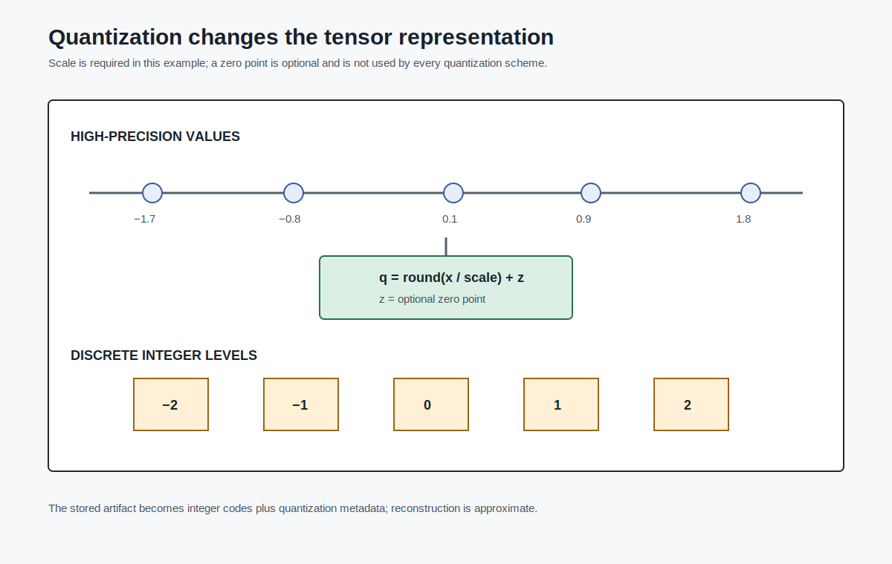

The basic idea is to map a real-valued tensor into a smaller set of representable values:

```text
float tensor -> integer code tensor + scale metadata
```

At inference or during a kernel, the system may use those integer codes directly, dequantize them, or use a mixed computation path. The details depend on the bitwidth, hardware, kernel implementation, and operation.

The safe claim is:

```text
quantization reduces representation cost;
performance depends on whether the runtime can exploit that representation
```

Lower precision does not automatically mean faster inference. If a kernel has to dequantize inefficiently, if the hardware lacks the right low-bit path, or if memory movement is not the bottleneck, the expected speedup may not appear.

### Scale, Zero Point, and Error

A quantizer maps a real value to an integer code. The simplest version uses a scale:

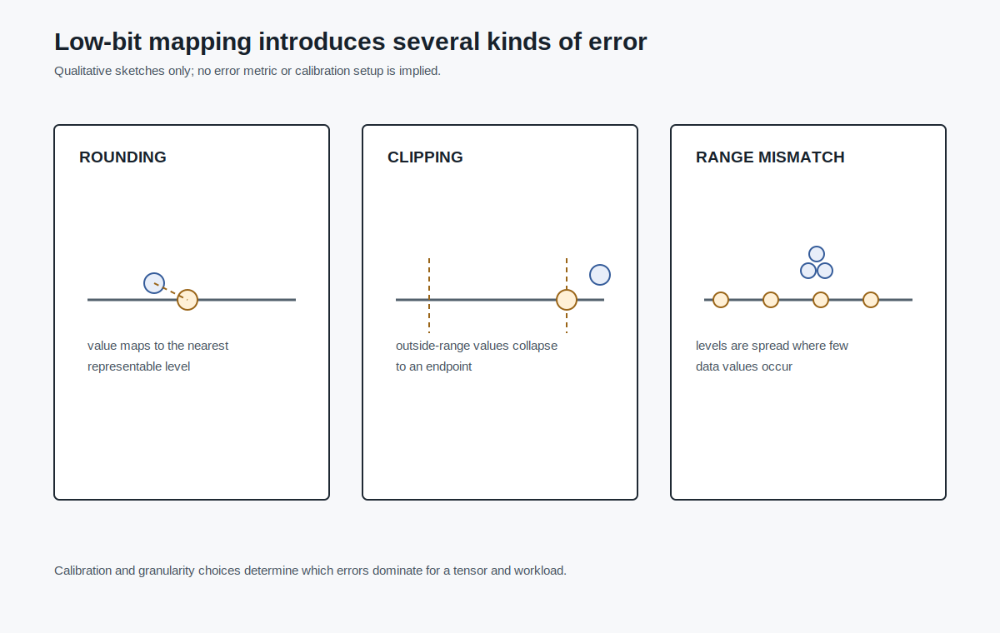

```text
q = round(x / s)
x_hat = s * q
```

where `x` is the original value, `q` is the integer code, `s` is the scale, and `x_hat` is the reconstructed approximation.

Absmax quantization chooses a scale from the largest absolute value in the tensor. The lecture summarizes it as linearly scaling according to the maximum absolute value. [CITE: llmsys-19-absmax-zeropoint]

Zero-point quantization adds an offset:

```text
q = round(x / s + z)
x_hat = s * (q - z)
```

where `z` is the zero point. This is useful when the representable integer range should be aligned with a real-valued range whose midpoint is not zero.

The mapping creates error. The lecture names several failure modes: loss of precision, range mismatch that clips values, and rounding error. [CITE: llmsys-19-direct-quantization-errors]

Those errors have different shapes:

```text
rounding:
  value lands on nearest representable bucket

clipping:
  value lies outside representable range and is cut off

range mismatch:
  scale wastes buckets on rarely used values or underserves important regions
```

Quantization is therefore not only a storage decision. It is an approximation decision.

### Post-Training Quantization and Calibration

Quantization can be built into training, or applied after training. The lecture distinguishes training-time and post-training approaches. [CITE: llmsys-19-quantization-approaches]

Post-training quantization is attractive because it avoids retraining the whole model. But it must preserve behavior using limited calibration data and local adjustments.

For a linear layer:

```text
Y = W X
```

a layer-wise quantization objective tries to choose quantized weights `W_hat` so the output stays close:

```text
minimize || W X - W_hat X ||^2
```

The lecture presents layer-wise quantization as minimizing the linear layer's output difference. [CITE: llmsys-19-layerwise-objective]

This objective shows why calibration data matters. The quantizer is not matching weights in the abstract. It is trying to preserve the layer's behavior on representative inputs `X`.

Layer-wise calibration also has a limitation: local output matching does not automatically remove accumulated error across the whole network. A small mismatch at one layer can shift the input distribution seen by later layers.

### ZeroQuant and LLM.int8 Show Two Scaling Tactics

ZeroQuant and LLM.int8 are useful because they show two different responses to the same problem: naive low-bit conversion is too brittle for large Transformer models.

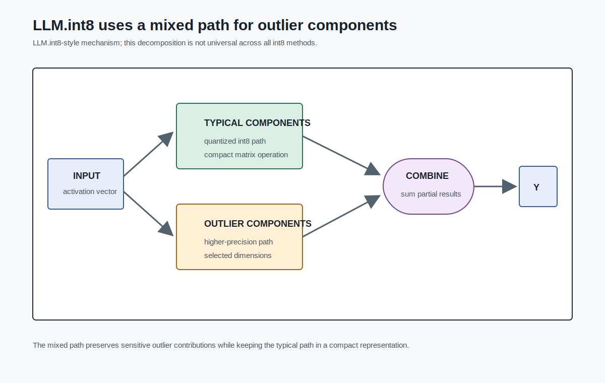

ZeroQuant uses layer-by-layer knowledge distillation. The lecture describes the full-precision model as the teacher and the quantized model as the student. [CITE: llmsys-19-zeroquant]

That is a calibration strategy:

```text
teacher layer output:
  what the full-precision model would produce

student layer output:
  what the quantized layer produces

training signal:
  reduce the mismatch
```

LLM.int8 addresses a different issue: outlier features. The lecture states that LLM.int8 keeps outliers in higher precision while quantizing the rest to 8-bit. [CITE: llmsys-19-llmint8-outliers]

The LLM.int8 paper frames this as vector-wise quantization plus a mixed-precision decomposition for outlier dimensions. [CITE: dettmers-2022-llmint8]

The systems lesson is:

```text
the rare values may determine the numerical path
```

If most values quantize well but a small set of activation dimensions has large magnitude, a uniform low-bit path can damage accuracy. A mixed path keeps the common case compact while preserving a higher-precision path for outliers.

### GPTQ: Quantize, Measure Error, Compensate

GPTQ is a post-training weight quantization method for generative Transformers. The lecture presents its goal as quantizing very large models while maintaining accuracy through layer-wise weight-matrix quantization. [CITE: llmsys-20-gptq-goal]

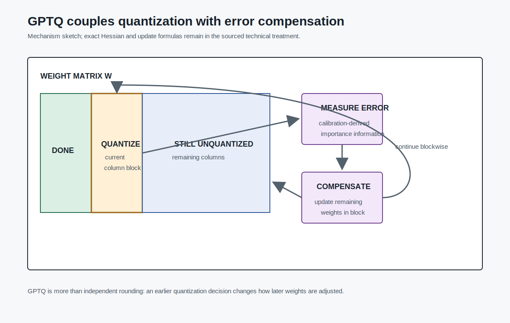

The GPTQ paper describes it as one-shot weight quantization using approximate second-order information. [CITE: frantar-2022-gptq]

The mechanism can be understood without a full derivation:

```text
1. take a layer's weight matrix W
2. use calibration inputs X for that layer
3. quantize part of W
4. measure the induced error
5. update still-unquantized weights to compensate
6. continue until the layer is quantized
```

The lecture emphasizes that GPTQ quantizes one column block at a time and updates not-yet-quantized weights to compensate for the error caused by quantizing earlier weights. [CITE: llmsys-20-gptq-blockwise-compensation]

This is the central idea:

```text
rounding error is not only accepted;
it is pushed into future compensation
```

GPTQ uses information derived from the layer inputs. The lecture describes precomputing information from the inverse Hessian using Cholesky decomposition. [CITE: llmsys-20-gptq-hessian-cholesky]

For this chapter, the important point is not the exact matrix formula. It is why second-order information appears at all. Some weights matter more than others for the layer output on the calibration distribution. Curvature-like information helps estimate how quantization error in one weight can be compensated by adjusting remaining weights.

### GPTQ Is Also a Systems Method

The algorithmic idea is only useful if it can run at model scale. The lecture describes GPTQ lazy updates: rather than applying every compensation update immediately in a way that underuses the GPU, GPTQ batches or delays updates to improve practical efficiency. [CITE: llmsys-20-gptq-lazy-updates]

That makes GPTQ a systems method, not just an optimization formula:

```text
calibration data determines local behavior
block order determines update dependencies
precomputation determines available curvature information
lazy updates determine practical GPU efficiency
custom kernels determine inference benefit
```

This chapter deliberately avoids GPTQ benchmark numbers. The value of a quantized model depends on model family, bitwidth, calibration set, hardware, kernel implementation, batch size, sequence length, and whether inference is memory-bound or compute-bound.

### Full Fine-Tuning Carries Full Training State

Quantization changes representation. PEFT changes what is trained.

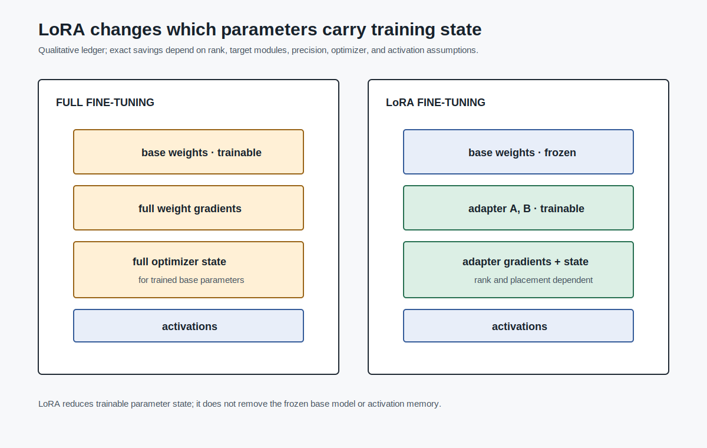

Full fine-tuning updates all model parameters. That means the system needs gradient and optimizer state for all trainable parameters. Chapter 10's ledger returns:

```text
base weights
weight gradients
optimizer states
activations
temporary buffers
```

The PEFT lecture uses full fine-tuning as the motivation for parameter-efficient methods: updating all parameters requires large GPU memory. [CITE: llmsys-23-full-finetuning-cost]

The problem is not that full fine-tuning is conceptually hard. It is that full fine-tuning reintroduces the memory footprint of training for every parameter, even if the adaptation task may only need a much smaller change.

### PEFT Changes What Is Trainable

Parameter-efficient fine-tuning updates a small subset or low-rank set of parameters rather than the entire model. [CITE: llmsys-23-peft-definition]

The lecture groups PEFT methods into selective, reparameterization, and additive methods. [CITE: llmsys-23-peft-categories]

At a systems level, the categories differ in what state they add or expose:

```text
selective:
  train chosen existing parameters

reparameterization:
  train a smaller parameterization of an update

additive:
  add trainable modules or prompts around the frozen model
```

This chapter focuses on LoRA because its system tradeoff is especially direct: freeze a large base matrix and train a low-rank update.

### LoRA: Low-Rank Updates

LoRA freezes pretrained weights and trains a low-rank update. The lecture writes the adapted weight as:

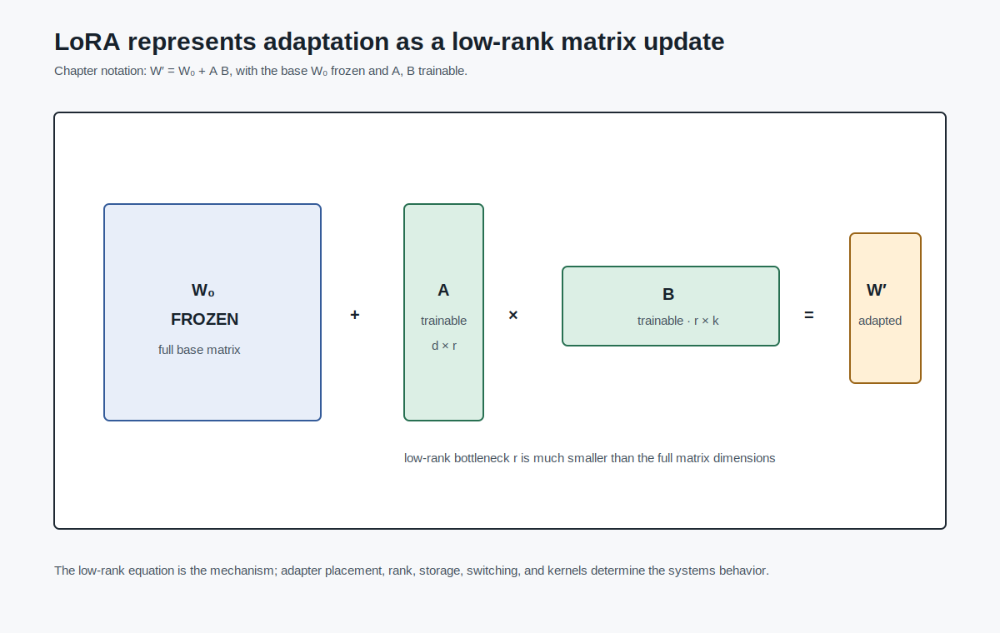

```text
W' = W0 + A B
```

where `W0` is the frozen pretrained weight and `A B` is a low-rank update with rank `r` much smaller than the full dimension. [CITE: llmsys-23-lora-lowrank-update]

The LoRA paper states the same core mechanism: freeze pretrained model weights and inject trainable rank-decomposition matrices into Transformer layers. [CITE: hu-2021-lora]

The forward path becomes:

```text
y = W0 x + A B x
```

The base matrix still participates in inference and training forward passes. But the trainable parameters are `A` and `B`, not all of `W0`.

That distinction matters for memory:

```text
frozen base weight:
  stored, used in forward/backward computation,
  but no optimizer state for updating it

LoRA matrices:
  stored, trained,
  carry gradients and optimizer state
```

The lecture states that LoRA training stores original parameters, adapter weights, adapter gradients, adapter states, and activations, and does not need original parameter states. [CITE: llmsys-23-lora-training-state]

LoRA does not remove activation memory. It does not make the base model disappear. Its main training-memory effect is reducing trainable parameter state.

### Adapter Placement Is a Design Choice

LoRA is often described by the equation `W' = W0 + A B`, but the system still has to decide where adapters go.

The lecture discusses applying LoRA/CIAT to Transformer weights such as attention projections, and notes that placement can vary. [CITE: llmsys-23-lora-lowrank-update]

Placement affects:

- trainable parameter count;
- memory for adapter gradients and optimizer state;
- compute overhead in forward/backward;
- task quality;
- adapter storage for multi-task deployment;
- whether adapters can be merged into base weights for a given deployment mode.

This is another example of the book's recurring rule:

```text
the mathematical trick becomes a systems interface
```

The low-rank update is the math. Target-module selection, adapter storage, merging, switching, and kernel behavior are the systems interface.

### QLoRA Combines Quantization and Low-Rank Training

QLoRA connects the two halves of this chapter. The lecture describes it as quantization plus low-rank training. [CITE: llmsys-23-qlora-quantized-lora]

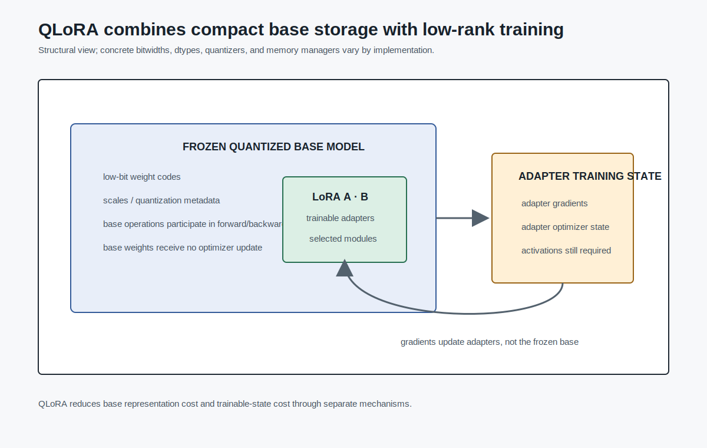

The QLoRA paper states that gradients are backpropagated through a frozen 4-bit quantized pretrained language model into LoRA adapters, and introduces NF4, double quantization, and paged optimizers. [CITE: dettmers-2023-qlora]

The basic structure is:

```text
base model:
  frozen
  stored in low precision

adapter:
  trainable
  low-rank
  carries gradients and optimizer state
```

QLoRA reduces memory from two directions:

```text
quantization reduces base model representation cost
LoRA reduces trainable-state cost
```

This does not mean QLoRA is automatically the right choice for every task or deployment. Quality, training stability, kernel support, optimizer behavior, and adapter rank still matter. The safe claim is structural: QLoRA combines a quantized frozen base with trainable low-rank adapters.

### Deployment Consequences

Compression and adaptation affect serving even when this chapter is not a serving chapter.

Quantized models need kernels that can exploit the chosen representation. A weight-only quantized model may reduce memory bandwidth pressure, but dequantization and mixed-precision paths still cost work. Low-bit storage is not the same as low-bit end-to-end execution.

LoRA-style adapters create a different deployment question:

```text
one base model
many task adapters
```

This can be useful because adapters are much smaller than full model copies. But a serving system still has to load, select, batch, merge, or switch adapters correctly. Those details interact with latency and memory.

Part V will handle serving architecture. The point here is narrower:

```text
compression and adaptation change the runtime contract
```

The model artifact is no longer just "a set of weights." It may be integer codes plus scales, mixed-precision outlier paths, frozen base weights, and adapter matrices.

### What to Remember

Quantization asks:

```text
How many bits do we need to represent this tensor well enough,
and can the runtime exploit that representation?
```

PEFT asks:

```text
Which parameters actually need gradients and optimizer state
for this adaptation?
```

GPTQ shows that quantization can be more than rounding: it can use calibration data and compensation to reduce output error. LoRA shows that fine-tuning can be more than updating every parameter: it can train a low-rank update while freezing the base model. QLoRA combines those ideas by storing the base model in low precision and training low-rank adapters.

The misconception to discard is:

```text
compression is just making the model smaller
```

Compression and adaptation are systems decisions. They alter memory layout, numerical error, kernel requirements, trainable state, optimizer state, and deployment mechanics. A smaller artifact is useful only when the surrounding runtime can preserve enough quality and convert the representation change into real memory or throughput benefits.

Owner: Principal Author
Purpose: Chapter 11 ready draft after source extraction, brief, technical review, and red-team review
Evidence grade: A for course lecture claims and primary papers; no benchmark numbers used
Assumptions: Chapter 11 focuses on mechanisms and systems tradeoffs; detailed benchmark comparisons, NF4 derivation, and serving architecture are out of scope
Open questions: Whether to add a deeper QLoRA source pass for NF4, double quantization, and paged optimizers
Handoff: Production can move to Chapter 12 source extraction

# Part V — Inference and Serving {#part-v-inference-and-serving .part-title}

## Chapter 12: The Cost Model of LLM Inference {#chapter-12-the-cost-model-of-llm-inference .chapter-title}

Training systems work on known batches. Serving systems do not.

An LLM server receives requests over time. Some prompts are short. Some are long. Some users ask for one sentence. Others ask for a page. Some requests share a prefix. Some arrive while the GPU is already decoding tokens for other users.

The serving problem is therefore not just:

```text
run model.forward()
```

It is:

```text
admit requests
batch compatible work
stream outputs
manage KV memory
route prefix reuse
keep GPU workers busy
control user-facing latency
```

The serving lecture states that efficient LLM servers must handle multi-user sessions, many simultaneous requests, varying generation lengths, common prompt prefixes, throughput, latency, and heterogeneous CPU/GPU devices. [CITE: llmsys-22-serving-goals]

This chapter builds the cost model that later chapters will refine. Chapter 13 will focus on KV cache, PagedAttention, and vLLM. Chapter 14 will focus on scheduling, caching, and disaggregation. Here the goal is to understand the terms that make inference expensive.

### Serving Is Online, Not a Training Step

The LLM application stack contains more than model execution. The serving framework lecture separates data preprocessing/embedding, prompt construction/retrieval, and prompt execution/inference. [CITE: llmsys-30-llm-app-stack]

This chapter focuses on prompt execution, but the boundary matters. A user request may arrive after retrieval, prompt construction, safety checks, or application orchestration. The inference server receives a prompt and has to produce output tokens under latency and throughput constraints.

The serving layer is often split into:

```text
API / request layer
tokenizer
scheduler
model worker
memory manager
detokenizer / streaming output
```

The course lecture uses serving frameworks to show this boundary: a serving layer may group client requests, while an inference engine performs batched model execution. [CITE: llmsys-30-serving-framework-boundary] Triton plus an inference engine is one example of this separation. [CITE: llmsys-30-triton-batching-engine]

The point is architectural, not a product recommendation:

```text
serving = request system + model execution system + memory system
```

The cost model has to include all three.

### Autoregressive Inference Has Two Phases

Autoregressive generation produces text one token at a time. ORCA describes Transformer-based generative inference as multiple model iterations, where each iteration generates a single output token. [CITE: yu-2022-orca-autoregressive-iterations]

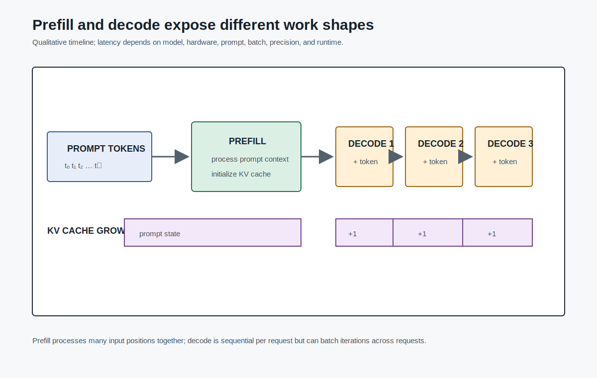

In serving systems, it is useful to split a request into two phases:

```text
prefill:
  process the input prompt
  build the initial attention state
  produce the first output-token distribution

decode:
  repeatedly generate one new token
  reuse previously stored keys and values
  stop when the request reaches its stop condition
```

Prefill cost grows with prompt length. Decode cost grows with generated length, but each decode step depends on the previous step's output. That dependency makes decode sequential at the request level:

```text
token t must be generated before token t+1 can be generated
```

Across requests, however, decode iterations can be batched. The serving scheduler decides which requests participate in each iteration.

### Latency Is Not One Number

Users experience several different delays:

```text
queueing delay:
  time before the request starts useful model work

time to first token:
  time until the first generated token can be streamed

per-token decode time:
  time between streamed output tokens

total response time:
  time until the request finishes
```

Throughput is also multi-sided. A server may report requests per second, tokens per second, or useful output tokens per second. These can move in different directions depending on prompt length, output length, batching policy, and cache reuse.

This chapter avoids formal metric abbreviations unless a later revision adds dedicated metric source cards. The practical point is enough:

```text
prefill dominates first-token latency for long prompts;
decode scheduling dominates streaming cadence for long outputs;
queueing depends on admission and batching;
KV memory limits how many requests can stay active
```

### Why Request-Level Batching Fails

Batching is natural for GPU utilization. Training uses batches constantly. But serving batches are different because requests have different output lengths.

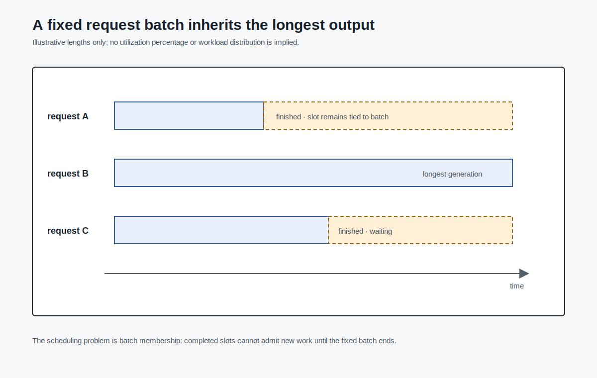

The serving lecture describes the challenge: a request batch may lead to different generation lengths, and a naive implementation waits for the longest sequence. [CITE: llmsys-22-naive-batch-longest]

ORCA makes the same point at the paper level. Under request-level scheduling, finished requests can wait for the whole batch, and newly arrived requests can wait for the current batch to finish. [CITE: yu-2022-orca-request-level-limitation]

Imagine a batch with three requests:

```text
request A: generate 2 tokens
request B: generate 20 tokens
request C: generate 5 tokens
```

If the engine treats the batch as one unit, A and C may be stuck behind B. The GPU may also miss opportunities to admit new requests after A and C finish.

The bottleneck is not only compute. It is batch membership:

```text
which requests are active in this iteration?
when can finished requests leave?
when can new requests enter?
```

### Continuous Batching

Continuous batching changes the scheduling granularity. Instead of choosing a batch and waiting for every request in it to finish, the scheduler updates the active set between generation iterations.

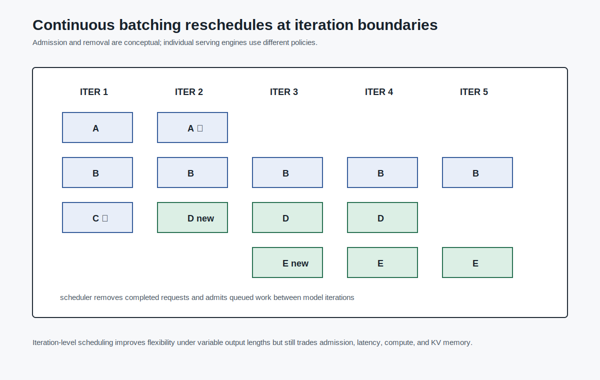

The serving lecture describes continuous batching as iteration-level scheduling: at each token-generation step, schedule a new request whenever one request finishes in a batch. [CITE: llmsys-22-continuous-batching]

ORCA calls this iteration-level scheduling: the serving system invokes the execution engine to run one model iteration on a batch, then can update request membership. [CITE: yu-2022-orca-iteration-level-scheduling]

The loop is:

```text
choose active requests
run one generation iteration
stream produced tokens
remove finished requests
admit waiting requests if memory and policy allow
repeat
```

Continuous batching improves the system's ability to keep the GPU occupied under variable output lengths. It does not remove every tradeoff. Larger batches may improve hardware utilization but increase contention for KV memory. Admitting prefill work can affect ongoing decode latency. Scheduler policy still determines fairness, queueing, and user-visible delay.

### Selective Batching

A Transformer block contains operations with different batching behavior. Linear layers, layer normalization, and elementwise operations can often benefit from batching across requests. Attention is harder when requests have different processed lengths and KV cache states.

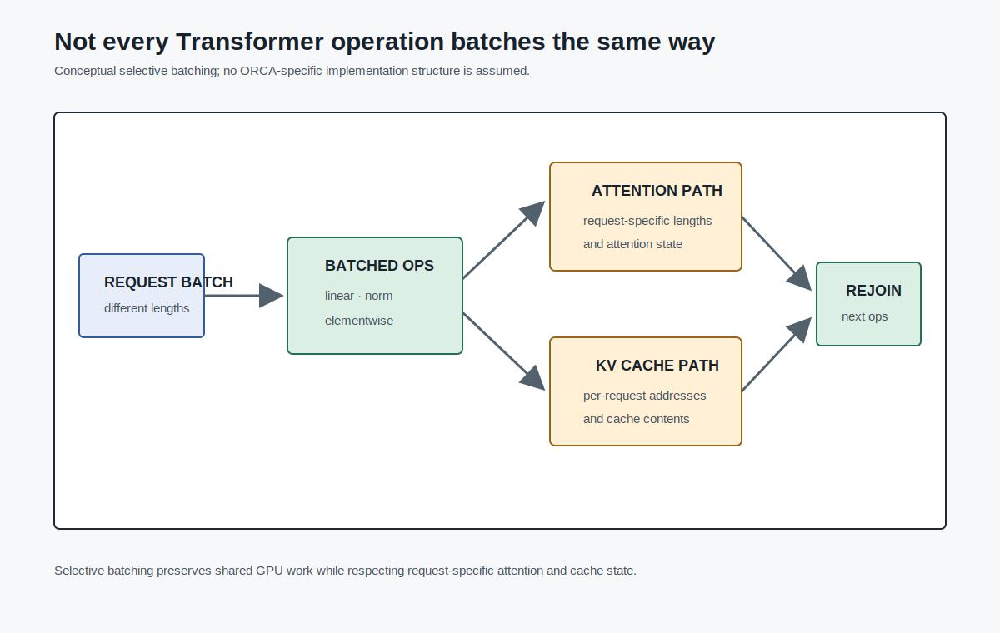

The serving lecture describes selective batching as batching non-attention operations while attention is executed by an attention engine. [CITE: llmsys-22-selective-batching]

ORCA describes selective batching as applying batching only to selected operations. [CITE: yu-2022-orca-selective-batching]

The reason is shape and reuse:

```text
non-attention operations:
  often share compatible dense computation across requests

attention:
  depends on each request's current context length and KV state
```

This is the operation-level version of the serving problem. Not all work in a batch is equally batchable.

### The Scheduler Is Part of the Critical Path

The scheduler does more than maintain a queue. The serving lecture lists scheduler responsibilities: receive input requests, stream outputs, check stop conditions, reorder requests, prepare batches, and allocate memory for next and running batches. [CITE: llmsys-22-request-scheduler]

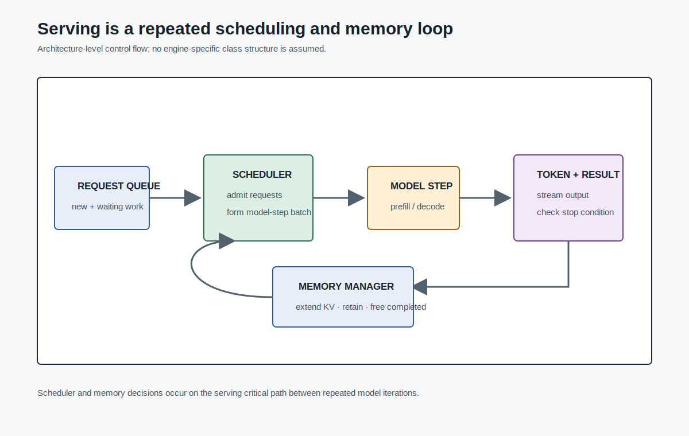

A simplified loop:

```text
while server is running:
  receive new requests
  process input requests
  choose next batch
  run model worker
  process generated tokens
  check stop conditions
  update memory ownership
```

This work can affect GPU utilization. If the GPU finishes an iteration and waits for the CPU scheduler, CPU-side overhead is now in the critical path.

The serving lecture therefore discusses overlapping CPU scheduler work with GPU model-worker execution. [CITE: llmsys-22-scheduler-worker-overlap]

The lesson is:

```text
serving overhead is not outside the model;
it can become part of the model's effective latency
```

### KV Cache Is Serving Memory

During decode, the model needs attention keys and values from previous tokens. Recomputing them every step would be wasteful. Transformer serving systems therefore store keys and values for previous tokens in GPU memory as a KV cache. [CITE: llmsys-22-kv-cache-need]

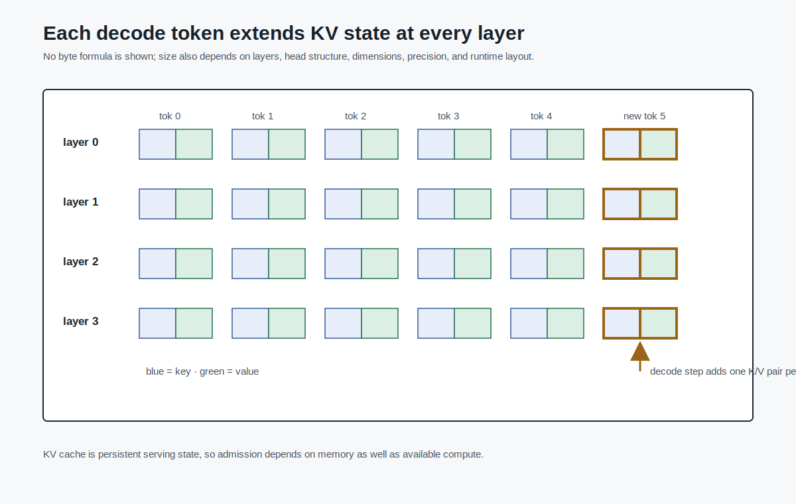

This changes the memory model:

```text
training memory:
  parameters + gradients + optimizer state + activations

serving memory:
  parameters + KV cache + temporary buffers + scheduler/runtime state
```

KV cache grows with:

```text
number of active requests
prompt length
generated length so far
number of layers
attention head dimensions
precision
```

This chapter intentionally avoids KV cache byte formulas. Chapter 13 will study KV cache and PagedAttention in detail. For the inference cost model, the key point is:

```text
active tokens consume persistent serving memory
```

The scheduler cannot admit requests based only on compute availability. It also needs enough KV memory for active and newly admitted requests.

### Prefix Reuse and Cache-Aware Scheduling

Many serving workloads contain repeated prefixes. A chat system may reuse prior conversation state. An in-context learning application may send the same examples with many queries. A system prompt may appear across many requests.

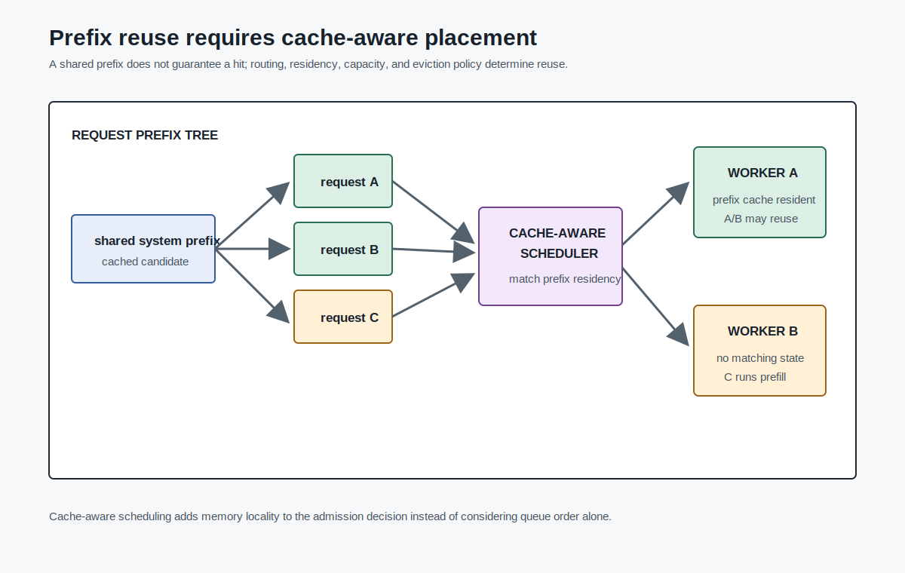

RadixAttention stores KV memory pointers in a radix tree keyed by prompt prefixes. [CITE: llmsys-22-radixattention-prefix-cache]

The mechanism is:

```text
shared prompt prefix
  -> shared path in prefix tree
  -> pointers to existing KV memory
  -> less repeated prefill work if cache is hit
```

Cache-aware scheduling can use matched prefix length or predicted prefix KV cache hit rates when ordering or routing requests. [CITE: llmsys-22-cache-aware-scheduling]

This introduces another cost-model term:

```text
effective prefill cost depends on prefix reuse
```

If a request hits a useful prefix cache, some prompt processing work may be reused. If it misses, the server pays the full prefill cost. If cache memory is full, eviction policy matters.

The detailed data structures belong in Chapter 13 and Chapter 14. Here the point is that a scheduler can be cache-aware, not only queue-aware.

### Tokenization, Detokenization, and Routing Are Also Work

Model kernels are the largest visible part of serving, but they are not the only work. The serving framework lecture notes systems such as LightLLM that perform tokenization, model inference, and detokenization asynchronously, and include token-wise KV cache memory management and routing. [CITE: llmsys-30-lightllm-async-token-attention]

This reinforces the boundary:

```text
request arrives as text
text becomes tokens
tokens enter scheduler/model worker
output tokens become streamed text
memory state is updated
```

When model execution is highly optimized, these surrounding steps can become visible. They may also affect batching because tokenization and detokenization happen at request boundaries, while model execution happens at prefill/decode iteration boundaries.

### A Conceptual Cost Model

A useful inference cost model does not start with one latency number. It starts with the pieces:

```text
request cost ≈ queueing
             + prefill(prompt length, prefix reuse)
             + decode(output length, batch policy)
             + KV memory pressure
             + scheduler/runtime overhead
```

This is not a numerical formula. It is a checklist.

For a long prompt and short output, prefill may dominate. For a short prompt and long output, decode scheduling and per-token latency may dominate. For many concurrent long-context requests, KV memory may dominate admission. For repeated system prompts or shared examples, prefix reuse can change effective prefill cost. For an overloaded server, queueing delay may dominate user experience.

The scheduler's job is to trade these costs against each other:

```text
admit more requests -> better occupancy, more KV memory pressure
larger batch -> better throughput, possible latency tradeoff
cache reuse -> less prefill work, more cache-management policy
overlap scheduler -> less CPU overhead on GPU critical path
```

### What to Remember

LLM inference is not a single forward pass. It is online, stateful, and iterative.

The core serving loop is:

```text
prefill prompt
store KV cache
decode one token
update request state
rebatch
repeat
```

The misconception to discard is:

```text
serving is just batching requests through the model
```

Batching is necessary, but insufficient. A serving system also manages variable output lengths, queueing, streaming, stop conditions, KV memory, cache reuse, CPU/GPU coordination, and user-facing latency. The model computes tokens; the server decides which tokens can be computed now.

Owner: Principal Author
Purpose: Chapter 12 ready draft after source extraction, brief, technical review, and red-team review
Evidence grade: A for course lecture claims and ORCA paper; no benchmark numbers used
Assumptions: Chapter 12 is a conceptual inference cost-model chapter; detailed PagedAttention/vLLM and disaggregated serving mechanisms remain Chapters 13-14
Open questions: Whether to add formal TTFT/TPOT terminology with dedicated source cards in a later revision
Handoff: Production can move to Chapter 13 source extraction

## Chapter 13: KV Cache, PagedAttention, and vLLM {#chapter-13-kv-cache-pagedattention-and-vllm .chapter-title}

Chapter 12 described inference as an online cost model: prefill, decode, batching, scheduling, and KV cache memory all interact. This chapter zooms into the memory term.

The important shift is simple:

```text
KV cache is not a temporary activation.
KV cache is persistent serving state.
```

During autoregressive decoding, each active request accumulates key and value tensors that later decode steps need. Those tensors live across model iterations. A serving engine therefore has to decide where they live, how they grow, when they can be shared, and what happens when the GPU runs out of available cache space.

The vLLM lecture states that attention KV cache stores per-token attention key/value state during inference. [CITE: llmsys-24-kv-cache-serving-state] It also frames efficient KV cache management as crucial for high-throughput LLM serving. [CITE: llmsys-24-kv-cache-memory-management] The original PagedAttention paper makes the same problem central: dynamic KV cache growth and fragmentation limit useful batching, and vLLM addresses that bottleneck with a new KV cache memory-management design. [CITE: kwon-2023-pagedattention]

The core idea is to stop treating a request's KV cache as one large contiguous tensor reservation. PagedAttention splits KV cache into fixed-size blocks, maps a request's logical blocks to physical GPU-memory blocks, and teaches the attention kernel how to read through that mapping. [CITE: llmsys-24-pagedattention-definition]

### Why KV Cache Becomes the Serving Memory Problem

Model parameters are large, but they are mostly stable during serving. They are loaded once per worker or sharded across workers, then reused across requests.

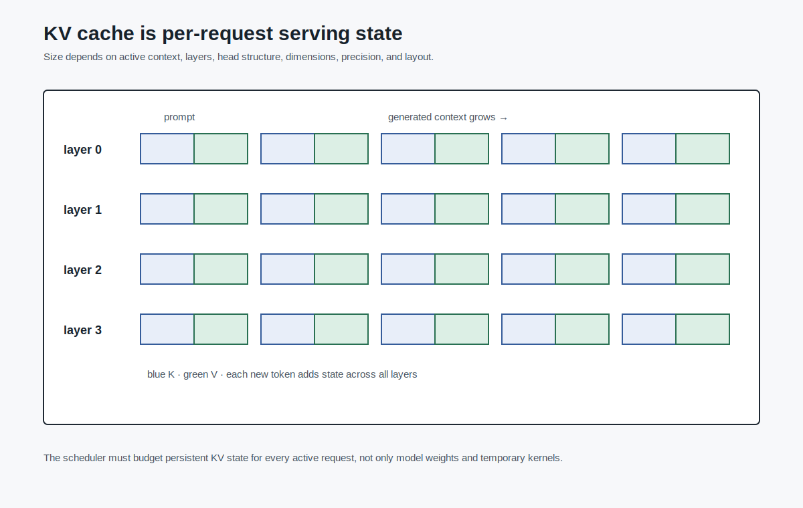

KV cache is different. It grows with the live workload:

```text
more active requests      -> more KV state
longer prompts            -> more initial KV state after prefill
longer generations        -> more decode-time KV state
more layers / KV heads    -> more state per token
larger element precision  -> more bytes per state value
```

The vLLM lecture frames inference pressure as increasing with model size, context length, and generated-token count. [CITE: llmsys-24-inference-scaling-pressure] The memory consequence is that a server may have enough arithmetic capacity to continue decoding, but not enough useful KV cache space to keep more requests resident.

This is why serving cannot be described as:

```text
parameters fit on GPU -> serving is solved
```

A more accurate serving memory ledger is:

```text
serving memory =
  model parameters
  + KV cache for active requests
  + temporary buffers
  + runtime and scheduler state
```

The KV cache term changes every time requests arrive, finish, or generate another token.

### Why Contiguous Allocation Fails

A straightforward allocator can reserve one contiguous KV cache region for each request. If the engine knows the request will never exceed a fixed maximum length, it can reserve enough space for that maximum.

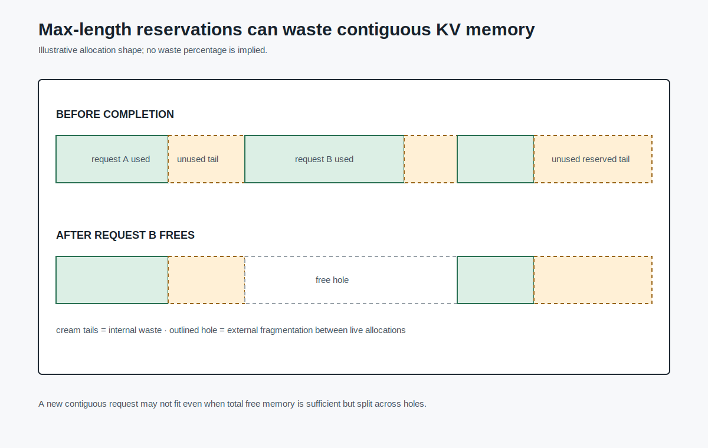

That approach matches older static-shape deep learning workloads better than online text generation. In generation, output length is unknown at admission time. Two requests with the same maximum length may finish at very different actual lengths. Different requests may also have different prompt lengths and generation limits.

The vLLM lecture describes previous KV cache management as preallocating contiguous memory to a request's maximum length, producing internal fragmentation from unknown output length and external fragmentation from non-uniform request maximums. [CITE: llmsys-24-contiguous-preallocation-fragmentation]

The waste has two forms:

```text
internal fragmentation:
  reserved slots inside a request allocation are never filled

external fragmentation:
  free memory exists, but not in the right contiguous shapes
```

For a serving engine, this is not just allocator ugliness. Fragmented KV memory reduces the number of active requests that can fit. Fewer active requests can reduce batching opportunities during decode. Worse batching can reduce throughput or increase queueing delay.

The lecture reports low KV cache utilization for earlier systems while citing ORCA, but the slide does not carry enough experiment context to use the numeric range as a general book claim. [CITE: llmsys-24-kv-cache-utilization-caution] The safe conclusion is qualitative: contiguous maximum-length reservation is a poor fit for variable-length autoregressive serving.

### KV Blocks

PagedAttention changes the allocation unit. Instead of reserving one contiguous region for an entire request, it divides KV cache into fixed-size KV blocks. The lecture defines a KV block as a fixed-size block of memory that stores KV cache state. [CITE: llmsys-24-kv-block-definition]

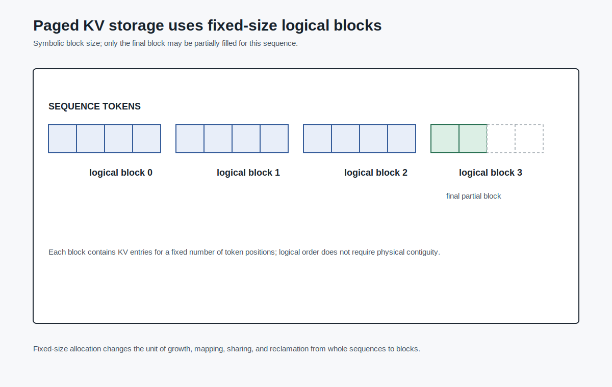

Conceptually:

```text
tokens in sequence order:
  t0 t1 t2 t3 | t4 t5 t6 t7 | t8 t9 ...

logical KV blocks:
  block 0     | block 1     | block 2 ...
```

The block size is an allocator choice. Smaller blocks can reduce unused space at the end of a sequence, but they can increase metadata and management overhead. Larger blocks reduce metadata pressure, but they can waste more space in the final partially filled block.

The useful property is that a request can grow one block at a time:

```text
request starts with prompt blocks
decode fills the current last block
when full, allocate one more physical block
```

This matches generation better than maximum-length reservation. The allocator does not need to know the final output length when the request arrives.

### Logical Blocks and Physical Blocks

Once a request is split into logical blocks, those logical blocks do not have to live in adjacent physical GPU-memory blocks.

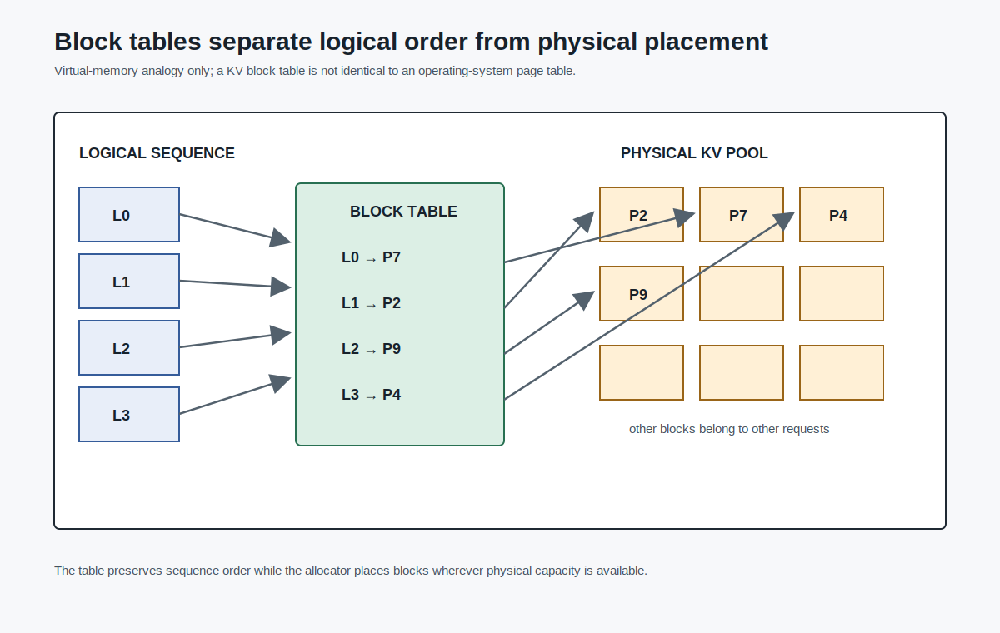

PagedAttention introduces a block table. The vLLM lecture shows logical KV blocks mapped to physical KV blocks through that table. [CITE: llmsys-24-block-table-virtualization]

One request might look like this:

```text
logical block:   0   1   2   3
physical block:  7   4   9   1
filled tokens:   B   B   B   2
```

Here `B` means a full block. The request's sequence order is logical. The GPU-memory placement is physical. The block table translates from one to the other.

This is why the operating-system analogy is helpful. The lecture explicitly compares OS pages to KV blocks, and shared pages across processes to shared KV blocks across samples. [CITE: llmsys-24-os-virtual-memory-analogy]

But the analogy has limits:

```text
OS virtual memory:
  hardware-supported address translation
  general-purpose process memory
  page faults and OS-level policies

PagedAttention:
  application-level block table
  specialized KV cache memory
  attention kernels that understand block indirection
  request-level preemption and recovery
```

The block table is not magic hardware paging. It is a serving-engine data structure that the attention implementation must respect.

### PagedAttention as a Kernel Contract

The allocator change only works if attention can read the new memory layout.

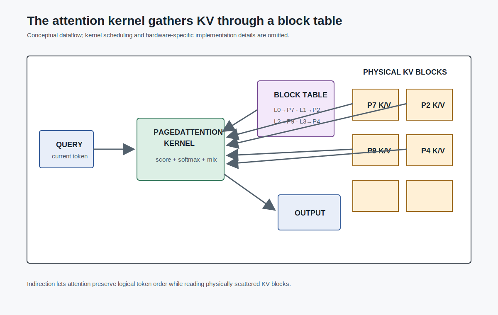

Standard attention wants the previous keys and values for the sequence. If those keys and values are stored in a contiguous tensor, the kernel can use ordinary contiguous indexing. With PagedAttention, the logical sequence is spread across non-contiguous physical KV blocks. The attention computation therefore needs the block table.

The vLLM lecture describes the PagedAttention mechanism as fetching non-contiguous KV blocks using the block table and applying attention on the fly. It also says PagedAttention is implemented as a custom GPU kernel to avoid materializing gathered keys and values. [CITE: llmsys-24-pagedattention-kernel]

The distinction matters. A naive implementation could gather physical blocks into a contiguous temporary buffer, then run ordinary attention. That would spend memory bandwidth and temporary memory to undo the allocator's layout. PagedAttention instead makes the layout part of the attention kernel's contract:

```text
attention input:
  query for current token
  block table for this request
  physical KV-block pool

attention behavior:
  follow logical blocks through the block table
  read physical K/V blocks in sequence order
  compute attention without building a contiguous K/V copy
```

This is the systems tradeoff. PagedAttention reduces allocator fragmentation and enables sharing, but it increases runtime complexity. The kernel has to handle indirection. The scheduler and KV cache manager have to maintain block tables correctly. The engine has to coordinate memory allocation with request admission and decode iterations.

### Fragmentation After Paging

With fixed-size blocks, the main remaining internal waste is at the last block of a sequence. The lecture states that internal fragmentation only happens at the last block and that the number of wasted tokens per sequence is less than the block size. [CITE: llmsys-24-pagedattention-fragmentation]

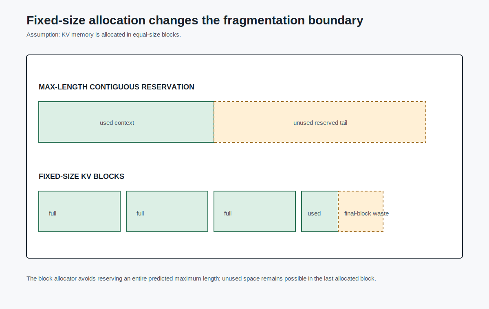

Under that model:

```text
full logical blocks:
  no unused token slots

final logical block:
  may be partially filled
```

This does not mean PagedAttention eliminates all memory cost. It means the allocator has changed the shape of the waste. Instead of reserving every request up to a maximum length, the engine pays at block granularity as the request grows.

The practical design question becomes:

```text
block too small:
  more metadata, more allocation activity, possible transfer overheads

block too large:
  more final-block waste
```

A draft of this chapter should not pick a universal block size. The right value depends on implementation, model layout, attention backend, memory allocator, and workload.

### Sharing KV Blocks

Paged memory also makes sharing natural.

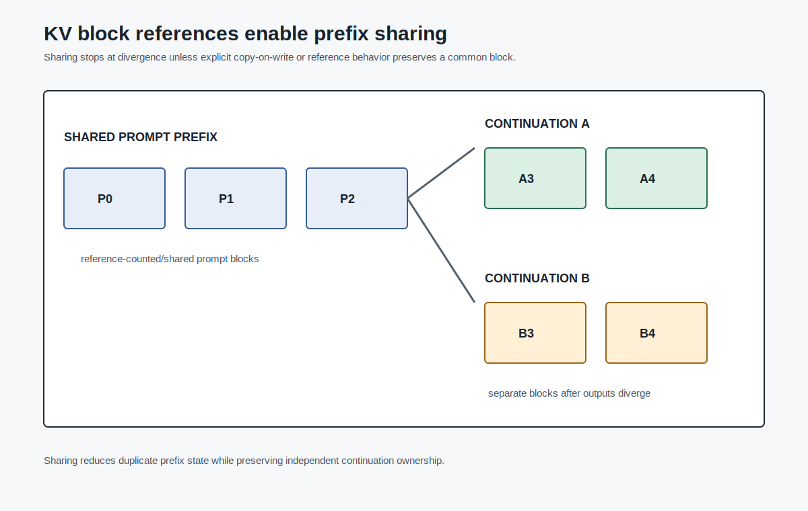

Suppose a server runs several continuations from the same prompt:

```text
prompt:
  "The future of cloud computing is ..."

sample A:
  prompt + continuation A

sample B:
  prompt + continuation B

sample C:
  prompt + continuation C
```

The prompt prefix has the same KV state for all three samples. Without sharing, each sequence may store duplicate prefix KV cache. With block-table indirection, several logical sequences can point to the same physical prefix blocks until their continuations diverge.

The vLLM lecture uses parallel sampling to show KV blocks shared across sequences. [CITE: llmsys-24-kv-block-sharing]

The mechanism is easier to see as references:

```text
physical blocks:
  P0 P1 P2 P3 P4 P5 ...

sample A logical blocks:
  P0 P1 P2 A3 A4 ...

sample B logical blocks:
  P0 P1 P2 B3 B4 ...

sample C logical blocks:
  P0 P1 P2 C3 C4 ...
```

The shared prefix blocks are stored once. The divergent suffix blocks are separate.

This is the same design pattern as the rest of PagedAttention: logical sequence identity is separated from physical memory ownership. The scheduler and cache manager can exploit that separation when prompts or decoding branches share a prefix.

### Memory Pressure, Preemption, and Recovery

Paged allocation does not make GPU memory infinite. At some point, the physical KV-block pool may be full.

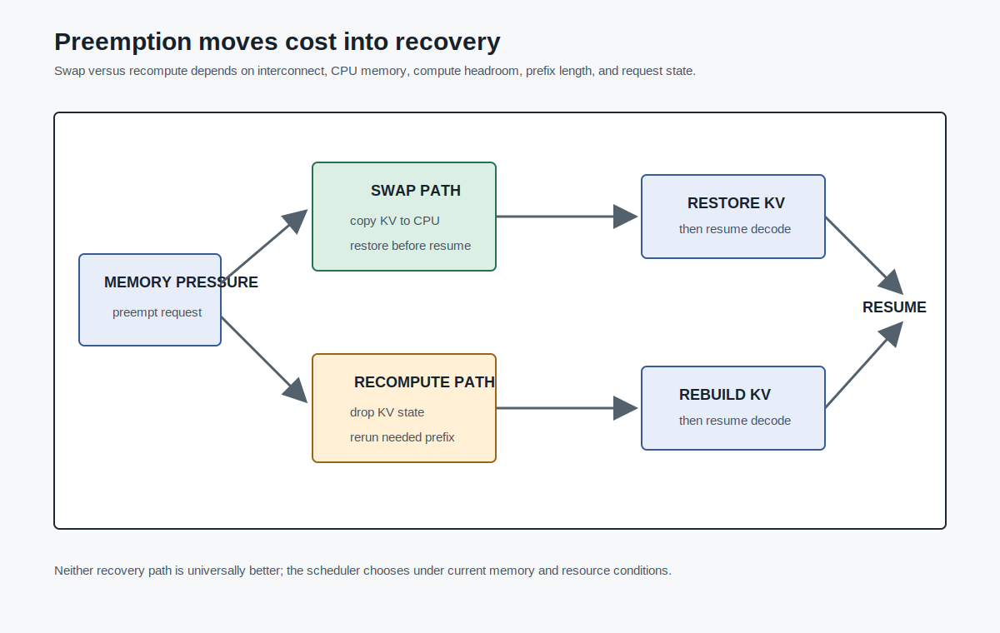

When a new block is needed and no physical block is available, the serving engine has to choose a policy:

```text
wait:
  leave the request queued or stalled

preempt:
  free KV blocks from another request

reject or shed:
  apply admission control outside the model worker
```

The vLLM lecture focuses on request preemption and recovery. Its stated goal is to free some requests' KV cache so other requests can run first. It presents two recovery options: swapping KV cache to CPU memory and later swapping it back, or deleting KV cache and recomputing it later. [CITE: llmsys-24-preemption-recovery]

Swapping treats KV cache as data to move:

```text
GPU KV blocks -> CPU memory
CPU memory    -> GPU KV blocks when resumed
```

Recomputation treats KV cache as derived state:

```text
delete KV blocks
later rerun prompt/prefix computation
recreate KV cache
resume decode
```

Neither option is free. Swapping consumes host-device bandwidth and creates transfer scheduling work. Recomputation consumes GPU compute and can affect latency. The right policy depends on request length, model cost, interconnect, memory pressure, and scheduling goals.

The important point for this chapter is that KV cache management becomes part of request scheduling. The scheduler is not only choosing which tokens to compute. It is choosing which requests deserve scarce persistent memory.

### vLLM Around PagedAttention

PagedAttention is the central mechanism in this chapter, but vLLM is an inference engine, not just an allocator.

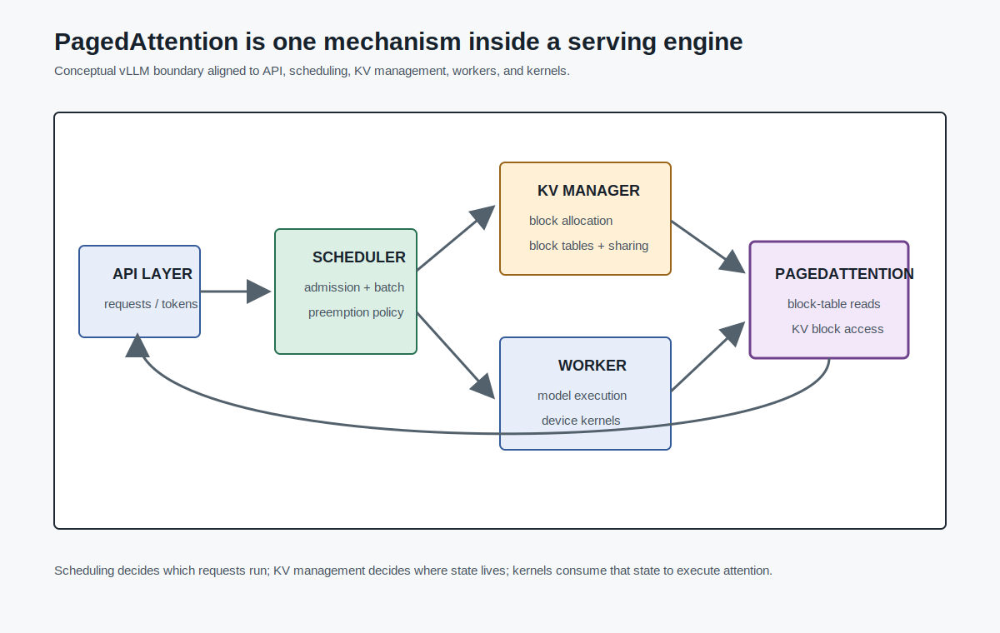

The lecture presents vLLM as exposing both an offline Python `LLM` interface and an OpenAI-compatible server interface. [CITE: llmsys-24-vllm-api-surface] That API surface is not the main lesson, but it marks the boundary between user-facing serving and the engine internals.

Inside the engine, the lecture groups vLLM optimizations into four areas:

```text
minimizing CPU overheads
efficient GPU kernels
model parallelism
efficient memory management and caching
```

[CITE: llmsys-24-vllm-optimization-areas]

PagedAttention sits in the fourth category, but it interacts with the other three:

```text
CPU overhead:
  scheduler and KV cache manager update block tables and batch metadata

GPU kernels:
  attention kernels must read non-contiguous blocks through indirection

model parallelism:
  KV cache may be partitioned or coordinated across devices

memory and caching:
  block allocation, sharing, preemption, and prefix reuse affect residency
```

The lecture also describes serving parallelism choices, including data, tensor, expert, context, pipeline parallelism, and prefill/decode disaggregation. [CITE: llmsys-24-vllm-parallelism-options]

Those topics matter, but they are not the center of this chapter. The boundary is:

```text
Chapter 13:
  how one engine manages KV cache as paged memory

Chapter 14:
  how serving systems schedule, cache, route, and disaggregate work across engines
```

### The Design Lesson

PagedAttention is useful to read as a memory-system design, not merely as an attention variant.

It changes four contracts at once:

```text
allocator contract:
  allocate fixed-size physical KV blocks on demand

sequence contract:
  represent each request as logical blocks

kernel contract:
  compute attention through block-table indirection

scheduler contract:
  account for KV-block ownership, sharing, and preemption
```

This is why vLLM belongs in a systems book. The improvement is not from one isolated trick. It comes from aligning the allocator, attention kernel, scheduler, and request lifecycle around the actual shape of autoregressive serving.

The common misconception is that inference serving is mostly about making `forward()` faster. Chapter 12 showed that serving cost includes scheduling and latency. This chapter shows that serving cost also includes memory address translation, fragmentation control, and cache residency.

The tradeoff to remember:

```text
PagedAttention exchanges simple contiguous KV tensors
for a paged KV cache memory system.

That exchange can reduce fragmentation and enable sharing,
but it requires specialized kernels and careful runtime bookkeeping.
```

Owner: Principal Author  
Purpose: Chapter 13 ready draft after source extraction, brief, technical review, and red-team review  
Evidence grade: A for course lecture claims and original PagedAttention paper; no benchmark numbers used  
Assumptions: This draft focuses on single-engine KV cache memory management and leaves distributed serving/disaggregation to Chapter 14
Open questions: Whether to add a KV cache byte formula, block-size waste derivation, or copy-on-write detail after a narrower source pass
Handoff: Production can move to Chapter 14 source extraction

## Chapter 14: Scheduling, Caching, and Disaggregated Serving {#chapter-14-scheduling-caching-and-disaggregated-serving .chapter-title}

Chapter 12 built an inference cost model. Chapter 13 showed why KV cache becomes a memory system inside an inference engine. This chapter moves up one level: distributed serving.

At this level, the question is no longer:

```text
How do I keep one model worker busy?
```

It is:

```text
Which request should go to which worker?
Where is the useful KV state?
Should prefill and decode run on the same GPUs?
How much KV cache should move across the network?
Which requests meet their latency SLOs?
```

The shift is from throughput to goodput. A system can complete many requests per second and still be a poor serving system if too many requests miss user-facing latency targets.

The disaggregation lecture defines goodput as completed requests within SLO criteria and contrasts it with raw throughput. [CITE: llmsys-29-goodput-definition] This chapter uses that distinction as the organizing principle.

### Inference at Scale Is Not Training at Scale

Training usually runs a coordinated job. It has a known model, a known parallelism plan, long-running workers, and a steady stream of batches.

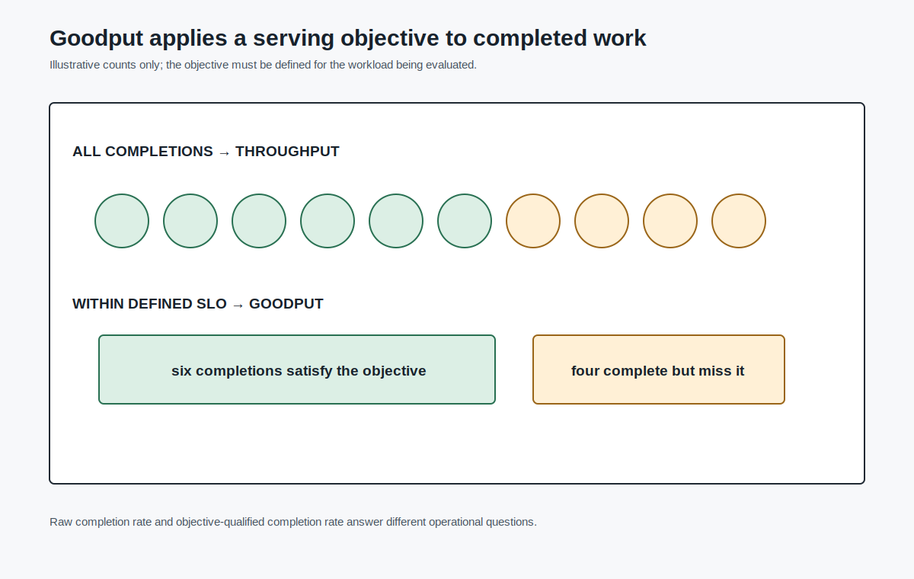

Serving is less regular. The Dynamo lecture contrasts training with inference by describing inference as many smaller online jobs with rapid scale-up and scale-down requirements. [CITE: llmsys-26-inference-vs-training]

At scale, the serving system must handle:

```text
variable input lengths
variable output lengths
multi-turn sessions
agentic workflows
heterogeneous hardware
fault tolerance
multiple models
cost and power constraints
KV cache hit rate
```

The Dynamo lecture lists these as part of the challenge of serving AI inference at scale. [CITE: llmsys-26-scale-serving-challenges]

This is why the serving scheduler becomes a distributed systems component. It is not just selecting the next batch for one GPU. It is making placement, routing, memory, and transfer decisions under SLOs.

### TTFT, TPOT, and Goodput

A streamed LLM response has at least two latency surfaces.

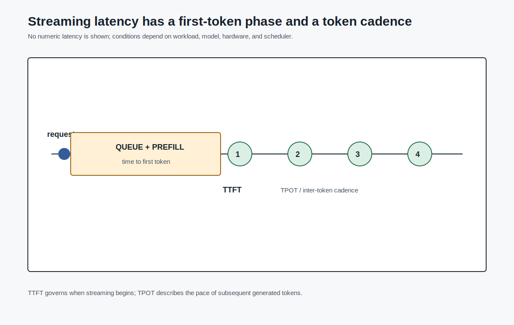

```text
TTFT:
  time to first token
  how long the user waits before output begins

TPOT:
  time per output token
  cadence of streamed tokens after generation starts
```

The disaggregation lecture defines TTFT as time to first token and TPOT as time per output token. [CITE: llmsys-29-ttft-tpot-slos]

These metrics are not interchangeable. A user may tolerate a slower first token for a batch summarization job but notice uneven token streaming in a chat UI. Another application may need the first token quickly but produce only a short output.

Goodput adds the SLO constraint:

```text
throughput:
  completed requests / time

goodput:
  completed requests that satisfy SLO / time
```

The useful serving system is the one that completes enough requests while meeting the relevant TTFT and TPOT constraints.

This reframes scheduling. A scheduler that maximizes tokens per second can still route work poorly if it creates long first-token delays, uneven decode cadence, or cache misses that force repeated prefill.

### Continuous Batching Is Necessary but Not Sufficient

Chapter 12 introduced continuous batching: update batch membership between decode iterations so finished requests can leave and new requests can enter. Continuous batching improves utilization under variable output lengths.

But it does not solve every serving-scale problem. The disaggregation lecture states the distinction directly: continuous batching improves utilization and throughput, while disaggregation targets goodput under SLOs. [CITE: llmsys-29-cb-vs-disaggregation]

Continuous batching still leaves several questions open:

```text
Should a long prefill share a worker with latency-sensitive decode?
Should all requests use the same tensor/pipeline/data parallelism?
Should a request route to the least-loaded worker or the worker with its KV prefix?
When should KV cache move to another worker or memory tier?
```

These questions are outside a single batch loop. They require serving architecture.

### Prefill and Decode Want Different Systems

Prefill and decode are both Transformer inference, but they stress the system differently.

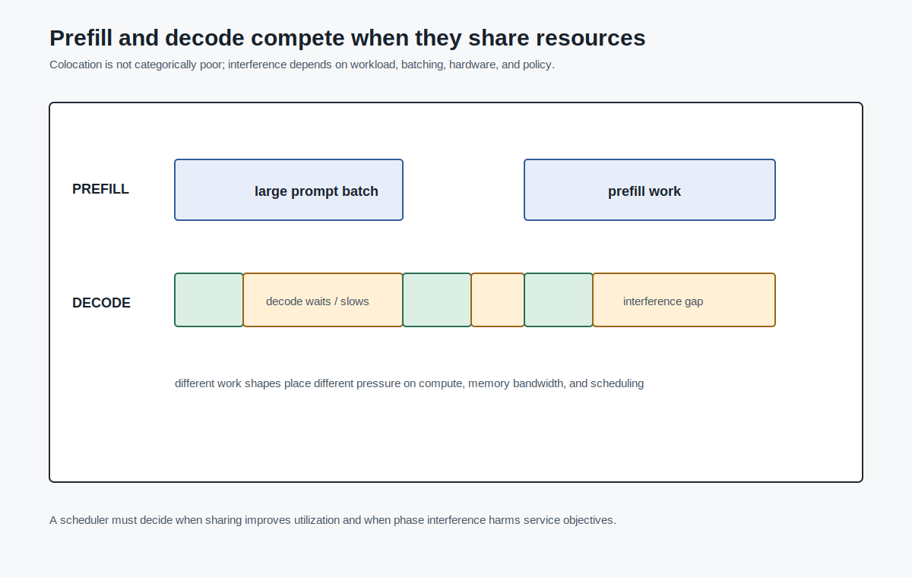

The disaggregation lecture characterizes prefill as compute-bound and decode as memory-bound, with decode needing many batched requests to saturate compute. [CITE: llmsys-29-prefill-decode-characteristics]

The reason is the shape of work:

```text
prefill:
  processes many prompt tokens at once
  uses larger matrix operations
  builds initial KV cache
  strongly affects TTFT

decode:
  advances one generated token per request per iteration
  repeatedly reads parameters and KV cache
  benefits from batching many active requests
  strongly affects TPOT
```

If prefill and decode share one worker pool, the scheduler must decide how to mix them. A long prefill can consume compute resources while decode requests wait. Decode-heavy traffic can delay new prefills and increase first-token latency.

The disaggregation lecture describes this as prefill/decode interference and coupled parallelism strategy when both phases are colocated. [CITE: llmsys-29-colocation-interference]

Colocation is not always wrong. It is simpler and avoids explicit KV transfer between pools. But under workloads with distinct TTFT/TPOT targets and enough traffic to justify specialization, colocation can force one resource plan onto two different phases.

### Disaggregated Prefill and Decode

Prefill/decode disaggregation separates the two phases into different worker pools:

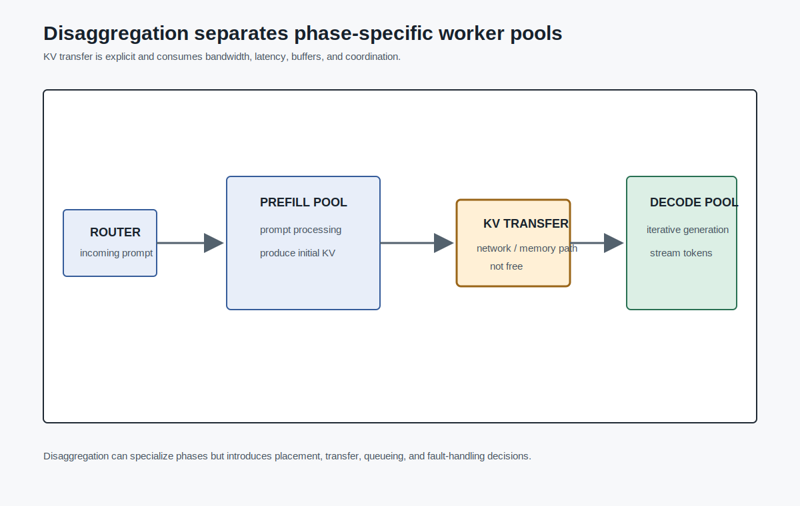

```text
request arrives
  -> prefill worker processes prompt
  -> prefill worker produces KV cache
  -> KV cache moves or becomes visible to decode worker
  -> decode worker streams output tokens
```

The disaggregation lecture describes the opportunity: prefill instances optimize TTFT, decode instances optimize TPOT, and each phase can choose suitable parallelism and resource allocation. [CITE: llmsys-29-disaggregation-opportunity]

Dynamo's lecture presents the same idea as scaling prefill and decode independently on separate GPUs and applying suitable parallelism for each phase. [CITE: llmsys-26-dynamo-disaggregated-serving]

The mechanism is attractive because the serving system can choose different answers for different bottlenecks:

```text
prefill pool:
  provision for prompt bursts and first-token latency
  choose parallelism that helps long prompt processing

decode pool:
  provision for steady token streaming
  choose batching and memory layout that helps TPOT
```

The cost is that KV cache crosses a boundary. A decode worker cannot continue generation unless it can access the keys and values created during prefill.

The disaggregation lecture names this directly: disaggregation introduces KV cache transmission overhead and makes per-GPU goodput hard to optimize because workload pattern, SLOs, parallelism, resource allocation, and network bandwidth all matter. [CITE: llmsys-29-disaggregation-challenges]

The design question is therefore not "disaggregate or not" in the abstract. It is:

```text
does the SLO benefit from specialization exceed
the placement and KV-transfer cost for this workload?
```

### Placement Is Part of the Algorithm

Once prefill and decode are separate, the system has to decide how many of each to run and where to put them.

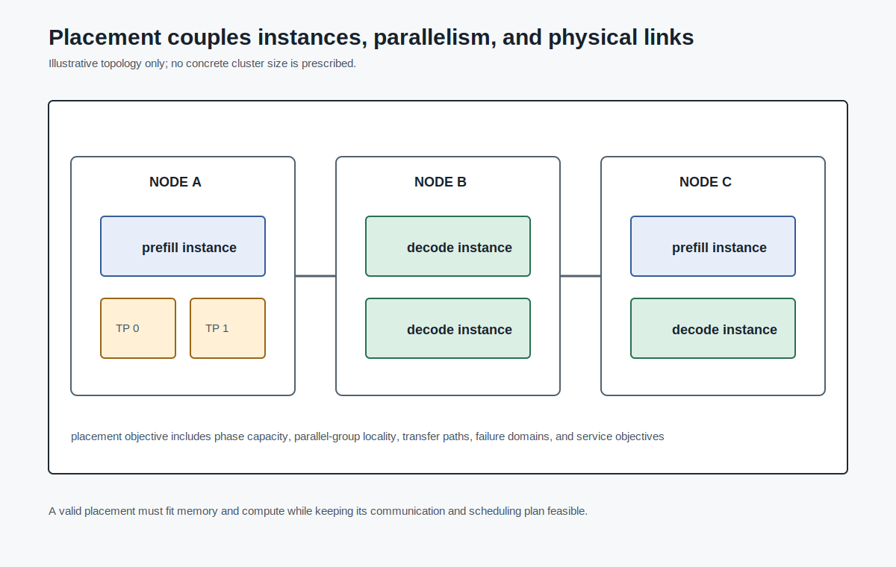

DistServe-style placement is framed as choosing:

```text
parallelism strategy for prefill instances
parallelism strategy for decode instances
number of each instance
physical cluster placement
```

The disaggregation lecture describes this as a placement problem for maximizing GPU goodput under workload requirements. [CITE: llmsys-29-distserve-placement]

This is where distributed systems details become load-bearing. If prefill and decode workers are placed far apart in the network topology, KV transfer can become expensive. If they are too tightly colocated, the system may lose some flexibility. If too many GPUs are assigned to prefill, decode may miss TPOT. If too many are assigned to decode, requests may wait too long for their first token.

Placement is not a one-time math exercise. Traffic changes. Prompt lengths change. Output lengths change. Hardware availability changes. A production serving system therefore needs monitoring and adaptation, even if the chapter keeps the control algorithms out of scope.

### KV-Aware Routing

Routing cannot look only at load.

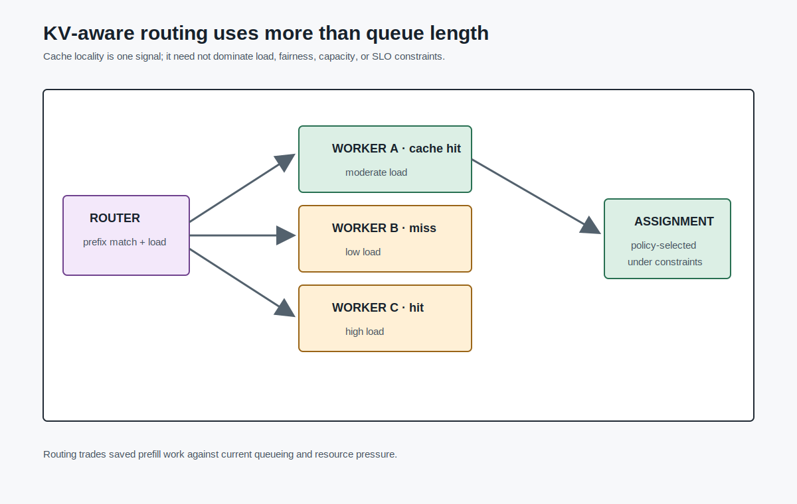

Suppose two workers are available:

```text
worker A:
  low current load
  no useful KV state

worker B:
  moderate current load
  already has the request's shared prefix KV cache
```

The cheapest route may be B, not A, if reusing KV cache avoids expensive prefill or transfer. But if B is overloaded, cache locality may not compensate for queueing delay.

The Dynamo lecture presents KV-aware routing as considering KV hit rate and worker KV load. [CITE: llmsys-26-kv-aware-routing]

The scheduler is balancing at least three terms:

```text
queueing:
  how busy is the worker?

cache locality:
  does the worker or nearby store already have useful KV?

SLO risk:
  will this route preserve TTFT and TPOT?
```

This is the distributed version of the Chapter 13 lesson. KV cache is not just memory usage. It is routing state.

### KV Cache Becomes External Data

Chapter 13 treated KV cache as a paged memory object inside an engine. Chapter 14 treats KV cache as data that may live outside one inference process.

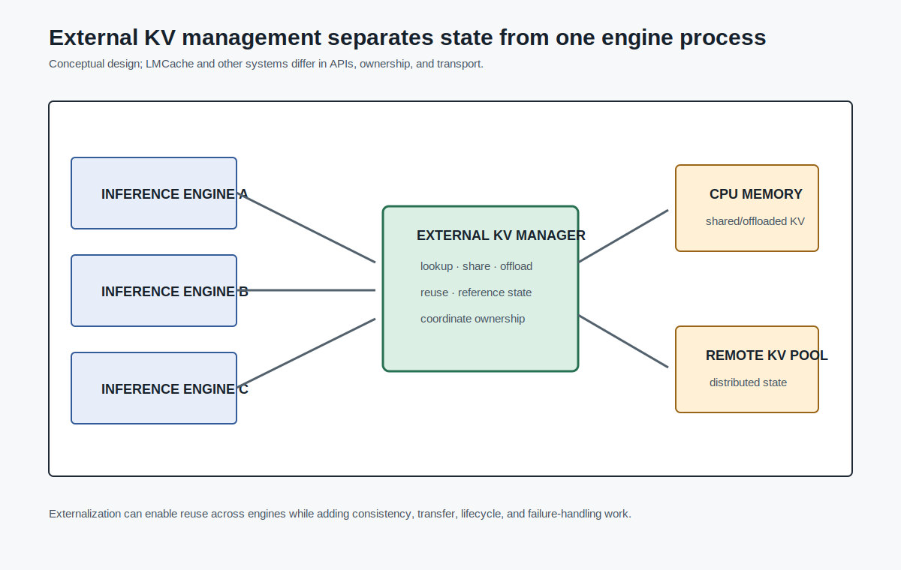

The LMCache lecture says KV cache can be treated as reusable serving data rather than merely internal tensors. [CITE: llmsys-27-kv-cache-ai-native-data] It also states that KV cache avoids repeated computation by storing reusable attention state. [CITE: llmsys-27-kv-cache-reuse]

LMCache is presented as separating KV cache management from inference engines by running as a separate KV cache management service. [CITE: llmsys-27-lmcache-separated-service]

The architectural move is:

```text
before:
  inference engine owns KV cache internally

after:
  inference engine can get/put KV cache through an external manager
```

This separation gives the serving system more options:

```text
share cache across workers
offload cache outside GPU memory
reuse cache across sessions or repeated prefixes
compress cache for storage or transfer
integrate with different storage backends
```

The LMCache lecture presents hooks and storage plugins for get/put KV cache operations. [CITE: llmsys-27-storage-plugin-interface] It also illustrates a multi-process CPU pool and remote KV pool to reduce extra CPU-side copies when sharing cache across GPU workers. [CITE: llmsys-27-zero-copy-cpu-sharing]

The exact APIs are implementation details and can change. The durable concept is the boundary: KV cache is becoming a managed object with a storage and transfer interface.

### Memory Tiers and Transfer

GPU HBM is fast and scarce. KV cache may be too large or too reusable to keep only in HBM.

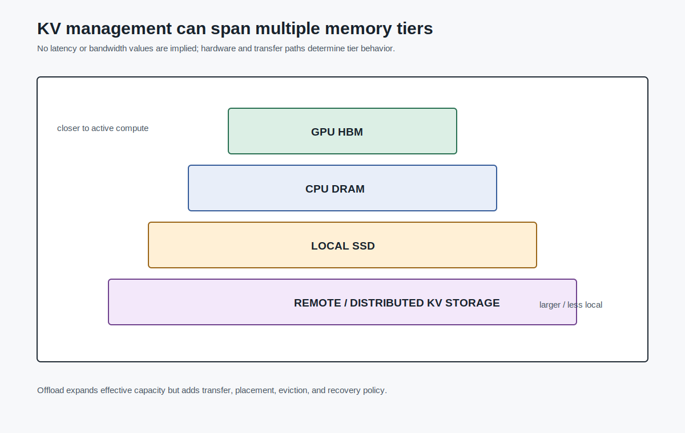

The Dynamo lecture presents KV offload across HBM, host memory, local SSD, and network storage. [CITE: llmsys-26-memory-tiers-kv-offload]

The hierarchy looks like this:

```text
HBM:
  fastest, smallest, active decode state

CPU DRAM:
  larger, slower, useful for nearby reuse/offload

local SSD:
  larger again, useful for colder cache or spill

network storage / remote pool:
  shared, potentially large, transfer-sensitive
```

Mooncake makes the same design point from a KV cache-centric architecture. It presents distributed multi-layer KV cache pools/storage and cache capacity beyond one machine. [CITE: llmsys-28-distributed-kv-pool]

But moving cache through the hierarchy has a cost. Mooncake's lecture states that KV cache caching creates storage challenges because cache size and transfer bandwidth matter. [CITE: llmsys-28-kvcache-storage-challenges]

This is the core tradeoff:

```text
store more KV cache:
  more reuse opportunities
  less recomputation

move more KV cache:
  more bandwidth demand
  more latency risk
```

The serving system has to decide which KV state is hot enough to keep near the GPU and which state can live in colder tiers.

### Transfer Substrates

Once KV cache moves across workers, memory tiers, and nodes, the transfer mechanism becomes part of serving performance.

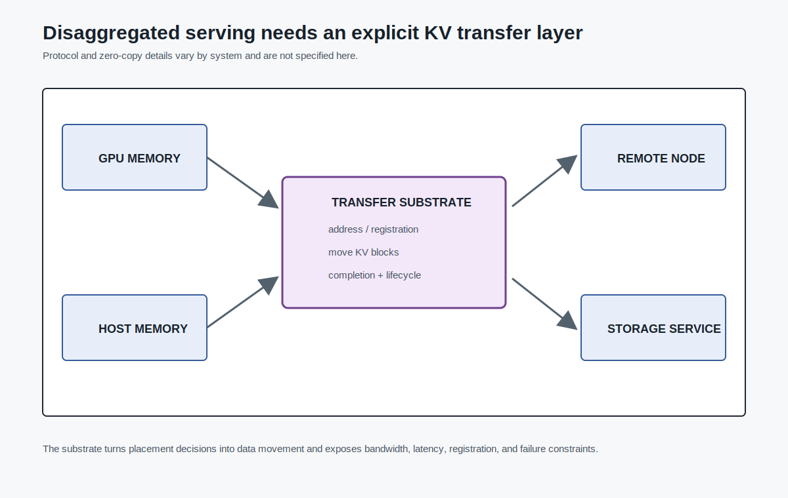

The Dynamo lecture presents NIXL as a cross-node and cross-memory transfer layer for buffer lists, with northbound and southbound APIs. [CITE: llmsys-26-nixl-transfer-layer]

Mooncake Store is presented as integrating inference engines with local memory, remote memory, SSD, and third-party storage through object put/get and batch transfer abstractions. [CITE: llmsys-28-mooncake-store-integration]

This chapter does not depend on the exact APIs. The mechanism to remember is:

```text
KV cache movement is not incidental I/O.
It is on the serving critical path when routing,
prefill/decode disaggregation, or cache reuse requires it.
```

A transfer layer has to coordinate memory registration, remote access, batching, and backend differences without making the decode worker wait unnecessarily.

### Mooncake and Dynamo as Architecture Examples

Dynamo is presented as a modular distributed inference stack with scheduling, disaggregated serving, memory management, and data transfer components. [CITE: llmsys-26-dynamo-modular-stack]

Mooncake is presented as a KV cache-centric disaggregated architecture with cache-aware prefill scheduling, KV cache pool, KV cache balancing, and decode scheduling. [CITE: llmsys-28-mooncake-kvcache-centric]

Mooncake's lecture also frames prefill/decode disaggregation as a way to avoid interference in mixed batches and decouple resources and parallelism. [CITE: llmsys-28-pd-disaggregation-interference]

The names are less important than the pattern:

```text
request router
prefill scheduler and workers
KV cache manager / store
transfer substrate
decode scheduler and workers
SLO-aware planner / controller
```

This is the serving architecture that emerges when KV cache is large, reusable, movable, and latency-sensitive.

### Advanced Cache Techniques

Once KV cache is external data, more transformations become possible.

The LMCache lecture presents CacheBlend-style selective prefill: reuse stored KV cache while recomputing selected tokens to recover interactions that direct cache concatenation would miss. [CITE: llmsys-27-cacheblend-selective-prefill]

It also presents KV cache compression as a way to store more cache and reduce transfer volume. [CITE: llmsys-27-kv-cache-compression]

These techniques are optional for the first-pass chapter, but they show the direction of travel:

```text
KV cache can be:
  routed to
  shared
  offloaded
  transferred
  selectively recomputed
  compressed
```

That list would make little sense if KV cache were only an internal tensor inside one worker. It makes sense once KV cache is part of the serving data plane.

### The Design Lesson

Chapter 12 showed that inference cost is not one forward pass. Chapter 13 showed that KV cache needs a memory system. Chapter 14 adds the distributed systems layer:

```text
goodput:
  meet SLOs, not just maximize completions

disaggregation:
  specialize prefill and decode, but pay KV-transfer cost

routing:
  balance load, cache locality, and SLO risk

memory hierarchy:
  decide which KV state belongs in HBM, DRAM, SSD, or remote storage

transfer:
  make KV movement a first-class serving operation
```

The common misconception is that serving architecture is just horizontal scaling: add more replicas behind a load balancer. That works only when requests are independent and stateless. LLM serving is not stateless. KV cache creates placement history, cache locality, and transfer costs.

The tradeoff to remember:

```text
distributed serving buys specialization and reuse,
but it turns KV cache into a data-management problem.
```

Owner: Principal Author  
Purpose: Chapter 14 ready draft after source extraction, brief, technical review, and red-team review  
Evidence grade: A for course lecture claims; no benchmark numbers used  
Assumptions: Draft explains mechanisms and tradeoffs without product evaluation or current API guarantees  
Open questions: Whether to add DistServe paper, official system docs, or deeper transfer API cards before technical review  
Handoff: Production can move to Chapter 15 source extraction

# Part VI — System Design Synthesis {#part-vi-system-design-synthesis .part-title}

## Chapter 15: Model-Algorithm-System Co-Design {#chapter-15-model-algorithm-system-co-design .chapter-title}

The book began with a simple mathematical object:

```text
predict the next token
```

A language model assigns a probability to the next token conditioned on the prompt and previous generated tokens. \[CITE: llmsys-01-next-token-probability] Pretraining commonly turns that into cross-entropy loss for next-token prediction over raw text. \[CITE: llmsys-01-training-objective]

That objective is compact. The system that makes it useful is not.

To train and serve modern LLMs, the system has to decide how the model is represented, how tensors move, how kernels use hardware, how workers communicate, how memory is partitioned, how requests are scheduled, and how latency or training targets are measured.

The introductory lecture states the central systems claim: making computation fast is not enough. LLM systems require attention to compute, memory, data movement, communication, abstraction design, distributed systems, frameworks, operators, kernels, and compression. \[CITE: llmsys-01-system-challenges]

This final chapter is a design method for using the rest of the book.

### The Simple Objective Becomes a Stack

Decoder-only autoregressive models are presented in the course as the most popular architecture choice for modern LLMs. \[CITE: llmsys-01-decoder-only]


That architecture choice has system consequences:

```text
autoregressive decoding
  -> one token depends on previous tokens
  -> serving has sequential per-request decode
  -> batching must happen across requests
  -> prior keys and values become KV cache
  -> KV cache becomes a memory and routing object
```

The same pattern appears throughout the book. A choice at one level creates constraints at another level.

```text
objective:
  next-token prediction

architecture:
  decoder-only Transformer

operator graph:
  attention, MLPs, normalization, softmax

kernel layer:
  matmul, reductions, memory movement

training system:
  data parallelism, model parallelism, optimizer state

serving system:
  batching, KV cache, scheduling, routing, SLOs
```

This is the stack view. It is useful, but incomplete. Real engineering does not move only downward from objective to hardware. Constraints also move upward.

A GPU memory limit may force ZeRO-style sharding, quantization, or smaller batch sizes. A network bottleneck may change the parallelism plan. A serving SLO may favor prefill/decode disaggregation even when a simpler colocated system has higher raw utilization. A kernel limitation may decide whether a model feature is practical to deploy.

The correct mental model is not a stack of independent layers. It is a loop.

### Co-Design Means Joint Constraints

The introduction lecture states that LLMs need model-algorithm-system co-design across model architecture, algorithms, software optimization, and hardware acceleration. \[CITE: llmsys-01-codesign]


Co-design means the design variable may live at any layer:

```text
model architecture:
  attention pattern, MoE, head structure, context length

algorithm:
  FlashAttention, GPTQ, ZeRO, LoRA, PagedAttention

software/runtime:
  framework graph, compiler, scheduler, memory manager

hardware:
  GPU memory hierarchy, interconnect, tensor cores, CPU/SSD tiers
```

The reason to think this way is that local improvements often move bottlenecks.

Examples:

```text
faster attention kernel:
  may expose communication or MLP as the new bottleneck

larger serving batch:
  may improve compute utilization but increase KV cache pressure

quantized weights:
  may reduce memory bandwidth but require compatible kernels

prefill/decode disaggregation:
  may improve SLO control but introduce KV-transfer cost
```

The design question is therefore:

```text
Where is the bottleneck now,
and where will it move if we apply this optimization?
```

### Bottleneck Ownership

When an LLM system fails to meet a target, first name the bottleneck. Do not begin by naming a tool.


Use a small checklist:

```text
compute:
  are arithmetic units underfed or oversubscribed?

memory capacity:
  do parameters, optimizer state, activations, or KV cache fit?

memory bandwidth:
  are kernels mostly moving bytes instead of doing useful arithmetic?

communication:
  are workers waiting on all-reduce, all-gather, send/recv, or KV transfer?

scheduling:
  are requests or microbatches waiting because policy is mismatched to workload?

abstraction:
  does the framework/runtime prevent the expression or fusion the system needs?

reliability/operations:
  does the design survive failures, load changes, or heterogeneous hardware?
```

Then ask which layer owns the cheapest safe intervention:

```text
can the model change?
can the algorithm change?
can the runtime schedule differently?
can memory be laid out differently?
can data movement overlap with compute?
can the workload be routed differently?
```

The word "safe" matters. A technique that improves one benchmark may be a bad intervention if it breaks accuracy, violates an SLO, requires unavailable hardware, or creates operational complexity the system cannot carry.

### Synthesis Example: Long Context

Long context looks like a model feature. It quickly becomes a system problem.

Longer contexts increase attention work, memory movement, and KV cache state. FlashAttention-style attention acceleration is an algorithm/hardware co-design response to attention's memory behavior; it changes how attention is computed to reduce memory traffic while preserving the result. \[CITE: llmsys-21-modern-hardware-attention]

At serving time, the long-context problem changes shape. The model no longer only needs efficient prefill attention. It must keep KV state for active requests. The vLLM lecture frames KV cache management as central to high-throughput serving. \[CITE: llmsys-24-kv-cache-memory-management]

PagedAttention then changes the memory layout:

```text
instead of:
  one large contiguous KV reservation per request

use:
  fixed-size KV blocks
  logical-to-physical block tables
  attention kernels that read through indirection
```

PagedAttention is presented as application-level paging and virtualization for attention KV cache. \[CITE: llmsys-24-pagedattention-definition] Its kernel reads non-contiguous KV blocks through the block table rather than materializing gathered K/V tensors. \[CITE: llmsys-24-pagedattention-kernel]

At distributed serving scale, long context becomes a routing and storage problem. KV-aware routing considers whether useful cache state already exists on a worker. \[CITE: llmsys-26-kv-aware-routing] Disaggregated serving may need to transfer KV cache from prefill to decode workers. \[CITE: llmsys-29-disaggregation-challenges]

One user-visible feature has touched:

```text
attention algorithm
GPU kernel memory traffic
KV cache allocator
serving scheduler
distributed routing
memory hierarchy
```

That is co-design.

### Synthesis Example: Large Training Run

Large training begins with a memory and communication ledger.

Data parallelism replicates the model and averages gradients across workers. DDP uses gradient synchronization and can overlap communication with backward computation. \[CITE: llmsys-15-ddp-overlap]

When the model no longer fits cleanly, model parallelism enters. Tensor parallelism partitions matrix operations; pipeline parallelism partitions layers and introduces pipeline scheduling costs. \[CITE: llmsys-16-tensor-parallel-matmul] \[CITE: llmsys-16-pipeline-costs]

When optimizer state dominates memory, ZeRO partitions optimizer states, gradients, and parameters across data-parallel ranks. \[CITE: llmsys-18-zero-key-idea]

The naive question is:

```text
which parallelism is fastest?
```

The co-design question is:

```text
what memory must be resident?
what communication is introduced?
can it overlap with computation?
does the framework express the partition?
does the interconnect support the chosen topology?
what happens to batch size and optimizer behavior?
```

There is no useful answer without conditions. Model size, sequence length, batch size, precision, topology, optimizer, and framework all travel with the claim.

This is why Part III did not treat distributed training as a list of tricks. The mechanism matters because the correct intervention depends on the bottleneck:

```text
parameter memory too large:
  shard parameters or change precision

optimizer state too large:
  shard optimizer state

activation memory too large:
  checkpoint or rematerialize

communication too exposed:
  overlap, bucket, change parallelism, or change topology

load imbalance:
  change pipeline schedule, partitioning, or expert routing
```

The system is the interaction.

### Synthesis Example: Cheap Adaptation and Serving

Compression and adaptation show the same principle from another angle.

Quantization reduces tensor precision and can reduce memory pressure, but it introduces numerical error and depends on kernel/runtime support. \[CITE: llmsys-19-quantization-purpose] Direct quantization can lose information through rounding, clipping, and range mismatch. \[CITE: llmsys-19-direct-quantization-errors]

LoRA changes what is trainable. It freezes pretrained weights and trains a low-rank update. \[CITE: llmsys-23-lora-lowrank-update] The memory saving comes from reducing trainable state, gradients, and optimizer state for the adaptation path, not from making the base model disappear. \[CITE: llmsys-23-lora-training-state]

QLoRA combines a quantized base model with LoRA-style adaptation. \[CITE: llmsys-23-qlora-quantized-lora]

A product team might state the problem as:

```text
we need cheaper fine-tuning and serving
```

The co-design version is more precise:

```text
which memory term is too large?
  base weights?
  gradients?
  optimizer states?
  activations?
  KV cache?

which quality risk is acceptable?
  quantization error?
  low-rank adaptation limit?
  calibration mismatch?

which runtime supports the representation?
  low-bit kernels?
  adapter loading?
  multi-adapter batching?
  mixed precision paths?
```

The intervention changes the system contract. Quantization is not just smaller files. LoRA is not just fewer trainable parameters. Both change what the runtime must store, compute, and schedule.

### Synthesis Example: Goodput-Oriented Serving

Serving also shows why the target metric matters.

Raw throughput is not enough if many requests miss latency SLOs. The disaggregation lecture defines goodput as completed requests within SLO criteria. \[CITE: llmsys-29-goodput-definition]

Prefill and decode stress different resources: prefill is compute-bound, while decode is memory-bound and benefits from many batched requests. \[CITE: llmsys-29-prefill-decode-characteristics]

A colocated server may have high utilization and still produce poor user experience under some workloads. Prefill/decode disaggregation separates the phases so prefill instances can optimize TTFT and decode instances can optimize TPOT. \[CITE: llmsys-29-disaggregation-opportunity]

But the intervention creates a new cost: KV cache has to move or become accessible across the phase boundary. The disaggregation lecture names KV cache transmission overhead as a challenge. \[CITE: llmsys-29-disaggregation-challenges]

The co-design loop is visible:

```text
SLO target:
  TTFT and TPOT

algorithm/runtime response:
  separate prefill and decode

memory consequence:
  KV cache must transfer or be shared

distributed systems consequence:
  placement, routing, memory tiers, transfer substrate
```

Serving architecture is therefore not merely horizontal scaling. KV cache makes requests stateful, and state changes routing.

### Scaling Up and Scaling Down

The introduction lecture frames the system challenge as computing training and inference for larger LLMs on bigger datasets with fewer resources, including GPU, memory, and power. \[CITE: llmsys-01-system-challenges]


That sentence contains both directions:

```text
scale up:
  larger models
  larger datasets
  longer contexts
  more users
  more complex serving workloads

scale down:
  fewer GPUs
  lower memory
  lower power
  lower latency
  cheaper adaptation
```

The same co-design method applies to both.

Scaling up asks:

```text
what partitioning, memory layout, communication pattern,
and scheduler allow the larger system to run?
```

Scaling down asks:

```text
what approximation, compression, reuse, or specialization
preserves the useful behavior under a tighter budget?
```

The book's techniques are not independent recipes. They are possible moves in this search space.

### The Engineering Checklist

When facing an LLM systems problem, write down the conditions before choosing a solution.

```text
1. Workload
   training or serving?
   online or offline?
   prompt length?
   output length?
   batch size or arrival process?

2. Target
   loss?
   accuracy?
   TTFT?
   TPOT?
   goodput?
   cost?
   power?

3. Bottleneck
   compute?
   memory capacity?
   memory bandwidth?
   communication?
   scheduling?
   reliability?
   abstraction?

4. Current owner
   model architecture?
   algorithm?
   framework/compiler?
   kernel?
   distributed runtime?
   serving scheduler?
   hardware topology?

5. Candidate intervention
   partition?
   recompute?
   quantize?
   cache?
   fuse?
   overlap?
   route?
   disaggregate?

6. New bottleneck
   what gets worse?
   what state moves?
   what accuracy risk appears?
   what operational burden appears?

7. Evidence
   what source supports the claim?
   what conditions travel with the number?
   what remains uncertain?
```

This checklist is deliberately mechanical. It forces the claim to carry the workload, hardware, model, precision, sequence length, batch size, and software context that make it meaningful.

### What to Remember

The visible behavior of an LLM is produced by a stack of system decisions.

Next-token prediction creates the objective. Decoder-only Transformers define the computation pattern. GPUs reward particular memory and parallelism structures. Distributed training creates communication and state-partitioning problems. Compression changes numerical representation. Serving turns KV cache into persistent memory and routing state.

The final habit is to ask:

```text
What problem does this system solve?
Why does it become hard at LLM scale?
Which bottleneck does it target?
Which layer owns the intervention?
What conditions travel with the result?
What bottleneck moves next?
```

That is model-algorithm-system co-design.

Owner: Principal Author  
Purpose: Chapter 15 ready draft after source extraction, brief, technical review, and red-team review  
Evidence grade: A for course framing and cited prior chapter source cards; no new benchmark numbers used  
Assumptions: Chapter 15 synthesizes Chapters 1-14 rather than introducing a new subsystem  
Open questions: Whether to add a chapter-to-bottleneck summary table and heterogeneous-serving sidebar  
Handoff: Production can move to front-half gated reviews or book-level consistency audit

# References

Generated by `scripts/generate_references.py`. Do not edit manually.

Source-card citations are resolved first, then cards describing the same work are deduplicated.

## Chapter Source Map

### `01-why-llm-systems`

[1](#ref-1)

### `02-tokens-probability-transformers`

[2](#ref-2), [3](#ref-3), [4](#ref-4), [5](#ref-5), [6](#ref-6), [1](#ref-1), [7](#ref-7)

### `03-tokenization-context-decoding`

[8](#ref-8), [9](#ref-9), [10](#ref-10), [6](#ref-6), [11](#ref-11), [12](#ref-12), [13](#ref-13), [14](#ref-14)

### `04-gpu-programming-model`

[15](#ref-15), [16](#ref-16)

### `05-kernels-memory-transformer-blocks`

[17](#ref-17), [18](#ref-18)

### `06-flashattention-transformer-acceleration`

[19](#ref-19), [20](#ref-20), [21](#ref-21), [22](#ref-22), [23](#ref-23)

### `07-dl-frameworks-and-compilers`

[24](#ref-24), [25](#ref-25), [26](#ref-26), [27](#ref-27), [28](#ref-28), [29](#ref-29), [30](#ref-30)

### `08-distributed-training-ddp`

[31](#ref-31), [32](#ref-32), [33](#ref-33), [34](#ref-34), [35](#ref-35)

### `09-model-parallelism`

[36](#ref-36), [37](#ref-37), [38](#ref-38), [39](#ref-39), [40](#ref-40)

### `10-zero-moe-and-memory`

[41](#ref-41), [42](#ref-42), [43](#ref-43), [44](#ref-44), [45](#ref-45), [46](#ref-46), [47](#ref-47)

### `11-quantization-and-peft`

[48](#ref-48), [49](#ref-49), [50](#ref-50), [51](#ref-51), [52](#ref-52), [53](#ref-53), [54](#ref-54)

### `12-inference-cost-model`

[55](#ref-55), [56](#ref-56), [57](#ref-57)

### `13-kv-cache-vllm-pagedattention`

[58](#ref-58), [59](#ref-59)

### `14-serving-scheduling-and-disaggregation`

[60](#ref-60), [61](#ref-61), [62](#ref-62), [63](#ref-63)

### `15-llm-system-codesign`

[1](#ref-1), [23](#ref-23), [58](#ref-58), [61](#ref-61), [60](#ref-60), [34](#ref-34), [36](#ref-36), [41](#ref-41), [49](#ref-49), [48](#ref-48)

## Bibliography

<a id="ref-1"></a>
1. Lei Li. 2026-01-15. *11868/11968 Large Language Model Systems, Lecture 1: Introduction*. lecture. `downloads/llmsystem2026spring/source_pdfs/llmsys-01-intro-14e74a426e4a7e3ed485a026e1f65b70.pdf`
   Source cards: `llmsys-01-system-challenges`, `llmsys-01-next-token-probability`, `llmsys-01-training-objective`, `llmsys-01-decoder-only`, `llmsys-01-codesign`. Evidence grade: A.

<a id="ref-2"></a>
2. Ashish Vaswani, Noam Shazeer, Niki Parmar, Jakob Uszkoreit, Llion Jones, Aidan N. Gomez, Lukasz Kaiser, Illia Polosukhin. 2017-06-12. *Attention Is All You Need*. paper. [source](https://arxiv.org/abs/1706.03762)
   Source cards: `vaswani-2017-attention-is-all-you-need`. Evidence grade: A.

<a id="ref-3"></a>
3. Lei Li. Source type: lecture. *11868/11968 Large Language Model Systems, Lecture 6: Transformer*. source. `downloads/llmsystem2026spring/source_pdfs/llmsys-06-transformer-14bd7575a2f6c8bac60522354c11d691.pdf`
   Source cards: `llmsys-06-teacher-forcing`, `llmsys-06-transformer-components`, `llmsys-06-masked-self-attention`. Evidence grade: A.

<a id="ref-4"></a>
4. Lei Li. Source type: lecture. *11868/11968 Large Language Model Systems, Lecture 7: Pre-trained LLMs*. source. `downloads/llmsystem2026spring/source_pdfs/llmsys-07-llms-acf5db9438a8d9a86f86d29d9c563c00.pdf`
   Source cards: `llmsys-07-llama-architecture`, `llmsys-07-t5-text-to-text`. Evidence grade: A.

<a id="ref-5"></a>
5. Jianlin Su, Yu Lu, Shengfeng Pan, Ahmed Murtadha, Bo Wen, Yunfeng Liu. 2021-04-20. *RoFormer: Enhanced Transformer with Rotary Position Embedding*. paper. [source](https://arxiv.org/abs/2104.09864)
   Source cards: `su-2021-roformer-rope`. Evidence grade: A.

<a id="ref-6"></a>
6. Hugo Touvron, Thibaut Lavril, Gautier Izacard, Xavier Martinet, Marie-Anne Lachaux, Timothee Lacroix, Baptiste Roziere, Naman Goyal, Eric Hambro, Faisal Azhar, Aurelien Rodriguez, Armand Joulin, Edouard Grave, Guillaume Lample. 2023-02-27. *LLaMA: Open and Efficient Foundation Language Models*. paper. [source](https://arxiv.org/abs/2302.13971)
   Source cards: `touvron-2023-llama`. Evidence grade: A.

<a id="ref-7"></a>
7. Colin Raffel, Noam Shazeer, Adam Roberts, Katherine Lee, Sharan Narang, Michael Matena, Yanqi Zhou, Wei Li, Peter J. Liu. 2019-10-23. *Exploring the Limits of Transfer Learning with a Unified Text-to-Text Transformer*. paper. [source](https://arxiv.org/abs/1910.10683)
   Source cards: `raffel-2020-t5`. Evidence grade: A.

<a id="ref-8"></a>
8. Lei Li. Source type: lecture. *11868/11968 Large Language Model Systems, Lecture 8: Tokenization and Embedding*. source. `downloads/llmsystem2026spring/source_pdfs/llmsys-08-tokenization-594dd043d7a87d8dcc91b7e7585a0e34.pdf`
   Source cards: `llmsys-08-tokenization-tradeoffs`, `llmsys-08-bpe-algorithm`, `llmsys-08-practical-tokenization`. Evidence grade: A.

<a id="ref-9"></a>
9. Rico Sennrich, Barry Haddow, Alexandra Birch. 2015-08-31. *Neural Machine Translation of Rare Words with Subword Units*. paper. [source](https://arxiv.org/abs/1508.07909)
   Source cards: `sennrich-2016-bpe-rare-words`. Evidence grade: A.

<a id="ref-10"></a>
10. Taku Kudo, John Richardson. 2018-08-19. *SentencePiece: A simple and language independent subword tokenizer and detokenizer for Neural Text Processing*. paper. [source](https://arxiv.org/abs/1808.06226)
   Source cards: `kudo-richardson-2018-sentencepiece`. Evidence grade: A.

<a id="ref-11"></a>
11. Lei Li. Source type: lecture. *11868/11968 Large Language Model Systems, Lecture 9: Decoding*. source. `downloads/llmsystem2026spring/source_pdfs/llmsys-09-decoding-cac2cd9402765ff5e6c24f7baffd321c.pdf`
   Source cards: `llmsys-09-autoregressive-decode-latency`, `llmsys-09-beam-search`, `llmsys-09-speculative-decoding`. Evidence grade: A.

<a id="ref-12"></a>
12. Yaniv Leviathan, Matan Kalman, Yossi Matias. 2022-11-30. *Fast Inference from Transformers via Speculative Decoding*. paper. [source](https://arxiv.org/abs/2211.17192)
   Source cards: `leviathan-2022-speculative-decoding`. Evidence grade: A.

<a id="ref-13"></a>
13. Charlie Chen, Sebastian Borgeaud, Geoffrey Irving, Jean-Baptiste Lespiau, Laurent Sifre, John Jumper. 2023-02-02. *Accelerating Large Language Model Decoding with Speculative Sampling*. paper. [source](https://arxiv.org/abs/2302.01318)
   Source cards: `chen-2023-speculative-sampling`. Evidence grade: A.

<a id="ref-14"></a>
14. Yuhui Li, Fangyun Wei, Chao Zhang, Hongyang Zhang. 2024-01-26. *EAGLE: Speculative Sampling Requires Rethinking Feature Uncertainty*. paper. [source](https://arxiv.org/abs/2401.15077)
   Source cards: `li-2024-eagle`. Evidence grade: A.

<a id="ref-15"></a>
15. CMU 11868/11968 LLM Systems course staff. Spring 2026. *GPU Programming*. lecture. `downloads/llmsystem2026spring/source_pdfs/llmsys-02-gpu-programming-c64a0141b96a1f384db7f6717ed8e039.pdf`
   Source cards: `llmsys-02-low-level-operators`, `llmsys-02-cuda-programming-model`, `llmsys-02-cpu-gpu-data-movement`, `llmsys-02-warp-execution`, `llmsys-02-gpu-architecture`, `llmsys-02-gpu-server-components`. Evidence grade: A.

<a id="ref-16"></a>
16. CMU 11868/11968 LLM Systems course staff. Spring 2026. *GPU Programming 2*. lecture. `downloads/llmsystem2026spring/source_pdfs/llmsys-03-gpu-programming2-b82b6ffdf554494747d00ce7ac606c3b.pdf`
   Source cards: `llmsys-03-cuda-memory-lifecycle`, `llmsys-03-launch-configuration`, `llmsys-03-thread-indexing`, `llmsys-03-vector-addition`, `llmsys-03-matrix-indexing`. Evidence grade: A.

<a id="ref-17"></a>
17. CMU 11868/11968 LLM Systems course staff. Spring 2026. *GPU Acceleration*. lecture. `downloads/llmsystem2026spring/source_pdfs/llmsys-04-gpu-acceleration-48ffa5768ba62c54138f0a71ca2b68b8.pdf`
   Source cards: `llmsys-04-memory-access-efficiency`, `llmsys-04-naive-matmul-intensity`, `llmsys-04-tiling-shared-memory`, `llmsys-04-coalesced-access`, `llmsys-04-bank-conflict`, `llmsys-04-cublas`. Evidence grade: A.

<a id="ref-18"></a>
18. CMU 11868/11968 LLM Systems course staff. Spring 2026. *Accelerating Transformer Training and Inference*. lecture. `downloads/llmsystem2026spring/source_pdfs/llmsys-10-transformer-acc-5ba466406bf7296f86cd244ad0405867.pdf`
   Source cards: `llmsys-10-transformer-operator-stack`, `llmsys-10-kernel-fusion`, `llmsys-10-fused-embedding`, `llmsys-10-layernorm-reduction-rewrite`, `llmsys-10-softmax-reduction`, `llmsys-10-mixed-precision`, `llmsys-10-memory-reuse`. Evidence grade: A.

<a id="ref-19"></a>
19. Tri Dao, Daniel Y. Fu, Stefano Ermon, Atri Rudra, Christopher Re. 2022. *FlashAttention: Fast and Memory-Efficient Exact Attention with IO-Awareness*. paper. `downloads/llmsystem2026spring/source_pdfs/2205.14135.pdf`
   Source cards: `dao-2022-standard-attention-materialization`, `dao-2022-flashattention-io-awareness`, `dao-2022-flashattention-tiling`, `dao-2022-online-softmax`, `dao-2022-backward-recomputation`, `dao-2022-io-complexity`, `dao-2022-benchmark-context`. Evidence grade: A.

<a id="ref-20"></a>
20. Tri Dao. 2023. *FlashAttention-2: Faster Attention with Better Parallelism and Work Partitioning*. paper. [source](https://arxiv.org/abs/2307.08691)
   Source cards: `dao-2023-flashattention-2`. Evidence grade: A.

<a id="ref-21"></a>
21. Jay Shah, Ganesh Bikshandi, Ying Zhang, Vijay Thakkar, Pradeep Ramani, Tri Dao. 2024. *FlashAttention-3: Fast and Accurate Attention with Asynchrony and Low-precision*. paper. [source](https://arxiv.org/abs/2407.08608)
   Source cards: `shah-2024-flashattention-3`. Evidence grade: A.

<a id="ref-22"></a>
22. Ted Zadouri, Markus Hoehnerbach, Jay Shah, Timmy Liu, Vijay Thakkar, Tri Dao. 2026. *FlashAttention-4: Algorithm and Kernel Pipelining Co-Design for Asymmetric Hardware Scaling*. paper. [source](https://arxiv.org/abs/2603.05451)
   Source cards: `zadouri-2026-flashattention-4`. Evidence grade: A.

<a id="ref-23"></a>
23. Tri Dao / CMU 11868/11968 LLM Systems guest lecture. Spring 2026. *Optimizing Attention for Modern Hardware*. lecture. `downloads/llmsystem2026spring/source_pdfs/llmsys-21-FlashAttention_tridao2026.4-50476379a6127697ae7fbf974ad28348.pdf`
   Source cards: `llmsys-21-decoding-attention-shape`, `llmsys-21-modern-hardware-attention`. Evidence grade: A.

<a id="ref-24"></a>
24. CMU 11868/11968 LLM Systems course staff; Lei Li. Spring 2026. *Deep Learning Framework and Auto Differentiation*. lecture. `downloads/llmsystem2026spring/source_pdfs/llmsys-05-dlframework-fa0770d636572de3f7b48ccae0ba8848.pdf`
   Source cards: `llmsys-05-computation-graph`, `llmsys-05-automatic-differentiation`, `llmsys-05-gradient-checking`, `llmsys-05-framework-programming-models`, `llmsys-05-tensorflow-graph-execution`. Evidence grade: A.

<a id="ref-25"></a>
25. JAX authors. Accessed 2026-07-05. *Quickstart: How to think in JAX*. official-docs. [source](https://docs.jax.dev/en/latest/notebooks/thinking_in_jax.html)
   Source cards: `official-jax-quickstart-transformations`. Evidence grade: A.

<a id="ref-26"></a>
26. CMU 11868/11968 LLM Systems course staff; Google slide source. Spring 2026. *Introduction to JAX / XLA / TPU*. lecture. `downloads/llmsystem2026spring/source_pdfs/llmsys-12-Introduction_to_JAX_XLA_TPU-f0450caf9e7e6707c009f7f77997a2be.pdf`
   Source cards: `llmsys-12-jax-transformations`, `llmsys-12-jax-tracing-jaxpr`, `llmsys-12-xla-compilation-pipeline`, `llmsys-12-hlo-static-shapes`, `llmsys-12-xla-optimization-passes`, `llmsys-12-xla-attention-fusion`, `llmsys-12-tpu-systolic-mxu`, `llmsys-12-jax-sharding-spmd`. Evidence grade: A.

<a id="ref-27"></a>
27. OpenXLA Project. Last updated 2024-12-03 UTC; accessed 2026-07-05. *StableHLO*. official-docs. [source](https://openxla.org/stablehlo)
   Source cards: `official-openxla-stablehlo-portability`. Evidence grade: A.

<a id="ref-28"></a>
28. OpenXLA Project. Last updated 2024-01-10 UTC; accessed 2026-07-05. *XLA architecture*. official-docs. [source](https://openxla.org/xla/architecture)
   Source cards: `official-openxla-xla-architecture`. Evidence grade: A.

<a id="ref-29"></a>
29. JAX authors. Accessed 2026-07-05. *Pallas: a JAX kernel language*. official-docs. [source](https://docs.jax.dev/en/latest/pallas/index.html)
   Source cards: `official-jax-pallas-experimental`. Evidence grade: A.

<a id="ref-30"></a>
30. CMU 11868/11968 LLM Systems course staff; Google slide source. Spring 2026. *Pallas Kernels Splash Attention*. lecture. `downloads/llmsystem2026spring/source_pdfs/llmsys-13-pallas_splash_attention_srinath_mandalapu-b0bc7990950b84561ff9aa8e1791f727.pdf`
   Source cards: `llmsys-13-pallas-memory-hierarchy`, `llmsys-13-pallas-blockspec`, `llmsys-13-pallas-vmem-constraint`, `llmsys-13-pallas-pipelining`, `llmsys-13-pallas-output-aliasing`, `llmsys-13-pallas-tile-size-tuning`, `llmsys-13-splash-attention-sparse-flash`, `llmsys-13-splash-attention-mask-metadata`. Evidence grade: A.

<a id="ref-31"></a>
31. CMU 11868/11968 LLM Systems course staff; Lei Li. Spring 2026. *Distributed Training*. lecture. `downloads/llmsystem2026spring/source_pdfs/llmsys-14-distributed-training-b27c3d1dc185e680c6f5cc924e9ec9d7.pdf`
   Source cards: `llmsys-14-data-parallel-allreduce`, `llmsys-14-nccl-communication`, `llmsys-14-allreduce-semantics`, `llmsys-14-ring-allreduce-phases`, `llmsys-14-parameter-server-vs-allreduce`. Evidence grade: A.

<a id="ref-32"></a>
32. NVIDIA. Accessed 2026-07-05. *Collective Operations — NCCL 2.30.7 documentation*. official-docs. [source](https://docs.nvidia.com/deeplearning/nccl/user-guide/docs/usage/collectives.html)
   Source cards: `official-nvidia-nccl-collectives`. Evidence grade: A.

<a id="ref-33"></a>
33. PyTorch documentation. Accessed 2026-07-05. *DistributedDataParallel — PyTorch 2.12 documentation*. official-docs. [source](https://docs.pytorch.org/docs/2.12/generated/torch.nn.parallel.DistributedDataParallel.html)
   Source cards: `official-pytorch-ddp-docs`. Evidence grade: A.

<a id="ref-34"></a>
34. CMU 11868/11968 LLM Systems course staff; Lei Li. Spring 2026. *Distributed Data Parallel Training*. lecture. `downloads/llmsystem2026spring/source_pdfs/llmsys-15-ddp-165dbe3873fac21eb8b339e64bcfee28.pdf`
   Source cards: `llmsys-15-ddp-replica-gradient-average`, `llmsys-15-ddp-naive-allreduce`, `llmsys-15-ddp-bucketing`, `llmsys-15-ddp-autograd-hooks`, `llmsys-15-ddp-design-goals`, `llmsys-15-ddp-overlap`. Evidence grade: A.

<a id="ref-35"></a>
35. Shen Li, Yanli Zhao, Rohan Varma, Omkar Salpekar, Pieter Noordhuis, Teng Li, Adam Paszke, Jeff Smith, Brian Vaughan, Pritam Damania, Soumith Chintala. 2020. *PyTorch Distributed: Experiences on Accelerating Data Parallel Training*. paper. [source](https://arxiv.org/abs/2006.15704)
   Source cards: `li-2020-pytorch-ddp`. Evidence grade: A.

<a id="ref-36"></a>
36. CMU 11868/11968 LLM Systems course staff; Lei Li. Spring 2026. *Model Parallel Training*. lecture. `downloads/llmsystem2026spring/source_pdfs/llmsys-16-model-parallel-83b41612547620ee0e172caa1ee448ed.pdf`
   Source cards: `llmsys-16-model-parallel-motivation`, `llmsys-16-layerwise-pipeline`, `llmsys-16-naive-pipeline-idle`, `llmsys-16-gpipe-microbatching`, `llmsys-16-pipeline-costs`, `llmsys-16-gradient-checkpointing`, `llmsys-16-one-f-one-b`, `llmsys-16-pipeline-chunking`, `llmsys-16-tensor-parallel-matmul`, `llmsys-16-tensor-parallel-ffn`, `llmsys-16-tensor-parallel-attention`, `llmsys-16-tensor-parallel-embeddings`, `llmsys-16-parallelism-composition`. Evidence grade: A.

<a id="ref-37"></a>
37. Yanping Huang, Youlong Cheng, Ankur Bapna, Orhan Firat, Mia Xu Chen, Dehao Chen, HyoukJoong Lee, Jiquan Ngiam, Quoc V. Le, Yonghui Wu, Zhifeng Chen. 2018. *GPipe: Efficient Training of Giant Neural Networks using Pipeline Parallelism*. paper. [source](https://arxiv.org/abs/1811.06965)
   Source cards: `huang-2018-gpipe`. Evidence grade: A.

<a id="ref-38"></a>
38. Aaron Harlap, Deepak Narayanan, Amar Phanishayee, Vivek Seshadri, Nikhil Devanur, Greg Ganger, Phil Gibbons. 2018. *PipeDream: Fast and Efficient Pipeline Parallel DNN Training*. paper. [source](https://arxiv.org/abs/1806.03377)
   Source cards: `harlap-2018-pipedream`. Evidence grade: A.

<a id="ref-39"></a>
39. Deepak Narayanan, Mohammad Shoeybi, Jared Casper, Patrick LeGresley, Mostofa Patwary, Vijay Anand Korthikanti, Dmitri Vainbrand, Prethvi Kashinkunti, Julie Bernauer, Bryan Catanzaro, Amar Phanishayee, Matei Zaharia. 2021. *Efficient Large-Scale Language Model Training on GPU Clusters Using Megatron-LM*. paper. [source](https://arxiv.org/abs/2104.04473)
   Source cards: `narayanan-2021-megatron-lm`. Evidence grade: A.

<a id="ref-40"></a>
40. PyTorch documentation. Accessed 2026-07-05. *Pipeline Parallelism — PyTorch 2.12 documentation*. official-docs. [source](https://docs.pytorch.org/docs/2.12/distributed.pipelining.html)
   Source cards: `official-pytorch-pipeline-parallelism`. Evidence grade: A.

<a id="ref-41"></a>
41. Lei Li / CMU LLM Systems. 2025. *Memory Optimization in Distributed Training*. lecture PDF. `downloads/llmsystem2026spring/source_pdfs/llmsys-18-zero-20eb6c8d8c1e7092e1b922abf03d8cdd.pdf`
   Source cards: `llmsys-18-ddp-memory-accounting`, `llmsys-18-zero-key-idea`, `llmsys-18-zero-stage1-optimizer`, `llmsys-18-zero-stage2-gradients`, `llmsys-18-zero-stage3-parameters`, `llmsys-18-zero-communication-cost`, `llmsys-18-zero-memory-formulas`, `llmsys-18-zero-other-memory-optimizations`. Evidence grade: A.

<a id="ref-42"></a>
42. Samyam Rajbhandari, Jeff Rasley, Olatunji Ruwase, Yuxiong He. 2019. *ZeRO: Memory Optimizations Toward Training Trillion Parameter Models*. paper. [source](https://arxiv.org/abs/1910.02054)
   Source cards: `rajbhandari-2019-zero`. Evidence grade: A.

<a id="ref-43"></a>
43. Lei Li / CMU LLM Systems. 2026. *System for MOE Models*. lecture PDF. `downloads/llmsystem2026spring/source_pdfs/llmsys-17-MoE-3aa3125f9ccdd4bb7109ef077fbe9260.pdf`
   Source cards: `llmsys-17-moe-ffn-router`, `llmsys-17-switch-top1-routing`, `llmsys-17-moe-load-balancing`, `llmsys-17-expert-parallelism`, `llmsys-17-moe-alltoall-optimization`, `llmsys-17-shared-routed-experts`, `llmsys-17-moe-inference-bottlenecks`. Evidence grade: A.

<a id="ref-44"></a>
44. William Fedus, Barret Zoph, Noam Shazeer. 2021. *Switch Transformers: Scaling to Trillion Parameter Models with Simple and Efficient Sparsity*. paper. [source](https://arxiv.org/abs/2101.03961)
   Source cards: `fedus-2021-switch-transformer`. Evidence grade: A.

<a id="ref-45"></a>
45. Dmitry Lepikhin et al.. 2020. *GShard: Scaling Giant Models with Conditional Computation and Automatic Sharding*. paper. [source](https://arxiv.org/abs/2006.16668)
   Source cards: `lepikhin-2020-gshard`. Evidence grade: A.

<a id="ref-46"></a>
46. Damai Dai et al.. 2024. *DeepSeekMoE: Towards Ultimate Expert Specialization in Mixture-of-Experts Language Models*. paper. [source](https://arxiv.org/abs/2401.06066)
   Source cards: `dai-2024-deepseekmoe`. Evidence grade: A.

<a id="ref-47"></a>
47. Samyam Rajbhandari et al.. 2022. *DeepSpeed-MoE: Advancing Mixture-of-Experts Inference and Training to Power Next-Generation AI Scale*. paper. [source](https://arxiv.org/abs/2201.05596)
   Source cards: `rajbhandari-2022-deepspeed-moe`. Evidence grade: A.

<a id="ref-48"></a>
48. Lei Li / CMU LLM Systems. 2026. *Parameter Efficient Fine-Tuning for LLM*. lecture PDF. `downloads/llmsystem2026spring/source_pdfs/llmsys-23-peft-791e97c5520e2ea7491153b45a923ac7.pdf`
   Source cards: `llmsys-23-full-finetuning-cost`, `llmsys-23-peft-definition`, `llmsys-23-peft-categories`, `llmsys-23-lora-lowrank-update`, `llmsys-23-lora-training-state`, `llmsys-23-qlora-quantized-lora`. Evidence grade: A.

<a id="ref-49"></a>
49. Lei Li / CMU LLM Systems. 2026. *LLM Quantization -- Basic methods*. lecture PDF. `downloads/llmsystem2026spring/source_pdfs/llmsys-19-quantization-da7a2abad092c802b03672ce1cc7bee9.pdf`
   Source cards: `llmsys-19-quantization-purpose`, `llmsys-19-absmax-zeropoint`, `llmsys-19-direct-quantization-errors`, `llmsys-19-quantization-approaches`, `llmsys-19-layerwise-objective`, `llmsys-19-zeroquant`, `llmsys-19-llmint8-outliers`. Evidence grade: A.

<a id="ref-50"></a>
50. Tim Dettmers, Mike Lewis, Younes Belkada, Luke Zettlemoyer. 2022. *LLM.int8(): 8-bit Matrix Multiplication for Transformers at Scale*. paper. [source](https://arxiv.org/abs/2208.07339)
   Source cards: `dettmers-2022-llmint8`. Evidence grade: A.

<a id="ref-51"></a>
51. Lei Li / CMU LLM Systems. 2026. *LLM Quantization - GPTQ*. lecture PDF. `downloads/llmsystem2026spring/source_pdfs/llmsys-20-quantization2-ba573d7e5d82e68027bbd3a92c3cd819.pdf`
   Source cards: `llmsys-20-gptq-goal`, `llmsys-20-gptq-blockwise-compensation`, `llmsys-20-gptq-hessian-cholesky`, `llmsys-20-gptq-lazy-updates`. Evidence grade: A.

<a id="ref-52"></a>
52. Elias Frantar, Saleh Ashkboos, Torsten Hoefler, Dan Alistarh. 2022. *GPTQ: Accurate Post-Training Quantization for Generative Pre-trained Transformers*. paper. [source](https://arxiv.org/abs/2210.17323)
   Source cards: `frantar-2022-gptq`. Evidence grade: A.

<a id="ref-53"></a>
53. Edward J. Hu et al.. 2021. *LoRA: Low-Rank Adaptation of Large Language Models*. paper. [source](https://arxiv.org/abs/2106.09685)
   Source cards: `hu-2021-lora`. Evidence grade: A.

<a id="ref-54"></a>
54. Tim Dettmers, Artidoro Pagnoni, Ari Holtzman, Luke Zettlemoyer. 2023. *QLoRA: Efficient Finetuning of Quantized LLMs*. paper. [source](https://arxiv.org/abs/2305.14314)
   Source cards: `dettmers-2023-qlora`. Evidence grade: A.

<a id="ref-55"></a>
55. Lei Li / CMU LLM Systems. 2026. *Design of Efficient LLM Inference Server*. lecture PDF. `downloads/llmsystem2026spring/source_pdfs/llmsys-22-llm-serving-scheduler-radixattention-dfa87a4515092525676277a85bc4425d.pdf`
   Source cards: `llmsys-22-serving-goals`, `llmsys-22-naive-batch-longest`, `llmsys-22-continuous-batching`, `llmsys-22-selective-batching`, `llmsys-22-request-scheduler`, `llmsys-22-scheduler-worker-overlap`, `llmsys-22-kv-cache-need`, `llmsys-22-radixattention-prefix-cache`, `llmsys-22-cache-aware-scheduling`. Evidence grade: A.

<a id="ref-56"></a>
56. Lei Li / CMU LLM Systems. 2024. *LLM Serving*. lecture PDF. `downloads/llmsystem2026spring/source_pdfs/llmsys-30-serving-c4a70ab21cde01fb60068a256c6e163a.pdf`
   Source cards: `llmsys-30-llm-app-stack`, `llmsys-30-serving-framework-boundary`, `llmsys-30-triton-batching-engine`, `llmsys-30-lightllm-async-token-attention`. Evidence grade: A.

<a id="ref-57"></a>
57. Gyeong-In Yu, Joo Seong Jeong, Geon-Woo Kim, Soojeong Kim, Byung-Gon Chun. 2022. *Orca: A Distributed Serving System for Transformer-Based Generative Models*. paper. `downloads/llmsystem2026spring/source_pdfs/osdi22-yu.pdf`
   Source cards: `yu-2022-orca-autoregressive-iterations`, `yu-2022-orca-request-level-limitation`, `yu-2022-orca-iteration-level-scheduling`, `yu-2022-orca-selective-batching`. Evidence grade: A.

<a id="ref-58"></a>
58. Woosuk Kwon / CMU LLM Systems. 2026. *Paged Attention & vLLM for Efficient LLM Inference Engine*. lecture PDF. `downloads/llmsystem2026spring/source_pdfs/llmsys-24-vLLM_woosuk_kwon-b6a0750bb310949461ba5a635a1126eb.pdf`
   Source cards: `llmsys-24-kv-cache-serving-state`, `llmsys-24-kv-cache-memory-management`, `llmsys-24-pagedattention-definition`, `llmsys-24-inference-scaling-pressure`, `llmsys-24-contiguous-preallocation-fragmentation`, `llmsys-24-kv-cache-utilization-caution`, `llmsys-24-kv-block-definition`, `llmsys-24-block-table-virtualization`, `llmsys-24-os-virtual-memory-analogy`, `llmsys-24-pagedattention-kernel`, `llmsys-24-pagedattention-fragmentation`, `llmsys-24-kv-block-sharing`, `llmsys-24-preemption-recovery`, `llmsys-24-vllm-api-surface`, `llmsys-24-vllm-optimization-areas`, `llmsys-24-vllm-parallelism-options`. Evidence grade: A.

<a id="ref-59"></a>
59. Woosuk Kwon, Zhuohan Li, Siyuan Zhuang, Ying Sheng, Lianmin Zheng, Cody Hao Yu, Joseph E. Gonzalez, Hao Zhang, Ion Stoica. 2023. *Efficient Memory Management for Large Language Model Serving with PagedAttention*. paper. [source](https://arxiv.org/abs/2309.06180)
   Source cards: `kwon-2023-pagedattention`. Evidence grade: A.

<a id="ref-60"></a>
60. Hao Zhang / CMU LLM Systems. 2025. *Disaggregating Prefill and Decode for Goodput-Optimized LLM Serving*. lecture PDF. `downloads/llmsystem2026spring/source_pdfs/llmsys-29-disaggregating_prefill_decode_hao_zhang-c0e55139d20512a2348783423397cc7f.pdf`
   Source cards: `llmsys-29-goodput-definition`, `llmsys-29-ttft-tpot-slos`, `llmsys-29-cb-vs-disaggregation`, `llmsys-29-prefill-decode-characteristics`, `llmsys-29-colocation-interference`, `llmsys-29-disaggregation-opportunity`, `llmsys-29-disaggregation-challenges`, `llmsys-29-distserve-placement`. Evidence grade: A.

<a id="ref-61"></a>
61. Vikram Sharma Mailthody / CMU LLM Systems. 2025. *Inference at Scale: Opportunities and Challenges*. lecture PDF. `downloads/llmsystem2026spring/source_pdfs/llmsys-26-dynamo-vikram_mailthody-0ddbeb69382d5c168b6d4636a82185d0.pdf`
   Source cards: `llmsys-26-inference-vs-training`, `llmsys-26-scale-serving-challenges`, `llmsys-26-dynamo-disaggregated-serving`, `llmsys-26-kv-aware-routing`, `llmsys-26-memory-tiers-kv-offload`, `llmsys-26-nixl-transfer-layer`, `llmsys-26-dynamo-modular-stack`. Evidence grade: A.

<a id="ref-62"></a>
62. Junchen Jiang / CMU LLM Systems. 2026. *KV Cache*. lecture PDF. `downloads/llmsystem2026spring/source_pdfs/llmsys-27-LMCache_junchenjiang-c21828fe582270cb5e08b4a21a002956.pdf`
   Source cards: `llmsys-27-kv-cache-ai-native-data`, `llmsys-27-kv-cache-reuse`, `llmsys-27-lmcache-separated-service`, `llmsys-27-storage-plugin-interface`, `llmsys-27-zero-copy-cpu-sharing`, `llmsys-27-cacheblend-selective-prefill`, `llmsys-27-kv-cache-compression`. Evidence grade: A.

<a id="ref-63"></a>
63. Lei Li / CMU LLM Systems. 2026. *LLM Serving on Heterogeneous Hardware*. lecture PDF. `downloads/llmsystem2026spring/source_pdfs/llmsys-28-mooncake-kTransformer-1243bfbecbb0c3610bf95eac030acb2a.pdf`
   Source cards: `llmsys-28-distributed-kv-pool`, `llmsys-28-kvcache-storage-challenges`, `llmsys-28-mooncake-store-integration`, `llmsys-28-mooncake-kvcache-centric`, `llmsys-28-pd-disaggregation-interference`. Evidence grade: A.

## Generation Summary

- Unique cited source cards: 219
- Deduplicated cited works: 63
- Unused source cards: 10

Owner: Reference Pipeline  
Purpose: Generate chapter source maps and a deduplicated bibliography  
Evidence grade: Inherited from source cards  
Assumptions: Identical normalized title, author, date, and location identify one work  
Open questions: Final publisher citation style and incomplete lecture metadata  
Handoff: Principal author / copyeditor

# Index

Generated by `scripts/generate_index.py`. This is a topic index keyed to the current markdown chapters and terminology registry.
It uses chapter links instead of page numbers because pagination is not yet part of the production workflow.
Do not edit manually.

## Chapter Map

- [Chapter 1: Why LLMs Are Systems Problems](../chapters/01-why-llm-systems.md)
- [Chapter 2: From Next-Token Probability to Transformer Computation](../chapters/02-tokens-probability-transformers.md)
- [Chapter 3: Tokenization, Context, and Decoding](../chapters/03-tokenization-context-decoding.md)
- [Chapter 4: Inside the GPU Programming Model](../chapters/04-gpu-programming-model.md)
- [Chapter 5: Kernels, Memory, and Transformer Blocks](../chapters/05-kernels-memory-transformer-blocks.md)
- [Chapter 6: FlashAttention and Attention Acceleration](../chapters/06-flashattention-transformer-acceleration.md)
- [Chapter 7: Deep Learning Frameworks, JAX, XLA, and TPU](../chapters/07-dl-frameworks-and-compilers.md)
- [Chapter 8: Distributed Training and Data Parallelism](../chapters/08-distributed-training-ddp.md)
- [Chapter 9: Model Parallelism](../chapters/09-model-parallelism.md)
- [Chapter 10: ZeRO, MoE, and Training Memory](../chapters/10-zero-moe-and-memory.md)
- [Chapter 11: Quantization and Parameter-Efficient Adaptation](../chapters/11-quantization-and-peft.md)
- [Chapter 12: The Cost Model of LLM Inference](../chapters/12-inference-cost-model.md)
- [Chapter 13: KV Cache, PagedAttention, and vLLM](../chapters/13-kv-cache-vllm-pagedattention.md)
- [Chapter 14: Scheduling, Caching, and Disaggregated Serving](../chapters/14-serving-scheduling-and-disaggregation.md)
- [Chapter 15: Model-Algorithm-System Co-Design](../chapters/15-llm-system-codesign.md)

## Core Terms

- `decode` — The autoregressive inference phase that generates new tokens, typically one step at a time per sequence. First defined in [Chapter 12](../chapters/12-inference-cost-model.md).
- `KV cache` — Cached key and value tensors from prior attention steps, reused during autoregressive decoding. First defined in [Chapter 12](../chapters/12-inference-cost-model.md).
- `LLM systems` — The full stack required to train, adapt, optimize, and serve large language models: model objective, architecture, kernels, frameworks, distributed training, inference runtime, and serving infrastructure. First defined in [Chapter 1](../chapters/01-why-llm-systems.md).
- `model-algorithm-system co-design` — Joint design across model architecture, training/inference algorithms, software runtime, and hardware constraints. First defined in [Chapter 1](../chapters/01-why-llm-systems.md).
- `prefill` — The inference phase that processes the prompt/context and builds the initial KV cache. First defined in [Chapter 12](../chapters/12-inference-cost-model.md).
- `token` — A discrete model input/output unit produced by a tokenizer; not necessarily a word. First defined in [Chapter 2](../chapters/02-tokens-probability-transformers.md).

## Topic Index

- `1F1B Starts Backward Earlier` — [Chapter 9](../chapters/09-model-parallelism.md)
- `A Conceptual Cost Model` — [Chapter 12](../chapters/12-inference-cost-model.md)
- `A Conditional Memory Formula` — [Chapter 10](../chapters/10-zero-moe-and-memory.md)
- `A Transformer Block as a Systems Object` — [Chapter 2](../chapters/02-tokens-probability-transformers.md)
- `Abstractions Decide What Engineers Can Build` — [Chapter 1](../chapters/01-why-llm-systems.md)
- `Activation Memory Becomes a Schedule Problem` — [Chapter 9](../chapters/09-model-parallelism.md)
- `Adapter Placement Is a Design Choice` — [Chapter 11](../chapters/11-quantization-and-peft.md)
- `Advanced Cache Techniques` — [Chapter 14](../chapters/14-serving-scheduling-and-disaggregation.md)
- `Advanced Sidebar: EAGLE as a Hint of the Direction` — [Chapter 3](../chapters/03-tokenization-context-decoding.md)
- `All-Reduce Is the Central Collective` — [Chapter 8](../chapters/08-distributed-training-ddp.md)
- `All-to-All Is Not a Detail` — [Chapter 10](../chapters/10-zero-moe-and-memory.md)
- `Attention Head Parallelism` — [Chapter 9](../chapters/09-model-parallelism.md)
- `Attention Mixes Positions` — [Chapter 2](../chapters/02-tokens-probability-transformers.md)
- `Autodiff Is a Program Transformation` — [Chapter 7](../chapters/07-dl-frameworks-and-compilers.md)
- `Autograd Hooks Make Communication Timely` — [Chapter 8](../chapters/08-distributed-training-ddp.md)
- `Autoregression Is Serial` — [Chapter 3](../chapters/03-tokenization-context-decoding.md)
- `Autoregressive Inference Has Two Phases` — [Chapter 12](../chapters/12-inference-cost-model.md)
- `Backward Uses Recomputation` — [Chapter 6](../chapters/06-flashattention-transformer-acceleration.md)
- `Benchmarks Need Conditions` — [Chapter 6](../chapters/06-flashattention-transformer-acceleration.md)
- `Beyond the Three Stages` — [Chapter 10](../chapters/10-zero-moe-and-memory.md)
- `Bottleneck Ownership` — [Chapter 15](../chapters/15-llm-system-codesign.md)
- `Boundary to Model and State Parallelism` — [Chapter 8](../chapters/08-distributed-training-ddp.md)
- `BPE as a Compression Habit` — [Chapter 3](../chapters/03-tokenization-context-decoding.md)
- `Capability Is Not the Same as Infrastructure` — [Chapter 1](../chapters/01-why-llm-systems.md)
- `Co-Design Is the Pattern` — [Chapter 1](../chapters/01-why-llm-systems.md)
- `Co-Design Means Joint Constraints` — [Chapter 15](../chapters/15-llm-system-codesign.md)
- `Combining Tensor, Pipeline, and Data Parallelism` — [Chapter 9](../chapters/09-model-parallelism.md)
- `Compilation Is Also a Runtime Contract` — [Chapter 7](../chapters/07-dl-frameworks-and-compilers.md)
- `Compression and Adaptation Reopen the Memory Ledger` — [Chapter 11](../chapters/11-quantization-and-peft.md)
- `Computation Is Not Enough` — [Chapter 1](../chapters/01-why-llm-systems.md)
- `Context Is a Budget` — [Chapter 3](../chapters/03-tokenization-context-decoding.md)
- `Continuous Batching` — [Chapter 12](../chapters/12-inference-cost-model.md)
- `Continuous Batching Is Necessary but Not Sufficient` — [Chapter 14](../chapters/14-serving-scheduling-and-disaggregation.md)
- `Correct Is Not Fast` — [Chapter 4](../chapters/04-gpu-programming-model.md)
- `Data Parallelism Replicates; Model Parallelism Partitions` — [Chapter 9](../chapters/09-model-parallelism.md)
- `Decode Attention Is Different` — [Chapter 6](../chapters/06-flashattention-transformer-acceleration.md)
- `Decoding Turns Probabilities Into Text` — [Chapter 3](../chapters/03-tokenization-context-decoding.md)
- `Deployment Consequences` — [Chapter 11](../chapters/11-quantization-and-peft.md)
- `Disaggregated Prefill and Decode` — [Chapter 14](../chapters/14-serving-scheduling-and-disaggregation.md)
- `Dynamic, Static, and Functional Interfaces` — [Chapter 7](../chapters/07-dl-frameworks-and-compilers.md)
- `Embeddings Are a Special Case` — [Chapter 9](../chapters/09-model-parallelism.md)
- `Encoder-Decoder, Decoder-Only, and Why the Difference Matters` — [Chapter 2](../chapters/02-tokens-probability-transformers.md)
- `Expert Parallelism and All-to-All` — [Chapter 10](../chapters/10-zero-moe-and-memory.md)
- `Feed-Forward Layers Transform Each Position` — [Chapter 2](../chapters/02-tokens-probability-transformers.md)
- `Fragmentation After Paging` — [Chapter 13](../chapters/13-kv-cache-vllm-pagedattention.md)
- `From Sequence Probability to Computation` — [Chapter 2](../chapters/02-tokens-probability-transformers.md)
- `From Vectors to Matrices` — [Chapter 4](../chapters/04-gpu-programming-model.md)
- `Full Fine-Tuning Carries Full Training State` — [Chapter 11](../chapters/11-quantization-and-peft.md)
- `Fusion Is a Memory Decision` — [Chapter 7](../chapters/07-dl-frameworks-and-compilers.md)
- `GPTQ Is Also a Systems Method` — [Chapter 11](../chapters/11-quantization-and-peft.md)
- `GPTQ: Quantize, Measure Error, Compensate` — [Chapter 11](../chapters/11-quantization-and-peft.md)
- `Gradient Buckets` — [Chapter 8](../chapters/08-distributed-training-ddp.md)
- `Host and Device` — [Chapter 4](../chapters/04-gpu-programming-model.md)
- `Inference at Scale Is Not Training at Scale` — [Chapter 14](../chapters/14-serving-scheduling-and-disaggregation.md)
- `Interleaving and Chunking Reduce Imbalance` — [Chapter 9](../chapters/09-model-parallelism.md)
- `IO Complexity Is the Argument` — [Chapter 6](../chapters/06-flashattention-transformer-acceleration.md)
- `IO-Awareness` — [Chapter 6](../chapters/06-flashattention-transformer-acceleration.md)
- `JAX as Staged Array Programming` — [Chapter 7](../chapters/07-dl-frameworks-and-compilers.md)
- `Kernel Fusion Removes Unnecessary Boundaries` — [Chapter 5](../chapters/05-kernels-memory-transformer-blocks.md)
- `KV Blocks` — [Chapter 13](../chapters/13-kv-cache-vllm-pagedattention.md)
- `KV Cache Becomes External Data` — [Chapter 14](../chapters/14-serving-scheduling-and-disaggregation.md)
- `KV Cache Is Serving Memory` — [Chapter 12](../chapters/12-inference-cost-model.md)
- `KV-Aware Routing` — [Chapter 14](../chapters/14-serving-scheduling-and-disaggregation.md)
- `Latency Is Not One Number` — [Chapter 12](../chapters/12-inference-cost-model.md)
- `Launching Parallel Work` — [Chapter 4](../chapters/04-gpu-programming-model.md)
- `Layout Decides Whether Warps Load Efficiently` — [Chapter 5](../chapters/05-kernels-memory-transformer-blocks.md)
- `Libraries Are Part of the Design` — [Chapter 5](../chapters/05-kernels-memory-transformer-blocks.md)
- `Logical Blocks and Physical Blocks` — [Chapter 13](../chapters/13-kv-cache-vllm-pagedattention.md)
- `LoRA: Low-Rank Updates` — [Chapter 11](../chapters/11-quantization-and-peft.md)
- `Memory Is Part of the Program` — [Chapter 4](../chapters/04-gpu-programming-model.md)
- `Memory Pressure, Preemption, and Recovery` — [Chapter 13](../chapters/13-kv-cache-vllm-pagedattention.md)
- `Memory Reuse Depends on Liveness` — [Chapter 5](../chapters/05-kernels-memory-transformer-blocks.md)
- `Memory Tiers and Transfer` — [Chapter 14](../chapters/14-serving-scheduling-and-disaggregation.md)
- `Memory-Bound Is a Real Category` — [Chapter 5](../chapters/05-kernels-memory-transformer-blocks.md)
- `Micro-Batching Fills the Pipeline` — [Chapter 9](../chapters/09-model-parallelism.md)
- `Mixed Precision Changes the Resource Model` — [Chapter 5](../chapters/05-kernels-memory-transformer-blocks.md)
- `Modern Hardware Keeps Moving` — [Chapter 6](../chapters/06-flashattention-transformer-acceleration.md)
- `MoE Inference Preview` — [Chapter 10](../chapters/10-zero-moe-and-memory.md)
- `MoE: Store Capacity, Activate Sparsely` — [Chapter 10](../chapters/10-zero-moe-and-memory.md)
- `Mooncake and Dynamo as Architecture Examples` — [Chapter 14](../chapters/14-serving-scheduling-and-disaggregation.md)
- `Naive Matrix Multiplication Wastes Reuse` — [Chapter 5](../chapters/05-kernels-memory-transformer-blocks.md)
- `One Thread, One Output` — [Chapter 4](../chapters/04-gpu-programming-model.md)
- `Online Softmax Makes Blocks Exact` — [Chapter 6](../chapters/06-flashattention-transformer-acceleration.md)
- `Operators Become Kernels` — [Chapter 4](../chapters/04-gpu-programming-model.md)
- `Overlap Is Conditional` — [Chapter 8](../chapters/08-distributed-training-ddp.md)
- `PagedAttention as a Kernel Contract` — [Chapter 13](../chapters/13-kv-cache-vllm-pagedattention.md)
- `Pallas: Grid, Blocks, and Memory Movement` — [Chapter 7](../chapters/07-dl-frameworks-and-compilers.md)
- `Parameter Server Versus All-Reduce` — [Chapter 8](../chapters/08-distributed-training-ddp.md)
- `PEFT Changes What Is Trainable` — [Chapter 11](../chapters/11-quantization-and-peft.md)
- `Pipeline APIs Expose the Runtime Contract` — [Chapter 9](../chapters/09-model-parallelism.md)
- `Pipeline Parallelism Splits the Layers` — [Chapter 9](../chapters/09-model-parallelism.md)
- `Pipelining Hides Transfer Latency` — [Chapter 7](../chapters/07-dl-frameworks-and-compilers.md)
- `Placement Is Part of the Algorithm` — [Chapter 14](../chapters/14-serving-scheduling-and-disaggregation.md)
- `Post-Training Quantization and Calibration` — [Chapter 11](../chapters/11-quantization-and-peft.md)
- `Prefill and Decode Want Different Systems` — [Chapter 14](../chapters/14-serving-scheduling-and-disaggregation.md)
- `Prefix Reuse and Cache-Aware Scheduling` — [Chapter 12](../chapters/12-inference-cost-model.md)
- `QLoRA Combines Quantization and Low-Rank Training` — [Chapter 11](../chapters/11-quantization-and-peft.md)
- `Quantization Changes Representation` — [Chapter 11](../chapters/11-quantization-and-peft.md)
- `Reductions Are Synchronization Problems` — [Chapter 5](../chapters/05-kernels-memory-transformer-blocks.md)
- `Replicating the Model Is the Easy Part` — [Chapter 8](../chapters/08-distributed-training-ddp.md)
- `Residuals and Normalization Keep the Stack Trainable` — [Chapter 2](../chapters/02-tokens-probability-transformers.md)
- `Ring All-Reduce Is a Schedule` — [Chapter 8](../chapters/08-distributed-training-ddp.md)
- `Routing Is a Systems Problem` — [Chapter 10](../chapters/10-zero-moe-and-memory.md)
- `Scale, Zero Point, and Error` — [Chapter 11](../chapters/11-quantization-and-peft.md)
- `Scaling Up and Scaling Down` — [Chapter 15](../chapters/15-llm-system-codesign.md)
- `Selective Batching` — [Chapter 12](../chapters/12-inference-cost-model.md)
- `Serving Is Online, Not a Training Step` — [Chapter 12](../chapters/12-inference-cost-model.md)
- `Shapes and Layouts Are Systems Information` — [Chapter 7](../chapters/07-dl-frameworks-and-compilers.md)
- `Sharding Turns Compilation into Distributed Execution` — [Chapter 7](../chapters/07-dl-frameworks-and-compilers.md)
- `Shared and Fine-Grained Experts` — [Chapter 10](../chapters/10-zero-moe-and-memory.md)
- `Sharing KV Blocks` — [Chapter 13](../chapters/13-kv-cache-vllm-pagedattention.md)
- `SMs, Warps, and SIMT` — [Chapter 4](../chapters/04-gpu-programming-model.md)
- `Speculative Decoding Changes the Work Shape` — [Chapter 3](../chapters/03-tokenization-context-decoding.md)
- `Splash Attention as a Boundary Case` — [Chapter 7](../chapters/07-dl-frameworks-and-compilers.md)
- `StableHLO and HLO Are Compiler Boundaries` — [Chapter 7](../chapters/07-dl-frameworks-and-compilers.md)
- `Standard Attention Materializes the Problem` — [Chapter 6](../chapters/06-flashattention-transformer-acceleration.md)
- `Synthesis Example: Cheap Adaptation and Serving` — [Chapter 15](../chapters/15-llm-system-codesign.md)
- `Synthesis Example: Goodput-Oriented Serving` — [Chapter 15](../chapters/15-llm-system-codesign.md)
- `Synthesis Example: Large Training Run` — [Chapter 15](../chapters/15-llm-system-codesign.md)
- `Synthesis Example: Long Context` — [Chapter 15](../chapters/15-llm-system-codesign.md)
- `Tensor Parallelism Splits the Matrix` — [Chapter 9](../chapters/09-model-parallelism.md)
- `The Boundary Becomes the Workload` — [Chapter 3](../chapters/03-tokenization-context-decoding.md)
- `The Case Study` — [Chapter 6](../chapters/06-flashattention-transformer-acceleration.md)
- `The Chapter 5 Pattern` — [Chapter 5](../chapters/05-kernels-memory-transformer-blocks.md)
- `The Contract Becomes a Tensor Program` — [Chapter 1](../chapters/01-why-llm-systems.md)
- `The Decoder Cannot Look Right` — [Chapter 2](../chapters/02-tokens-probability-transformers.md)
- `The Design Lesson` — [Chapter 13](../chapters/13-kv-cache-vllm-pagedattention.md), [Chapter 14](../chapters/14-serving-scheduling-and-disaggregation.md)
- `The Dominant Shape: Decoder-Only Autoregression` — [Chapter 1](../chapters/01-why-llm-systems.md)
- `The Engineering Checklist` — [Chapter 15](../chapters/15-llm-system-codesign.md)
- `The First Bottleneck: Resources` — [Chapter 1](../chapters/01-why-llm-systems.md)
- `The GPU Server Is a System` — [Chapter 4](../chapters/04-gpu-programming-model.md)
- `The Memory Ledger After Model Parallelism` — [Chapter 10](../chapters/10-zero-moe-and-memory.md)
- `The Model Is Python; the Machine Wants a Program` — [Chapter 7](../chapters/07-dl-frameworks-and-compilers.md)
- `The Naive DDP Critical Path` — [Chapter 8](../chapters/08-distributed-training-ddp.md)
- `The Naive Pipeline Wastes Devices` — [Chapter 9](../chapters/09-model-parallelism.md)
- `The Scheduler Is Part of the Critical Path` — [Chapter 12](../chapters/12-inference-cost-model.md)
- `The Simple Contract` — [Chapter 1](../chapters/01-why-llm-systems.md)
- `The Simple Objective Becomes a Stack` — [Chapter 15](../chapters/15-llm-system-codesign.md)
- `The Tradeoff: Abstraction Boundary` — [Chapter 7](../chapters/07-dl-frameworks-and-compilers.md)
- `Tile Size Is a Performance Parameter` — [Chapter 7](../chapters/07-dl-frameworks-and-compilers.md)
- `Tiling Attention` — [Chapter 6](../chapters/06-flashattention-transformer-acceleration.md)
- `Tiling Turns Bandwidth Into Reuse` — [Chapter 5](../chapters/05-kernels-memory-transformer-blocks.md)
- `Tokenization, Detokenization, and Routing Are Also Work` — [Chapter 12](../chapters/12-inference-cost-model.md)
- `Tokens Are Not Words` — [Chapter 3](../chapters/03-tokenization-context-decoding.md)
- `Tokens Become Vectors` — [Chapter 2](../chapters/02-tokens-probability-transformers.md)
- `TPU Shows Why the Backend Matters` — [Chapter 7](../chapters/07-dl-frameworks-and-compilers.md)
- `Tracing Turns Python into JAXpr` — [Chapter 7](../chapters/07-dl-frameworks-and-compilers.md)
- `Training Uses Known Prefixes` — [Chapter 2](../chapters/02-tokens-probability-transformers.md)
- `Transfer Substrates` — [Chapter 14](../chapters/14-serving-scheduling-and-disaggregation.md)
- `Transformer Blocks Are Mixed Workloads` — [Chapter 5](../chapters/05-kernels-memory-transformer-blocks.md)
- `Transformer FFN Tensor Parallelism` — [Chapter 9](../chapters/09-model-parallelism.md)
- `TTFT, TPOT, and Goodput` — [Chapter 14](../chapters/14-serving-scheduling-and-disaggregation.md)
- `vLLM Around PagedAttention` — [Chapter 13](../chapters/13-kv-cache-vllm-pagedattention.md)
- `Vocabulary Size Is a Systems Choice` — [Chapter 3](../chapters/03-tokenization-context-decoding.md)
- `What Controls Scaling` — [Chapter 8](../chapters/08-distributed-training-ddp.md)
- `What to Remember` — [Chapter 7](../chapters/07-dl-frameworks-and-compilers.md), [Chapter 8](../chapters/08-distributed-training-ddp.md), [Chapter 9](../chapters/09-model-parallelism.md), [Chapter 10](../chapters/10-zero-moe-and-memory.md), [Chapter 11](../chapters/11-quantization-and-peft.md), [Chapter 12](../chapters/12-inference-cost-model.md), [Chapter 15](../chapters/15-llm-system-codesign.md)
- `When the Compiler Is Not Enough` — [Chapter 7](../chapters/07-dl-frameworks-and-compilers.md)
- `Why Contiguous Allocation Fails` — [Chapter 13](../chapters/13-kv-cache-vllm-pagedattention.md)
- `Why KV Cache Becomes the Serving Memory Problem` — [Chapter 13](../chapters/13-kv-cache-vllm-pagedattention.md)
- `Why Request-Level Batching Fails` — [Chapter 12](../chapters/12-inference-cost-model.md)
- `Why This Belongs in a Systems Book` — [Chapter 6](../chapters/06-flashattention-transformer-acceleration.md)
- `ZeRO and MoE Solve Different Problems` — [Chapter 10](../chapters/10-zero-moe-and-memory.md)
- `ZeRO-1 Partitions Optimizer States` — [Chapter 10](../chapters/10-zero-moe-and-memory.md)
- `ZeRO-2 Partitions Gradients` — [Chapter 10](../chapters/10-zero-moe-and-memory.md)
- `ZeRO-3 Partitions Parameters` — [Chapter 10](../chapters/10-zero-moe-and-memory.md)
- `ZeRO: Remove Redundant State` — [Chapter 10](../chapters/10-zero-moe-and-memory.md)
- `ZeroQuant and LLM.int8 Show Two Scaling Tactics` — [Chapter 11](../chapters/11-quantization-and-peft.md)

## Generation Summary

- Chapters scanned: 15
- Core terms: 6
- Topic entries: 167

Owner: Publishing Pipeline  
Purpose: Generate a navigation-oriented index from chapter headings and core terms  
Evidence grade: A for structure; derived from the current manuscript and terminology registry  
Assumptions: Chapter numbering stays stable and pagination will be added later if a print index is needed  
Open questions: Whether the eventual print edition should replace chapter links with page numbers  
Handoff: Principal author / layout editor
